# Agent Interaction Diagrams

This document provides detailed diagrams showing how SentinelOps agents interact with each other and external systems using the Google Agent Development Kit (ADK).

## Agent Communication Overview (ADK-Based)

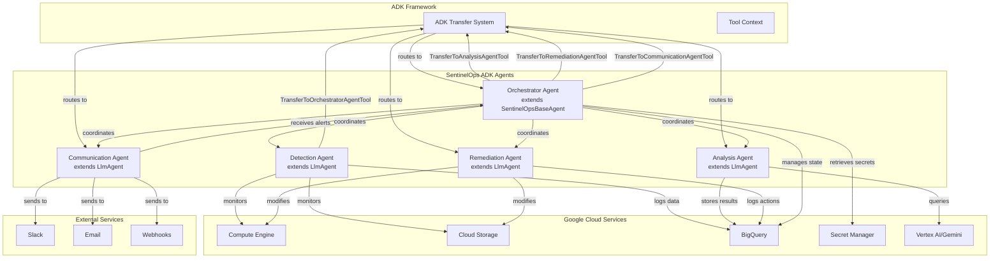

## Incident Response Flow (ADK-Based)

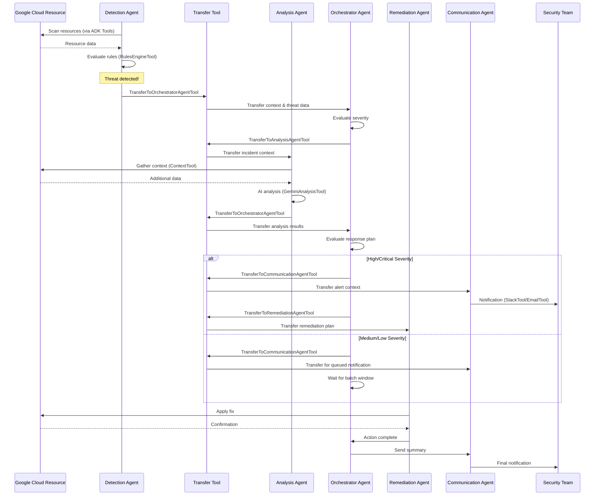

## Data Flow Diagram

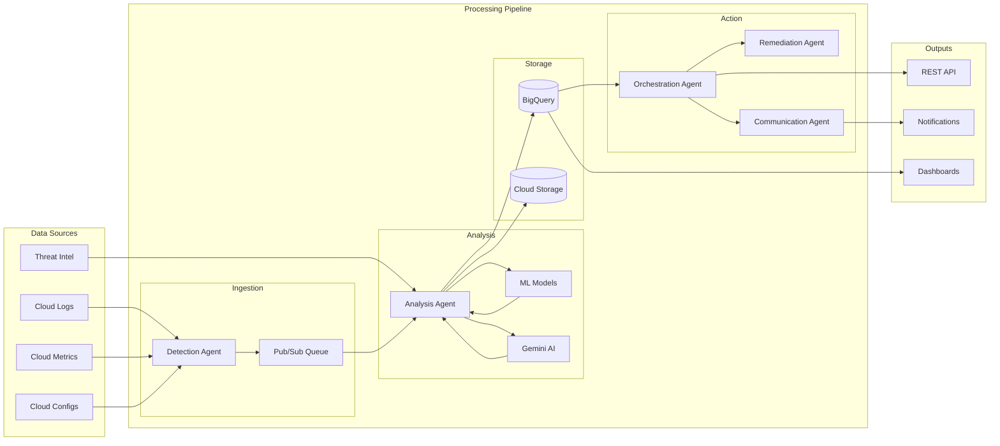

## Agent State Machine

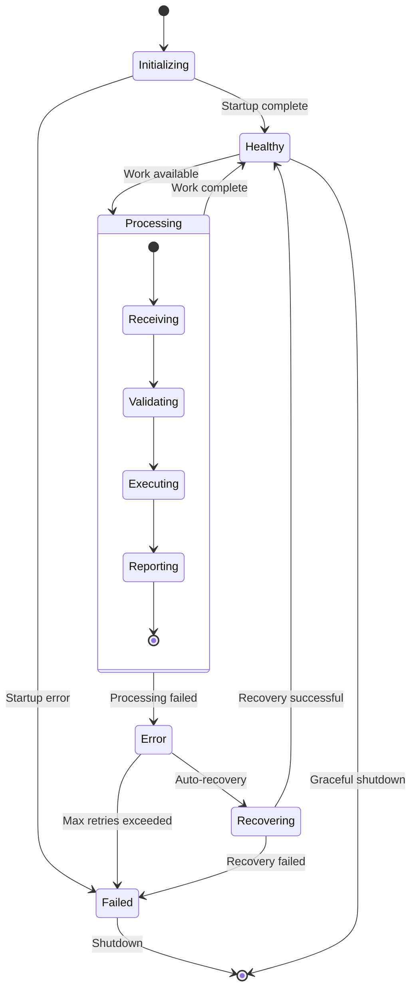

## Communication Patterns

### Synchronous Communication

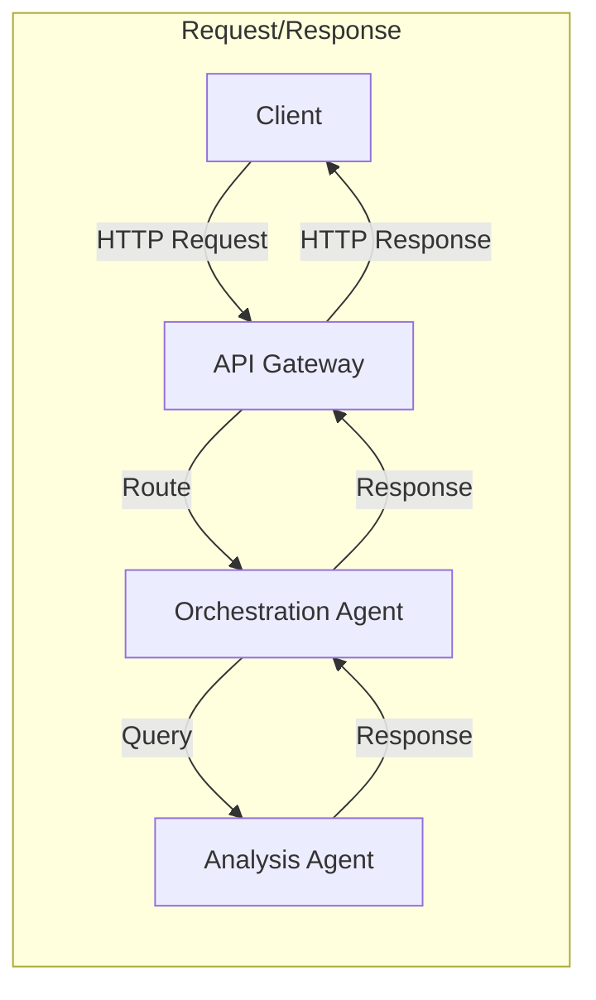

### Asynchronous Communication

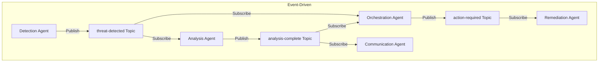

## Security Flow

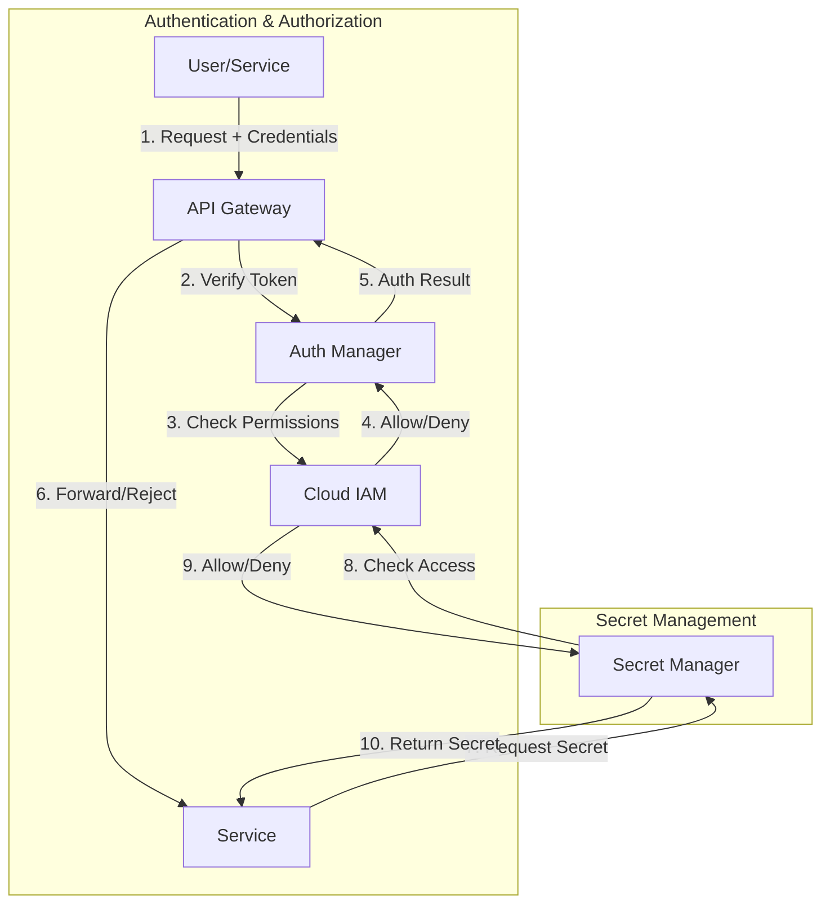

## Scaling Architecture

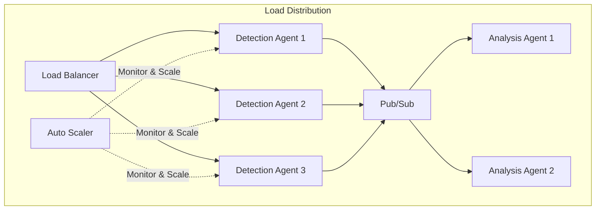

## Error Handling Flow

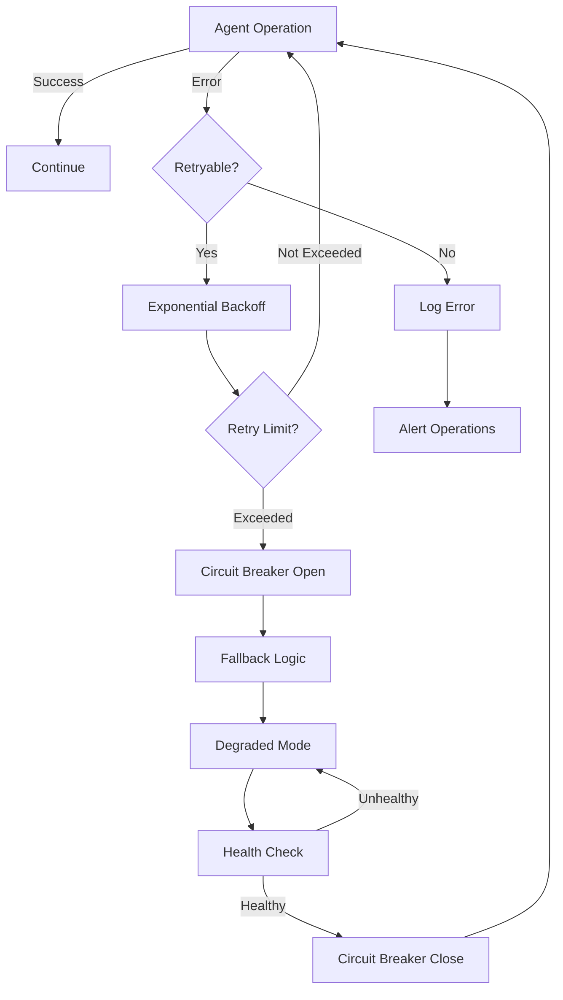

## Deployment Pipeline

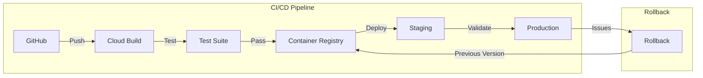

## Monitoring Integration

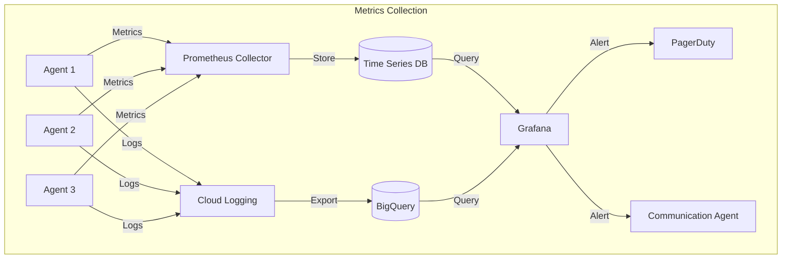

These diagrams illustrate the complex interactions and data flows within the SentinelOps platform. Each agent has specific responsibilities and communication patterns that ensure efficient and reliable security monitoring and response.
