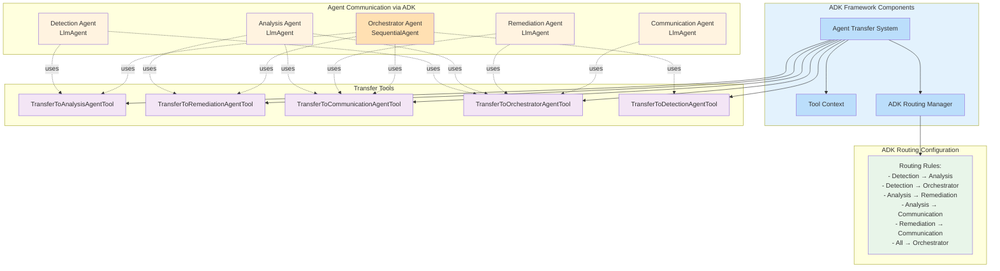
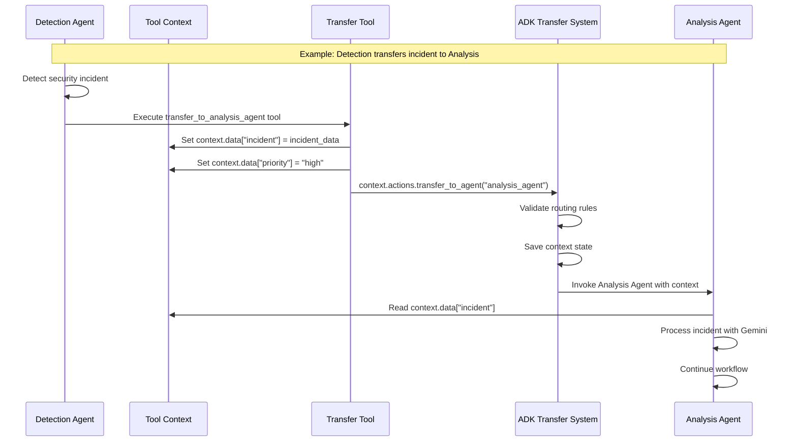

# Agent Interaction Model with ADK



## ADK Agent Transfer Flow



## Agent Responsibilities with ADK

### Orchestrator Agent (Hub)
- **Type**: SequentialAgent (ADK class for workflow orchestration)
- **Transfer Tools**: Can transfer to all other agents
- **Responsibilities**:
  - Central coordinator using ADK's workflow patterns
  - Maintains incident state in Firestore
  - Routes incidents based on severity and type
  - Implements conditional logic for complex workflows

### Detection Agent
- **Type**: LlmAgent with Gemini Flash
- **Transfer Tools**: TransferToAnalysisAgentTool, TransferToOrchestratorAgentTool
- **Domain Tools**:
  - RulesEngineTool: Wraps detection rules engine
  - EventCorrelatorTool: Correlates related events
  - QueryBuilderTool: Optimizes BigQuery queries
  - IncidentCreationTool: Creates and deduplicates incidents

### Analysis Agent
- **Type**: LlmAgent with Gemini Pro
- **Transfer Tools**: TransferToRemediationAgentTool, TransferToCommunicationAgentTool, TransferToOrchestratorAgentTool
- **Domain Tools**:
  - GeminiAnalysisTool: Sophisticated prompt engineering for analysis
  - RecommendationTool: Generates remediation recommendations
  - RiskScoringTool: Calculates incident risk scores
  - ContextRetrievalTool: Enriches with historical data

### Remediation Agent
- **Type**: LlmAgent with safety controls
- **Transfer Tools**: TransferToCommunicationAgentTool, TransferToOrchestratorAgentTool
- **Domain Tools**:
  - BlockIPTool: Creates firewall rules
  - IsolateVMTool: Isolates compromised instances
  - RevokeCredentialsTool: Revokes service account keys
  - All tools include dry-run mode and rollback support

### Communication Agent
- **Type**: LlmAgent for multi-channel notifications
- **Transfer Tools**: TransferToOrchestratorAgentTool (for status updates)
- **Domain Tools**:
  - SlackNotificationTool: Slack integration
  - EmailNotificationTool: Email service
  - SMSNotificationTool: SMS alerts
  - WebhookTool: Custom integrations

## ADK Routing Configuration

The routing system enforces these rules:

1. **Orchestrator as Hub**: Can reach all agents, all agents can return to it
2. **Sequential Flow**: Detection → Analysis → Remediation → Communication
3. **Direct Shortcuts**: Analysis can directly notify via Communication for urgent alerts
4. **No Reverse Flow**: Prevents circular dependencies
5. **Bidirectional Validation**: Ensures routing integrity

## Key Differences from Original Architecture

1. **No Pub/Sub**: Replaced entirely with ADK's transfer system
2. **Rich Context**: Tool context carries full incident data and metadata
3. **Type Safety**: Strongly typed routing configuration
4. **Native Orchestration**: Uses ADK's built-in workflow patterns
5. **Tool-Based Communication**: All inter-agent communication through transfer tools

## Production Patterns

### Circuit Breaker Pattern in Transfer Tools
```python
class TransferToAnalysisAgentTool(BaseTool):
    def __init__(self):
        super().__init__(
            name="transfer_to_analysis_agent",
            description="Transfer incident to Analysis Agent"
        )
        self.circuit_breaker = CircuitBreaker(
            failure_threshold=5,
            recovery_timeout=60,
            expected_exception=TransferException
        )
    
    async def execute(self, context: ToolContext, **kwargs):
        if self.circuit_breaker.is_open():
            # Fallback: Send to orchestrator instead
            context.actions.transfer_to_agent("orchestrator_agent")
            return {"status": "circuit_open", "fallback": "orchestrator"}
        
        try:
            context.data.update(kwargs)
            context.actions.transfer_to_agent("analysis_agent")
            self.circuit_breaker.record_success()
            return {"status": "transferred", "target": "analysis_agent"}
        except Exception as e:
            self.circuit_breaker.record_failure()
            raise
```

This ensures system resilience even if an agent becomes unavailable.