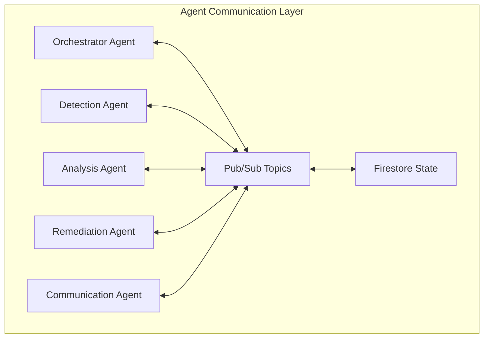

# Agent Communication API

## Overview

The Agent Communication API defines how SentinelOps agents communicate with each other using Google ADK's transfer mechanisms and Pub/Sub messaging. This document covers the protocols, message formats, and patterns used for inter-agent coordination.

## Communication Architecture



## ADK Transfer System

### Transfer Tools

Each agent implements transfer tools to hand off tasks:

```python
from google.adk import BaseTool, ToolContext
from typing import Any, Dict

class TransferToAnalysisAgentTool(BaseTool):
    def __init__(self):
        super().__init__(
            name="transfer_to_analysis",
            description="Transfer incident to Analysis Agent"
        )

    async def run_async(self, *, args: Dict[str, Any], tool_context: ToolContext) -> Any:
        incident_data = args.get("incident_data")
        priority = args.get("priority", "normal")

        # Create transfer context
        transfer_context = {
            "source_agent": tool_context.agent_id,
            "target_agent": "analysis-agent",
            "incident_id": incident_data["id"],
            "priority": priority,
            "timestamp": datetime.utcnow().isoformat()
        }

        # Execute transfer via ADK
        return await self._execute_transfer(transfer_context)
```

### Transfer Protocol

1. **Source Agent** initiates transfer with context
2. **ADK Router** validates and routes the transfer
3. **Target Agent** receives context and acknowledges
4. **State Update** in Firestore for tracking
5. **Confirmation** sent back to source

## Message Formats

### Base Message Structure

All inter-agent messages follow this structure:

```json
{
  "message_id": "msg_uuid",
  "version": "1.0",
  "source": {
    "agent_id": "detection-agent-01",
    "agent_type": "detection"
  },
  "target": {
    "agent_id": "analysis-agent-01",
    "agent_type": "analysis"
  },
  "message_type": "TASK_ASSIGNMENT",
  "priority": "HIGH",
  "payload": {
    // Message-specific data
  },
  "context": {
    "incident_id": "inc_123456",
    "workflow_id": "wf_789012",
    "correlation_id": "corr_345678"
  },
  "metadata": {
    "timestamp": "2025-06-11T10:00:00Z",
    "ttl": 3600,
    "retry_count": 0
  }
}
```

### Message Types

#### TASK_ASSIGNMENT
Assign a task to another agent:

```json
{
  "message_type": "TASK_ASSIGNMENT",
  "payload": {
    "task_type": "analyze_incident",
    "task_data": {
      "incident": {
        "id": "inc_123456",
        "type": "suspicious_login",
        "severity": "HIGH",
        "affected_resources": ["user@example.com"]
      },
      "analysis_depth": "comprehensive",
      "include_recommendations": true
    },
    "deadline": "2025-06-11T10:30:00Z"
  }
}
```

#### TASK_RESULT
Return results from a completed task:

```json
{
  "message_type": "TASK_RESULT",
  "payload": {
    "task_id": "task_567890",
    "status": "SUCCESS",
    "results": {
      "root_cause": "Credential stuffing attack",
      "confidence": 0.92,
      "recommendations": [
        {
          "action": "block_ip",
          "priority": "HIGH",
          "parameters": {
            "ip_addresses": ["192.168.1.1"]
          }
        }
      ]
    },
    "execution_time_ms": 3456
  }
}
```

#### STATE_UPDATE
Notify other agents of state changes:

```json
{
  "message_type": "STATE_UPDATE",
  "payload": {
    "entity_type": "incident",
    "entity_id": "inc_123456",
    "updates": {
      "status": "INVESTIGATING",
      "assigned_to": "analysis-agent-01"
    },
    "previous_state": {
      "status": "OPEN",
      "assigned_to": null
    }
  }
}
```

#### COORDINATION_REQUEST
Request coordination for multi-agent tasks:

```json
{
  "message_type": "COORDINATION_REQUEST",
  "payload": {
    "workflow_type": "incident_response",
    "steps": [
      {
        "step_id": "detect",
        "agent_type": "detection",
        "status": "COMPLETED"
      },
      {
        "step_id": "analyze",
        "agent_type": "analysis",
        "status": "IN_PROGRESS"
      },
      {
        "step_id": "remediate",
        "agent_type": "remediation",
        "status": "PENDING"
      }
    ],
    "coordination_type": "sequential"
  }
}
```

#### ERROR_NOTIFICATION
Report errors to other agents:

```json
{
  "message_type": "ERROR_NOTIFICATION",
  "payload": {
    "error_type": "TASK_FAILURE",
    "error_code": "ANALYSIS_TIMEOUT",
    "error_message": "Analysis timed out after 300 seconds",
    "failed_task": {
      "task_id": "task_123456",
      "task_type": "analyze_incident"
    },
    "retry_possible": true,
    "suggested_action": "retry_with_reduced_scope"
  }
}
```

## Pub/Sub Topics

### Topic Structure

Topics follow the naming convention: `sentinelops-{environment}-{purpose}`

| Topic | Purpose | Publishers | Subscribers |
|-------|---------|------------|-------------|
| `sentinelops-prod-incidents` | New incident notifications | Detection Agent | All agents |
| `sentinelops-prod-analysis` | Analysis requests/results | All agents | Analysis Agent |
| `sentinelops-prod-remediation` | Remediation commands | Orchestrator | Remediation Agent |
| `sentinelops-prod-notifications` | Alert notifications | All agents | Communication Agent |
| `sentinelops-prod-coordination` | Workflow coordination | Orchestrator | All agents |
| `sentinelops-prod-system` | System events/health | All agents | All agents |

### Subscription Patterns

#### Push Subscriptions
```python
from google.cloud import pubsub_v1

subscriber = pubsub_v1.SubscriberClient()
subscription_path = subscriber.subscription_path(
    project_id, 'sentinelops-prod-incidents-detection-sub'
)

def callback(message):
    # Process message
    data = json.loads(message.data.decode('utf-8'))
    process_incident(data)
    message.ack()

future = subscriber.subscribe(subscription_path, callback=callback)
```

#### Pull Subscriptions
```python
def pull_messages():
    response = subscriber.pull(
        request={
            "subscription": subscription_path,
            "max_messages": 10,
        }
    )

    for msg in response.received_messages:
        process_message(msg.message)

    # Acknowledge processed messages
    ack_ids = [msg.ack_id for msg in response.received_messages]
    subscriber.acknowledge(subscription=subscription_path, ack_ids=ack_ids)
```

## Communication Patterns

### 1. Request-Response Pattern

For synchronous operations requiring immediate response:

```python
async def request_analysis(self, incident_data: dict) -> dict:
    # Send request
    request_id = str(uuid.uuid4())
    await self.publish_message("sentinelops-prod-analysis", {
        "message_id": request_id,
        "message_type": "ANALYSIS_REQUEST",
        "payload": incident_data,
        "reply_to": f"sentinelops-prod-responses-{self.agent_id}"
    })

    # Wait for response
    response = await self.wait_for_response(request_id, timeout=30)
    return response
```

### 2. Fire-and-Forget Pattern

For asynchronous notifications:

```python
async def notify_incident_created(self, incident: dict):
    await self.publish_message("sentinelops-prod-incidents", {
        "message_type": "INCIDENT_CREATED",
        "payload": incident,
        "metadata": {
            "timestamp": datetime.utcnow().isoformat(),
            "ttl": 3600
        }
    })
```

### 3. Workflow Pattern

For multi-step coordinated operations:

```python
class WorkflowCoordinator:
    async def execute_incident_workflow(self, incident_id: str):
        workflow = {
            "workflow_id": str(uuid.uuid4()),
            "incident_id": incident_id,
            "steps": [
                {"agent": "detection", "action": "verify_incident"},
                {"agent": "analysis", "action": "analyze_root_cause"},
                {"agent": "remediation", "action": "apply_fixes"},
                {"agent": "communication", "action": "notify_stakeholders"}
            ],
            "current_step": 0
        }

        # Store workflow state
        await self.firestore.create_workflow(workflow)

        # Start workflow execution
        await self.execute_next_step(workflow)
```

### 4. Event Sourcing Pattern

For maintaining audit trails:

```python
class EventStore:
    async def append_event(self, event: dict):
        event_record = {
            "event_id": str(uuid.uuid4()),
            "aggregate_id": event["incident_id"],
            "event_type": event["type"],
            "event_data": event["data"],
            "timestamp": datetime.utcnow(),
            "agent_id": self.agent_id
        }

        # Store in Firestore
        await self.firestore.collection("events").add(event_record)

        # Publish to event stream
        await self.publish_message("sentinelops-prod-events", event_record)
```

## State Management

### Agent State in Firestore

```python
class AgentStateManager:
    async def update_state(self, status: str, current_task: dict = None):
        state = {
            "agent_id": self.agent_id,
            "agent_type": self.agent_type,
            "status": status,
            "last_heartbeat": datetime.utcnow(),
            "current_task": current_task,
            "health_metrics": await self.collect_health_metrics()
        }

        await self.firestore.collection("agent_state").document(
            self.agent_id
        ).set(state, merge=True)
```

### Distributed Locking

For coordinating exclusive operations:

```python
class DistributedLock:
    async def acquire_lock(self, resource_id: str, ttl: int = 60) -> bool:
        lock_doc = self.firestore.collection("locks").document(resource_id)

        try:
            lock_data = {
                "locked_by": self.agent_id,
                "locked_at": datetime.utcnow(),
                "expires_at": datetime.utcnow() + timedelta(seconds=ttl)
            }

            # Atomic create (fails if exists)
            await lock_doc.create(lock_data)
            return True
        except AlreadyExists:
            # Check if lock expired
            current_lock = await lock_doc.get()
            if current_lock.exists:
                lock_data = current_lock.to_dict()
                if datetime.utcnow() > lock_data["expires_at"]:
                    # Expired lock, try to acquire
                    await lock_doc.set(lock_data)
                    return True
            return False
```

## Error Handling

### Retry Mechanisms

```python
class MessageRetryHandler:
    def __init__(self, max_retries: int = 3, backoff_base: float = 2.0):
        self.max_retries = max_retries
        self.backoff_base = backoff_base

    async def publish_with_retry(self, topic: str, message: dict):
        for attempt in range(self.max_retries):
            try:
                await self.publish_message(topic, message)
                return
            except Exception as e:
                if attempt == self.max_retries - 1:
                    # Final attempt failed, send to DLQ
                    await self.send_to_dlq(topic, message, str(e))
                    raise

                # Exponential backoff
                wait_time = self.backoff_base ** attempt
                await asyncio.sleep(wait_time)
```

### Dead Letter Queue

```python
async def send_to_dlq(self, original_topic: str, message: dict, error: str):
    dlq_message = {
        "original_topic": original_topic,
        "original_message": message,
        "error": error,
        "failed_at": datetime.utcnow().isoformat(),
        "retry_count": message.get("metadata", {}).get("retry_count", 0)
    }

    await self.publish_message("sentinelops-prod-dlq", dlq_message)
```

## Monitoring and Observability

### Message Tracing

```python
class MessageTracer:
    def create_trace_context(self, parent_trace_id: str = None) -> dict:
        return {
            "trace_id": parent_trace_id or str(uuid.uuid4()),
            "span_id": str(uuid.uuid4()),
            "timestamp": datetime.utcnow().isoformat()
        }

    async def trace_message(self, message: dict, event: str):
        trace_event = {
            "trace_id": message["context"]["correlation_id"],
            "event": event,
            "agent_id": self.agent_id,
            "message_id": message["message_id"],
            "timestamp": datetime.utcnow().isoformat()
        }

        await self.publish_message("sentinelops-prod-traces", trace_event)
```

### Metrics Collection

```python
class CommunicationMetrics:
    async def record_message_sent(self, topic: str, message_type: str):
        metric = {
            "metric_type": "message_sent",
            "topic": topic,
            "message_type": message_type,
            "agent_id": self.agent_id,
            "timestamp": datetime.utcnow()
        }

        await self.monitoring_client.write_time_series(metric)

    async def record_message_latency(self, duration_ms: float):
        metric = {
            "metric_type": "message_latency",
            "value": duration_ms,
            "agent_id": self.agent_id,
            "timestamp": datetime.utcnow()
        }

        await self.monitoring_client.write_time_series(metric)
```

## Security Considerations

### Message Encryption

Sensitive data in messages should be encrypted:

```python
from cryptography.fernet import Fernet

class SecureMessaging:
    def __init__(self, encryption_key: bytes):
        self.cipher = Fernet(encryption_key)

    def encrypt_payload(self, payload: dict) -> str:
        json_bytes = json.dumps(payload).encode()
        return self.cipher.encrypt(json_bytes).decode()

    def decrypt_payload(self, encrypted: str) -> dict:
        decrypted_bytes = self.cipher.decrypt(encrypted.encode())
        return json.loads(decrypted_bytes.decode())
```

### Message Signing

Ensure message authenticity:

```python
import hmac
import hashlib

class MessageSigner:
    def __init__(self, signing_key: bytes):
        self.signing_key = signing_key

    def sign_message(self, message: dict) -> str:
        message_bytes = json.dumps(message, sort_keys=True).encode()
        signature = hmac.new(
            self.signing_key,
            message_bytes,
            hashlib.sha256
        ).hexdigest()
        return signature

    def verify_signature(self, message: dict, signature: str) -> bool:
        expected_signature = self.sign_message(message)
        return hmac.compare_digest(expected_signature, signature)
```

## Best Practices

1. **Idempotency**: Design message handlers to be idempotent
2. **Timeouts**: Set appropriate timeouts for all operations
3. **Circuit Breakers**: Implement circuit breakers for external calls
4. **Message Size**: Keep messages under 1MB for Pub/Sub
5. **Batching**: Batch messages when possible for efficiency
6. **Monitoring**: Track all communication metrics
7. **Error Handling**: Implement comprehensive error handling
8. **Testing**: Test communication paths thoroughly

## Testing Agent Communication

### Unit Testing

```python
import pytest
from unittest.mock import Mock, patch

class TestAgentCommunication:
    @pytest.mark.asyncio
    async def test_message_publishing(self):
        with patch('google.cloud.pubsub_v1.PublisherClient') as mock_pub:
            agent = DetectionAgent()

            await agent.publish_incident({
                "type": "test_incident",
                "severity": "HIGH"
            })

            mock_pub.return_value.publish.assert_called_once()

    @pytest.mark.asyncio
    async def test_message_handling(self):
        agent = AnalysisAgent()

        test_message = {
            "message_type": "TASK_ASSIGNMENT",
            "payload": {
                "task_type": "analyze_incident",
                "incident_id": "test_123"
            }
        }

        result = await agent.handle_message(test_message)
        assert result["status"] == "SUCCESS"
```

### Integration Testing

```python
class TestAgentIntegration:
    @pytest.mark.integration
    async def test_detection_to_analysis_flow(self):
        # Start test agents
        detection = DetectionAgent(test_mode=True)
        analysis = AnalysisAgent(test_mode=True)

        # Simulate incident detection
        incident = await detection.detect_incident({
            "log_entry": "Failed login attempt",
            "severity": "HIGH"
        })

        # Wait for analysis to complete
        analysis_result = await self.wait_for_analysis(incident["id"])

        assert analysis_result is not None
        assert "root_cause" in analysis_result
```

## Related Documentation

- [ADK Tool Reference](../06-reference/adk-tool-reference.md)
- [Architecture Overview](./architecture.md)
- [Agent Interactions](./agent-interactions.md)
- [Pub/Sub Configuration](../03-deployment/pubsub-configuration.md)
