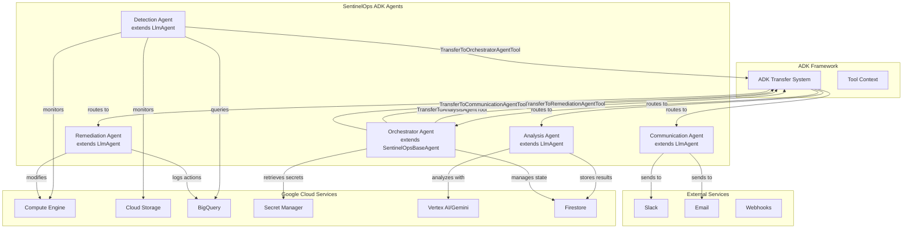
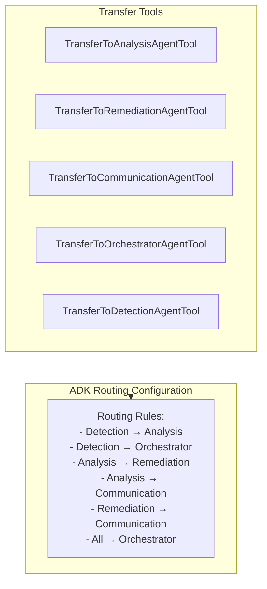
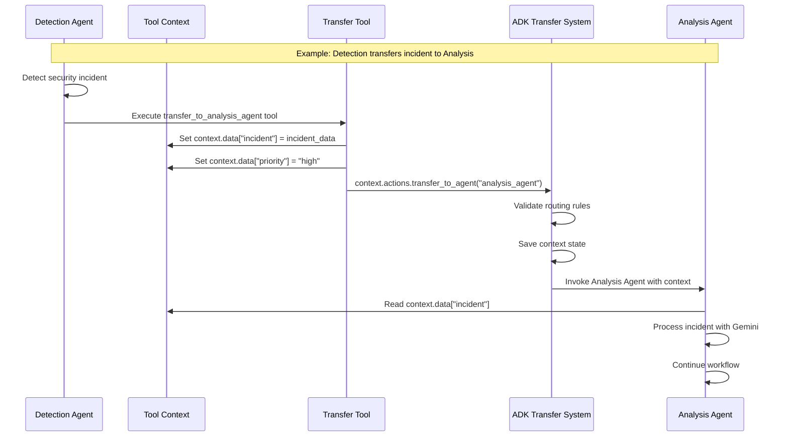
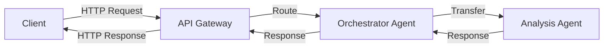
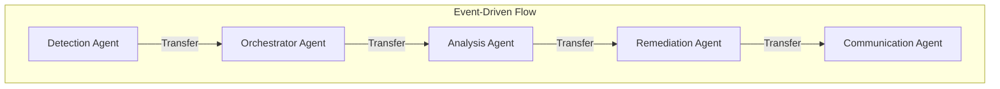
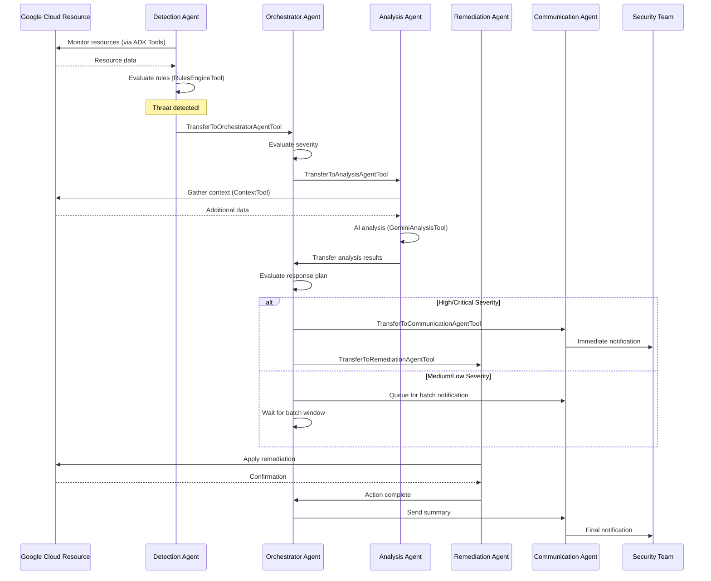
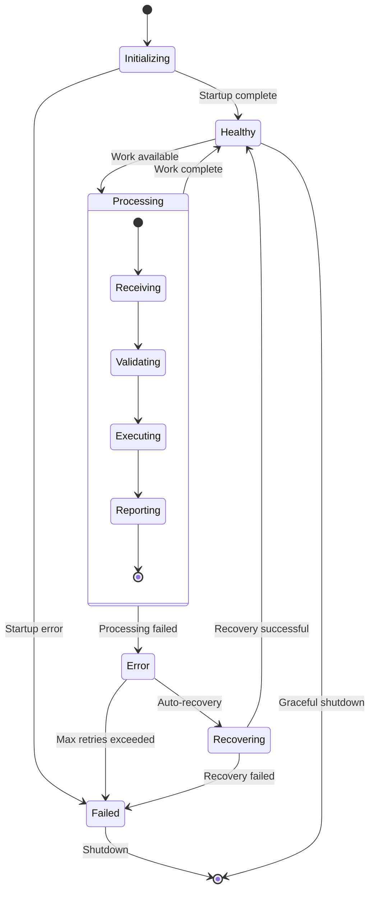
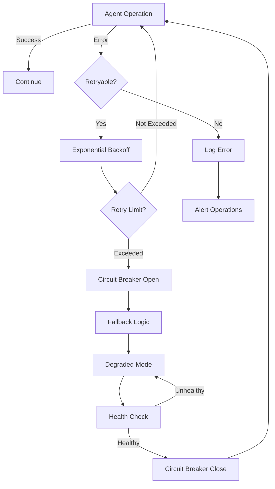
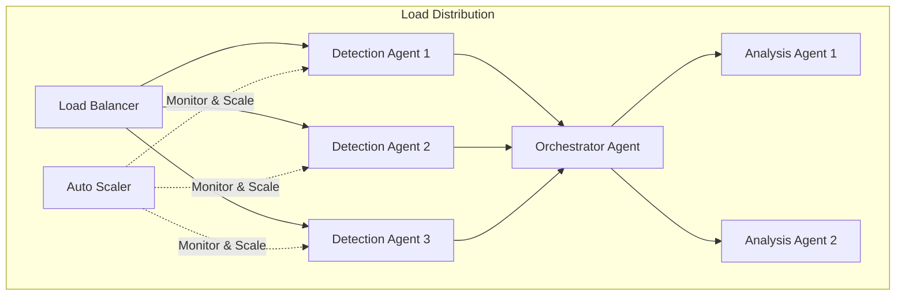

# Agent Interactions - Comprehensive Guide

This document provides a complete overview of how SentinelOps agents interact with each other using Google's Agent Development Kit (ADK). It consolidates all agent interaction patterns, communication flows, and architectural decisions.

## Table of Contents
1. [ADK Agent Communication Overview](#adk-agent-communication-overview)
2. [Agent Transfer System](#agent-transfer-system)
3. [Agent Responsibilities](#agent-responsibilities)
4. [Communication Patterns](#communication-patterns)
5. [Incident Response Flow](#incident-response-flow)
6. [Production Patterns](#production-patterns)
7. [Scaling and Performance](#scaling-and-performance)

## ADK Agent Communication Overview

SentinelOps uses ADK's transfer system for all inter-agent communication, replacing traditional message queues with a type-safe, context-aware transfer mechanism.



## Agent Transfer System

### Transfer Tools Architecture



### Transfer Flow Sequence



## Agent Responsibilities

### Orchestrator Agent (Central Hub)
- **Type**: SequentialAgent (ADK class for workflow orchestration)
- **Role**: Central coordinator and workflow manager
- **Transfer Capabilities**: Can transfer to all other agents
- **Key Responsibilities**:
  - Workflow orchestration using ADK patterns
  - State management in Firestore
  - Incident routing based on severity
  - Complex conditional logic implementation
  - Health monitoring of other agents

### Detection Agent
- **Type**: LlmAgent with Gemini Flash
- **Role**: Continuous monitoring and threat detection
- **Transfer Tools**:
  - TransferToAnalysisAgentTool
  - TransferToOrchestratorAgentTool
- **Domain Tools**:
  - LogMonitoringTool: BigQuery log analysis
  - AnomalyDetectionTool: ML-based detection
  - RulesEngineTool: Rule evaluation
  - EventCorrelatorTool: Event correlation
  - QueryBuilderTool: Query optimization
  - IncidentDeduplicatorTool: Deduplication

### Analysis Agent
- **Type**: LlmAgent with Gemini Pro
- **Role**: Deep incident analysis and risk assessment
- **Transfer Tools**:
  - TransferToRemediationAgentTool
  - TransferToCommunicationAgentTool
  - TransferToOrchestratorAgentTool
- **Domain Tools**:
  - IncidentAnalysisTool: Gemini-powered analysis
  - RecommendationTool: Remediation suggestions
  - ContextTool: Historical context retrieval
  - Performance Optimizer: Caching and batching

### Remediation Agent
- **Type**: LlmAgent with safety controls
- **Role**: Automated response execution
- **Transfer Tools**:
  - TransferToCommunicationAgentTool
  - TransferToOrchestratorAgentTool
- **Domain Tools**:
  - BlockIPTool: Firewall rule management
  - IsolateVMTool: Instance isolation
  - RevokeCredentialsTool: Credential revocation
  - All tools support dry-run mode and rollback

### Communication Agent
- **Type**: LlmAgent for multi-channel notifications
- **Role**: Stakeholder communication
- **Transfer Tools**:
  - TransferToOrchestratorAgentTool
- **Domain Tools**:
  - SlackNotificationTool: Slack integration
  - EmailNotificationTool: Email service
  - SMSNotificationTool: SMS alerts
  - WebhookTool: Custom integrations

## Communication Patterns

### Synchronous Pattern (API Requests)



### Asynchronous Pattern (Event-Driven)



## Incident Response Flow

### Complete Incident Lifecycle



## Production Patterns

### Circuit Breaker Pattern

```python
class TransferToAnalysisAgentTool(BaseTool):
    """Transfer tool with circuit breaker for resilience."""

    def __init__(self):
        super().__init__(
            name="transfer_to_analysis_agent",
            description="Transfer incident to Analysis Agent with fault tolerance"
        )
        self.circuit_breaker = CircuitBreaker(
            failure_threshold=5,
            recovery_timeout=60,
            expected_exception=TransferException
        )

    async def execute(self, context: ToolContext, **kwargs):
        if self.circuit_breaker.is_open():
            # Fallback: Send to orchestrator instead
            context.actions.transfer_to_agent("orchestrator_agent")
            return {"status": "circuit_open", "fallback": "orchestrator"}

        try:
            context.data.update(kwargs)
            context.actions.transfer_to_agent("analysis_agent")
            self.circuit_breaker.record_success()
            return {"status": "transferred", "target": "analysis_agent"}
        except Exception as e:
            self.circuit_breaker.record_failure()
            raise
```

### Agent State Machine



### Error Handling Flow



## Scaling and Performance

### Load Distribution Architecture



### Performance Optimizations

1. **Analysis Agent Caching**
   - 1-hour TTL for similar incidents
   - Reduces Gemini API calls by 30-50%
   - Sub-10ms response for cache hits

2. **Batch Processing**
   - Groups similar incidents for analysis
   - Reduces API costs significantly
   - Maintains response time SLAs

3. **Connection Pooling**
   - Reuses Firestore connections
   - Minimizes connection overhead
   - Improves throughput

## Key Differences from Traditional Architecture

| Aspect | Traditional | ADK-Based |
|--------|-------------|-----------|
| Communication | Pub/Sub messaging | ADK Transfer Tools |
| Context Passing | JSON messages | Rich Tool Context |
| Orchestration | Custom coordination | ADK SequentialAgent |
| Error Handling | Manual retry logic | Built-in resilience |
| Type Safety | Runtime validation | Compile-time safety |
| State Management | Distributed state | Centralized in Firestore |

## Best Practices

1. **Always use Transfer Tools** for agent communication
2. **Preserve context** throughout the transfer chain
3. **Implement circuit breakers** for production resilience
4. **Monitor transfer metrics** for performance optimization
5. **Use appropriate agent types** (LlmAgent vs SequentialAgent)
6. **Leverage ADK's built-in** error handling and retry logic

---

*This consolidated guide represents the complete agent interaction architecture for SentinelOps, leveraging ADK's powerful transfer system for reliable, scalable security operations.*
