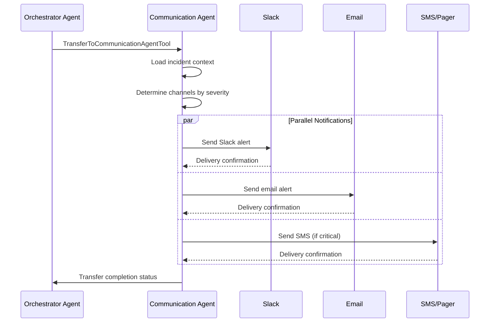

# Communication Agent Documentation

The Communication Agent is responsible for all external notifications and stakeholder communications in the SentinelOps platform. Built on Google's Agent Development Kit (ADK), it provides multi-channel notification capabilities with template-based messaging and delivery tracking.

## Overview

- **Type**: LlmAgent (ADK base class)
- **Model**: Gemini Flash (for message formatting)
- **Purpose**: Multi-channel notifications and reporting
- **Location**: `src/communication_agent/adk_agent.py`

## Architecture

### ADK Integration

```python
class CommunicationAgent(SentinelOpsBaseAgent):
    """ADK-based agent for multi-channel communications."""
    
    def __init__(self):
        super().__init__(
            name="communication_agent",
            description="Handles notifications and stakeholder communications",
            model="gemini-1.5-flash",
            tools=[
                SlackNotificationTool(),
                EmailNotificationTool(),
                SMSNotificationTool(),
                WebhookTool(),
                TemplateRenderTool(),
                DeliveryTrackingTool(),
                TransferToOrchestratorAgentTool()
            ]
        )
```

## Communication Tools

### 1. SlackNotificationTool

Sends formatted messages to Slack channels using webhooks.

**Features:**
- Rich message formatting with blocks
- Thread support for incident updates
- Channel routing based on severity
- Attachment support for reports

**Configuration:**
```yaml
slack:
  webhook_url: ${SLACK_WEBHOOK_URL}
  channels:
    critical: "#security-critical"
    high: "#security-alerts"
    medium: "#security-info"
    low: "#security-logs"
  rate_limit: 10  # messages per minute
```

### 2. EmailNotificationTool

Sends HTML and plain text emails via SMTP or SendGrid.

**Features:**
- HTML templates with incident details
- PDF report attachments
- Distribution lists by severity
- Delivery tracking

**Configuration:**
```yaml
email:
  provider: "sendgrid"  # or "smtp"
  api_key: ${SENDGRID_API_KEY}
  from_address: "sentinelops@company.com"
  smtp:
    host: "smtp.gmail.com"
    port: 587
    username: ${SMTP_USERNAME}
    password: ${SMTP_PASSWORD}
```

### 3. SMSNotificationTool

Sends SMS alerts for critical incidents via Twilio.

**Features:**
- Short message formatting
- On-call rotation integration
- Delivery confirmation
- Geographic routing

**Configuration:**
```yaml
sms:
  provider: "twilio"
  account_sid: ${TWILIO_ACCOUNT_SID}
  auth_token: ${TWILIO_AUTH_TOKEN}
  from_number: "+1234567890"
  max_length: 160
```

### 4. WebhookTool

Sends structured data to external systems.

**Features:**
- Custom payload formatting
- Retry with exponential backoff
- Authentication support
- Response handling

**Supported Formats:**
- JSON webhooks
- XML for legacy systems
- Form-encoded data
- Custom headers

### 5. TemplateRenderTool

Renders notification templates with incident data.

**Template Variables:**
- `{{incident_id}}` - Unique incident identifier
- `{{severity}}` - Incident severity level
- `{{summary}}` - AI-generated summary
- `{{affected_resources}}` - List of affected resources
- `{{remediation_actions}}` - Actions taken/recommended
- `{{timeline}}` - Incident timeline

**Example Template:**
```jinja2
🚨 Security Incident: {{incident_id}}
Severity: {{severity | upper}}
Time: {{detected_at | format_time}}

Summary: {{summary}}

Affected Resources:

- {{resource.type}}: {{resource.name}}


Actions Taken:

✓ {{action.description}} ({{action.status}})


View details: {{dashboard_url}}/incidents/{{incident_id}}
```

## Communication Workflows

### 1. Immediate Notification Flow

For HIGH and CRITICAL severity incidents:



### 2. Batch Notification Flow

For MEDIUM and LOW severity incidents:

```python
class BatchNotificationWorkflow:
    def __init__(self):
        self.batch_window = 300  # 5 minutes
        self.max_batch_size = 50
        
    async def process_batch(self, incidents):
        # Group by severity and type
        grouped = self.group_incidents(incidents)
        
        # Generate summary report
        summary = await self.generate_summary(grouped)
        
        # Send consolidated notification
        await self.send_batch_notification(summary)
```

### 3. Escalation Flow

When initial notifications fail or go unacknowledged:

1. **Initial Alert**: Standard channels
2. **First Escalation** (5 min): Additional recipients
3. **Second Escalation** (15 min): Management chain
4. **Final Escalation** (30 min): Executive notification

## Message Formatting

### Severity-Based Formatting

Different severity levels use different formatting:

- **CRITICAL**: 🚨 Red alerts with immediate action required
- **HIGH**: ⚠️ Orange warnings with recommended actions
- **MEDIUM**: ℹ️ Blue informational with FYI status
- **LOW**: 📝 Gray logs for record keeping

### Rich Content Support

The agent supports rich content in notifications:

1. **Charts**: Incident trend visualizations
2. **Tables**: Affected resource lists
3. **Timelines**: Incident progression
4. **Links**: Direct dashboard access

## Performance Optimization

### 1. Template Caching

Templates are cached for performance:
```python
@lru_cache(maxsize=100)
def get_compiled_template(template_name: str):
    return jinja2.Template(load_template(template_name))
```

### 2. Batch Processing

Multiple notifications are batched when possible:
```python
async def send_notifications(self, incidents: List[Incident]):
    # Group by channel and severity
    batches = self.create_batches(incidents)
    
    # Send in parallel
    tasks = [self.send_batch(batch) for batch in batches]
    await asyncio.gather(*tasks)
```

### 3. Rate Limiting

Prevents overwhelming external services:
```python
@rate_limit(calls=10, period=60)  # 10 calls per minute
async def send_slack_message(self, channel: str, message: dict):
    # Implementation
```

## Configuration Reference

### Environment Variables

```env
# Slack Configuration
SLACK_WEBHOOK_URL=https://hooks.slack.com/services/...
SLACK_RATE_LIMIT=10

# Email Configuration
EMAIL_PROVIDER=sendgrid
SENDGRID_API_KEY=SG.xxx...
EMAIL_FROM=sentinelops@company.com

# SMS Configuration
TWILIO_ACCOUNT_SID=ACxxx...
TWILIO_AUTH_TOKEN=xxx...
TWILIO_FROM_NUMBER=+1234567890

# Webhook Configuration
WEBHOOK_TIMEOUT=30
WEBHOOK_RETRY_COUNT=3
```

### Notification Rules

```yaml
notification_rules:
  - severity: CRITICAL
    channels: [slack, email, sms]
    template: "critical_incident"
    escalation: true
    
  - severity: HIGH
    channels: [slack, email]
    template: "high_priority"
    escalation: true
    
  - severity: MEDIUM
    channels: [slack]
    template: "standard"
    batch: true
    
  - severity: LOW
    channels: [email]
    template: "summary"
    batch: true
```

## Monitoring & Metrics

### Key Metrics

- **Notification Latency**: Time from incident to notification
- **Delivery Success Rate**: Percentage of successful deliveries
- **Channel Performance**: Response time by channel
- **Template Rendering Time**: Performance of template engine

### Dashboards

The Communication Agent provides dashboards showing:
1. Notification volume by channel
2. Delivery success rates
3. Average latency by severity
4. Failed notification tracking

## Integration Examples

### Integrating with PagerDuty

```python
class PagerDutyTool(BaseTool):
    """Custom tool for PagerDuty integration."""
    
    name = "pagerduty_notification"
    description = "Create PagerDuty incidents"
    
    def execute(self, incident_data: dict) -> dict:
        event = {
            "routing_key": self.routing_key,
            "event_action": "trigger",
            "payload": {
                "summary": incident_data["summary"],
                "severity": incident_data["severity"].lower(),
                "source": "sentinelops",
                "custom_details": incident_data
            }
        }
        
        response = requests.post(
            "https://events.pagerduty.com/v2/enqueue",
            json=event
        )
        
        return {"success": response.ok, "key": response.json().get("dedup_key")}
```

### Custom Webhook Integration

```python
def create_custom_webhook(endpoint: str, auth_type: str = "bearer"):
    """Factory for custom webhook tools."""
    
    class CustomWebhookTool(BaseTool):
        name = f"webhook_{endpoint.replace('/', '_')}"
        description = f"Send to {endpoint}"
        
        def execute(self, data: dict) -> dict:
            headers = self._build_auth_headers(auth_type)
            response = requests.post(endpoint, json=data, headers=headers)
            return {"success": response.ok, "status": response.status_code}
    
    return CustomWebhookTool()
```

## Best Practices

1. **Template Management**
   - Version control all templates
   - Test templates with sample data
   - Keep templates concise and actionable

2. **Channel Selection**
   - Match severity to appropriate channels
   - Avoid notification fatigue
   - Respect quiet hours for non-critical alerts

3. **Message Content**
   - Include actionable information
   - Provide clear next steps
   - Link to detailed dashboards

4. **Delivery Tracking**
   - Monitor delivery success rates
   - Implement retry logic for failures
   - Log all notification attempts

5. **Performance**
   - Cache compiled templates
   - Batch similar notifications
   - Use async operations

---

*The Communication Agent ensures that security incidents are promptly and appropriately communicated to all stakeholders through their preferred channels.*