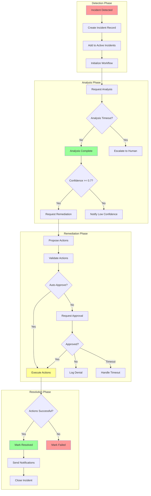
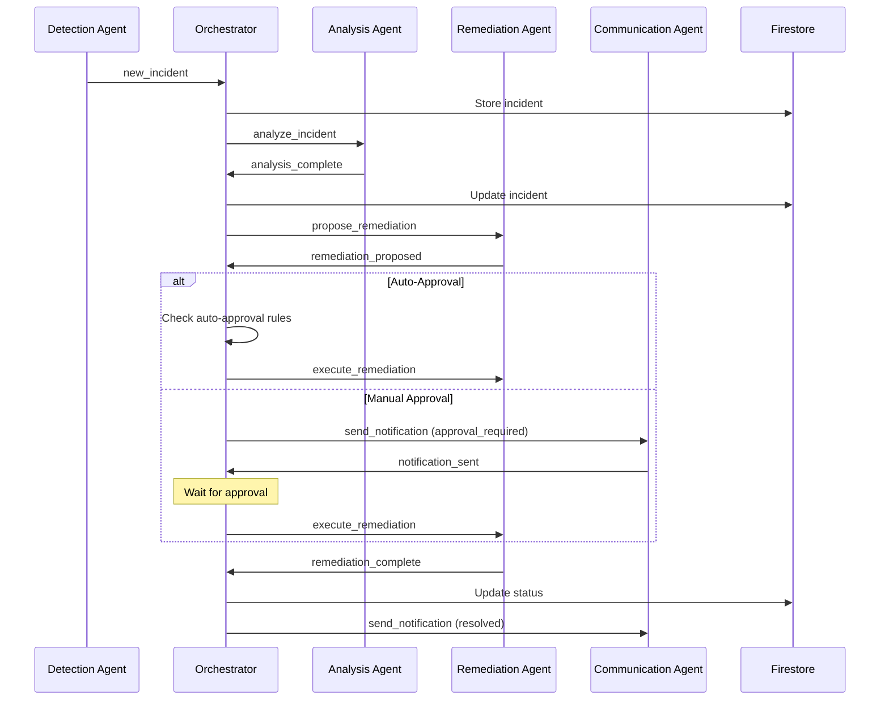
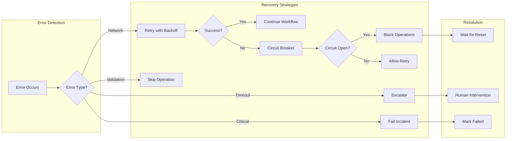
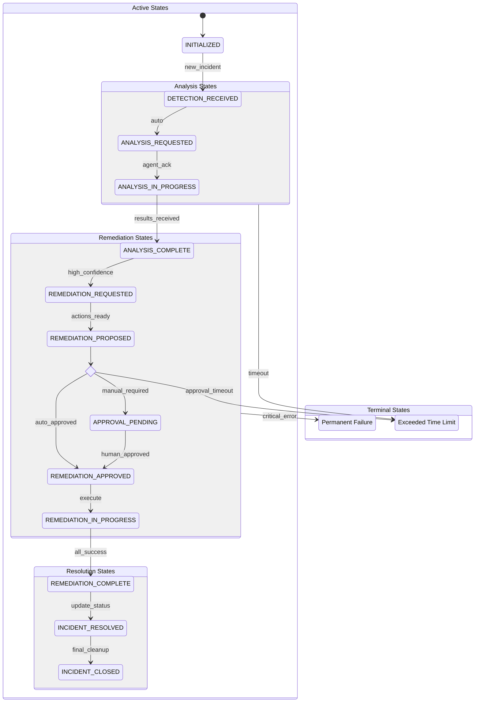
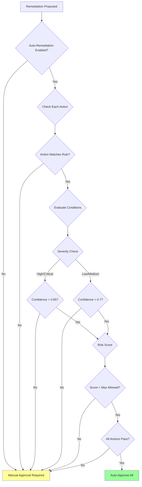
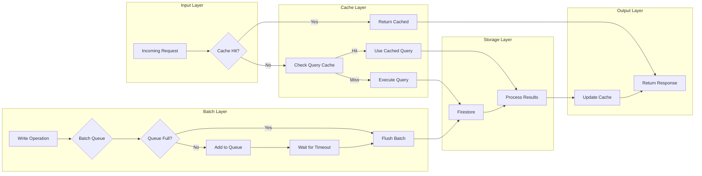
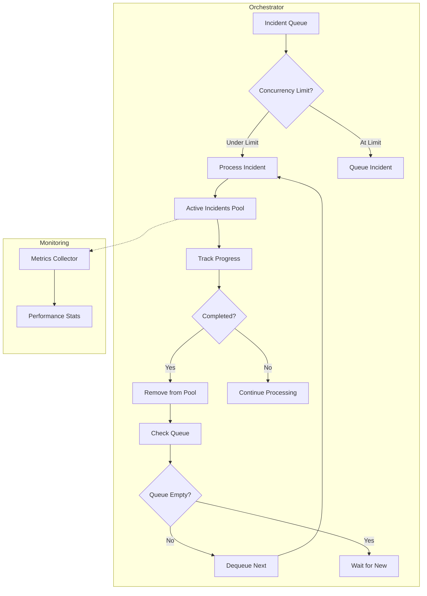
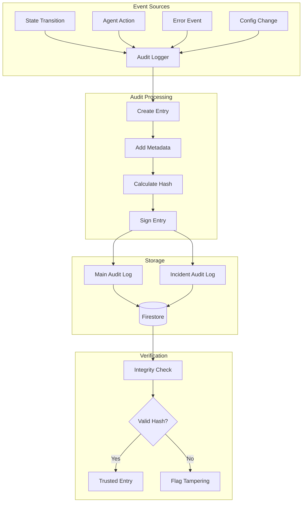
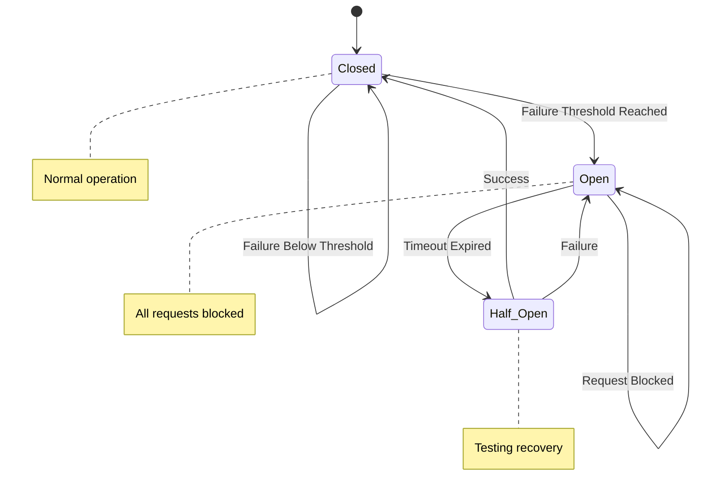

# Orchestration Agent Workflow Diagrams

## Complete Incident Response Workflow

## Message Flow Diagram

## Error Recovery Flow

## State Machine Detailed View

## Auto-Approval Decision Tree

## Performance Optimization Flow

## Concurrent Incident Handling

## Audit Trail Flow

## Circuit Breaker State Machine

