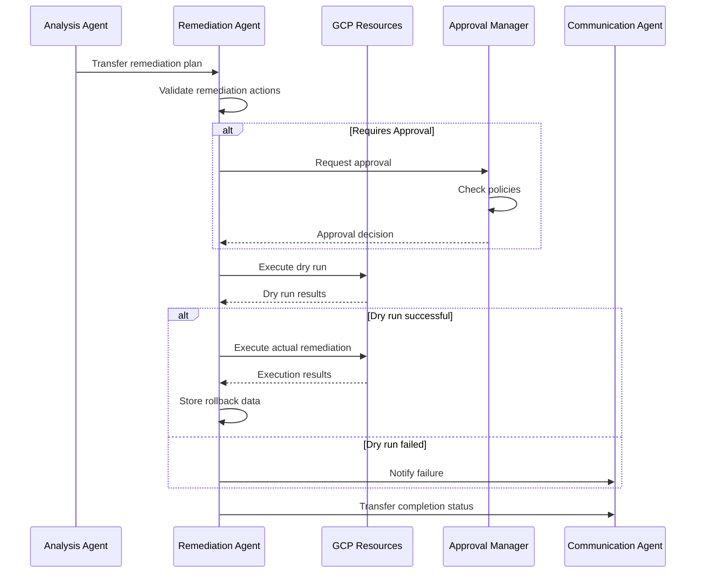

# Remediation Agent Documentation

The Remediation Agent is responsible for executing automated response actions to security incidents. Built on Google's Agent Development Kit (ADK), it implements safety controls, dry-run capabilities, and rollback mechanisms to ensure reliable and reversible remediation actions.

## Overview

- **Type**: LlmAgent (ADK base class)
- **Model**: Gemini Pro (for decision making)
- **Purpose**: Automated incident response and remediation
- **Location**: `src/remediation_agent/adk_agent.py`
- **Lines of Code**: 766 (most comprehensive agent)

## Architecture

### ADK Integration

```python
class RemediationAgent(SentinelOpsBaseAgent):
    """ADK-based agent for automated remediation with safety controls."""
    
    def __init__(self):
        super().__init__(
            name="remediation_agent",
            description="Executes remediation actions with safety controls",
            model="gemini-1.5-pro",
            tools=[
                # Network Security Tools
                BlockIPTool(),
                UpdateFirewallRuleTool(),
                EnableDDoSProtectionTool(),
                
                # Compute Security Tools
                IsolateVMTool(),
                StopInstanceTool(),
                SnapshotInstanceTool(),
                
                # IAM Security Tools
                RevokeCredentialsTool(),
                DisableServiceAccountTool(),
                RemoveIAMBindingTool(),
                
                # Data Security Tools
                RestrictBucketAccessTool(),
                EnableBucketLockTool(),
                
                # Utility Tools
                RollbackTool(),
                DryRunValidatorTool(),
                TransferToOrchestratorAgentTool(),
                TransferToCommunicationAgentTool()
            ]
        )
        self.safety_mode = True
        self.dry_run_default = True
```

## Remediation Tools

### Network Security Tools

#### 1. BlockIPTool

Blocks malicious IP addresses at the firewall level.

**Features:**
- Creates deny rules in Cloud Armor
- Updates VPC firewall rules
- Supports CIDR blocks
- Automatic expiration options

**Example Usage:**
```python
result = await block_ip_tool.execute(
    ip_address="192.168.1.100",
    reason="Brute force attack detected",
    duration_hours=24,
    dry_run=False
)
```

#### 2. UpdateFirewallRuleTool

Modifies existing firewall rules for immediate protection.

**Capabilities:**
- Add/remove source IPs
- Modify port ranges
- Update protocols
- Priority adjustments

#### 3. EnableDDoSProtectionTool

Activates Cloud Armor DDoS protection.

**Actions:**
- Enable adaptive protection
- Configure rate limiting
- Set up geo-blocking
- Create custom rules

### Compute Security Tools

#### 1. IsolateVMTool

Isolates compromised virtual machines from the network.

**Isolation Methods:**
- Remove external IPs
- Apply restrictive firewall tags
- Disable specific network interfaces
- Move to isolated VPC

**Safety Features:**
```python
class IsolateVMTool(BaseTool):
    def execute(self, instance_id: str, **kwargs):
        # Snapshot before isolation
        snapshot_id = self.create_snapshot(instance_id)
        
        # Store rollback information
        self.store_rollback_data({
            "instance_id": instance_id,
            "snapshot_id": snapshot_id,
            "original_network": self.get_network_config(instance_id)
        })
        
        # Perform isolation
        return self.isolate_instance(instance_id)
```

#### 2. StopInstanceTool

Stops compromised instances to prevent further damage.

**Features:**
- Graceful shutdown attempt
- Force stop after timeout
- Preservation of persistent disks
- Automatic restart scheduling

#### 3. SnapshotInstanceTool

Creates point-in-time snapshots for forensics and recovery.

**Capabilities:**
- Disk snapshots
- Machine images
- Metadata preservation
- Chain of custody tracking

### IAM Security Tools

#### 1. RevokeCredentialsTool

Revokes compromised credentials immediately.

**Supported Credential Types:**
- Service account keys
- OAuth tokens
- API keys
- User sessions

**Implementation:**
```python
class RevokeCredentialsTool(BaseTool):
    async def execute(self, credential_type: str, identifier: str):
        if credential_type == "service_account_key":
            await self.iam_client.delete_service_account_key(identifier)
        elif credential_type == "oauth_token":
            await self.revoke_oauth_token(identifier)
        elif credential_type == "api_key":
            await self.disable_api_key(identifier)
        
        # Log for audit trail
        await self.log_action("credential_revoked", {
            "type": credential_type,
            "identifier": identifier,
            "timestamp": datetime.utcnow()
        })
```

#### 2. DisableServiceAccountTool

Disables compromised service accounts.

**Actions:**
- Disable account
- Revoke all keys
- Remove IAM bindings
- Create audit entry

#### 3. RemoveIAMBindingTool

Removes specific IAM permissions.

**Features:**
- Granular permission removal
- Condition-based removal
- Bulk operations
- Inheritance handling

### Data Security Tools

#### 1. RestrictBucketAccessTool

Restricts access to compromised storage buckets.

**Capabilities:**
- Make buckets private
- Remove public access
- Update IAM policies
- Enable access logging

#### 2. EnableBucketLockTool

Enables retention policies to prevent data deletion.

**Features:**
- Retention period setting
- Lock configuration
- Compliance mode
- Event-based holds

## Safety Controls

### 1. Dry Run Mode

All remediation actions support dry-run mode:

```python
class RemediationActionBase:
    def execute(self, dry_run: bool = True, **kwargs):
        if dry_run:
            return self.simulate_action(**kwargs)
        else:
            return self.perform_action(**kwargs)
    
    def simulate_action(self, **kwargs):
        """Returns what would happen without making changes."""
        validation = self.validate_prerequisites(**kwargs)
        impact = self.calculate_impact(**kwargs)
        
        return {
            "dry_run": True,
            "would_succeed": validation["valid"],
            "impact_assessment": impact,
            "estimated_duration": self.estimate_duration(**kwargs)
        }
```

### 2. Approval Workflows

Critical actions require approval:

```python
class ApprovalRequired:
    ACTIONS = [
        "delete_instance",
        "revoke_all_credentials",
        "shutdown_project",
        "delete_data"
    ]
    
    async def check_approval(self, action: str, context: dict):
        if action in self.ACTIONS:
            approval = await self.request_approval(action, context)
            if not approval.approved:
                raise ApprovalDeniedException(
                    f"Action {action} denied by {approval.reviewer}"
                )
```

### 3. Rollback Capabilities

Every action is reversible:

```python
class RollbackManager:
    def __init__(self):
        self.rollback_store = FirestoreClient()
    
    async def store_rollback_data(self, action_id: str, data: dict):
        """Store data needed to reverse an action."""
        await self.rollback_store.create(
            collection="rollback_data",
            document_id=action_id,
            data={
                "action_type": data["action_type"],
                "original_state": data["original_state"],
                "timestamp": datetime.utcnow(),
                "ttl_hours": 168  # 7 days
            }
        )
    
    async def rollback(self, action_id: str):
        """Reverse a previous action."""
        data = await self.rollback_store.get(
            collection="rollback_data",
            document_id=action_id
        )
        
        return await self.apply_rollback(data)
```

## Remediation Workflows

### 1. Incident Response Flow



### 2. Progressive Remediation

The agent implements progressive remediation strategies:

```python
class ProgressiveRemediation:
    ESCALATION_LEVELS = [
        {
            "level": 1,
            "actions": ["block_ip", "rate_limit"],
            "severity": ["LOW", "MEDIUM"]
        },
        {
            "level": 2,
            "actions": ["isolate_vm", "revoke_credentials"],
            "severity": ["HIGH"]
        },
        {
            "level": 3,
            "actions": ["stop_instance", "disable_service_account"],
            "severity": ["CRITICAL"]
        }
    ]
    
    async def determine_actions(self, incident: Incident):
        """Determine appropriate remediation level."""
        for level in self.ESCALATION_LEVELS:
            if incident.severity in level["severity"]:
                return level["actions"]
        
        return []  # No automated action for undefined severities
```

## Performance & Optimization

### 1. Parallel Execution

Multiple non-conflicting actions execute in parallel:

```python
async def execute_remediation_plan(self, actions: List[RemediationAction]):
    # Group actions by resource type to avoid conflicts
    grouped = self.group_by_resource(actions)
    
    # Execute each group in parallel
    tasks = []
    for group in grouped.values():
        tasks.extend([self.execute_action(action) for action in group])
    
    results = await asyncio.gather(*tasks, return_exceptions=True)
    return self.consolidate_results(results)
```

### 2. Caching

Frequently accessed data is cached:

```python
@lru_cache(maxsize=1000)
def get_resource_metadata(resource_id: str):
    """Cache resource metadata to avoid repeated API calls."""
    return self.compute_client.get_instance(resource_id)
```

### 3. Batch Operations

Similar operations are batched:

```python
async def block_multiple_ips(self, ip_list: List[str]):
    """Batch IP blocking for efficiency."""
    firewall_rule = {
        "name": f"block-ips-{datetime.utcnow().timestamp()}",
        "source_ranges": ip_list,
        "denied": [{"IPProtocol": "all"}],
        "priority": 1000
    }
    
    return await self.firewall_client.create_rule(firewall_rule)
```

## Configuration

### Environment Variables

```env
# Safety Controls
REMEDIATION_DRY_RUN_DEFAULT=true
REMEDIATION_APPROVAL_REQUIRED=true
REMEDIATION_ROLLBACK_ENABLED=true

# Timeouts
REMEDIATION_ACTION_TIMEOUT=300
REMEDIATION_APPROVAL_TIMEOUT=600

# Limits
REMEDIATION_MAX_PARALLEL_ACTIONS=10
REMEDIATION_RATE_LIMIT_PER_MINUTE=20
```

### Action Configuration

```yaml
remediation_config:
  actions:
    block_ip:
      max_duration_hours: 168  # 7 days
      default_duration_hours: 24
      require_approval: false
      
    isolate_vm:
      snapshot_before_isolation: true
      remove_external_ip: true
      require_approval: true
      
    revoke_credentials:
      immediate: true
      notify_owner: true
      require_approval: true
      
  safety:
    enable_dry_run: true
    require_approval_for_critical: true
    enable_rollback: true
    rollback_retention_days: 7
```

## Monitoring & Metrics

### Key Metrics

- **Action Success Rate**: Percentage of successful remediations
- **Average Execution Time**: Time to complete actions
- **Rollback Frequency**: How often rollbacks are needed
- **Approval Wait Time**: Time waiting for approvals

### Audit Trail

All actions are logged for compliance:

```python
class AuditLogger:
    async def log_action(self, action: RemediationAction, result: dict):
        audit_entry = {
            "timestamp": datetime.utcnow(),
            "action_type": action.type,
            "resource": action.resource_id,
            "executed_by": "remediation_agent",
            "dry_run": action.dry_run,
            "result": result,
            "approval_id": action.approval_id,
            "incident_id": action.incident_id
        }
        
        await self.audit_store.create(audit_entry)
```

## Best Practices

1. **Always Test with Dry Run**
   - Validate actions before execution
   - Review impact assessment
   - Check for conflicts

2. **Implement Progressive Response**
   - Start with least invasive actions
   - Escalate based on effectiveness
   - Monitor for side effects

3. **Maintain Rollback Data**
   - Store complete state before changes
   - Test rollback procedures
   - Set appropriate retention

4. **Document Actions**
   - Clear action descriptions
   - Impact assessments
   - Success criteria

5. **Monitor and Iterate**
   - Track action effectiveness
   - Update based on outcomes
   - Refine automation rules

---

*The Remediation Agent provides powerful automated response capabilities while maintaining safety, reversibility, and compliance through comprehensive controls and audit trails.*