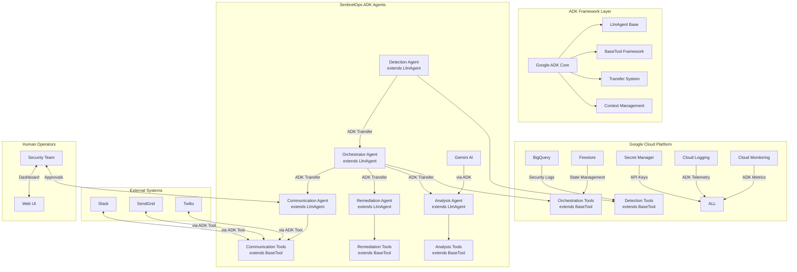
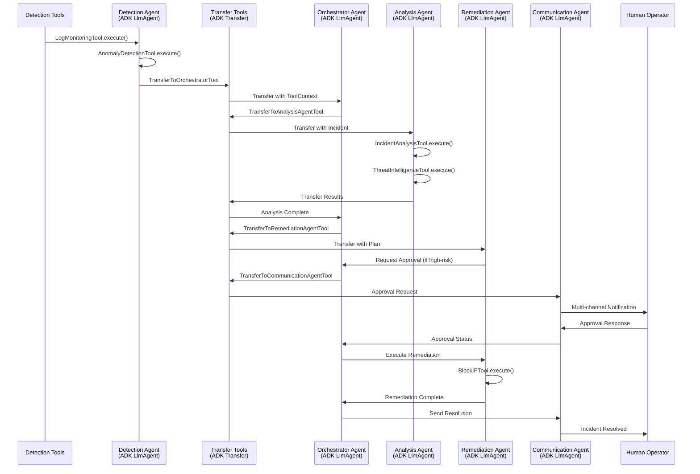

# SentinelOps Architecture

This comprehensive guide covers the complete SentinelOps architecture, demonstrating how Google's Agent Development Kit (ADK) enables enterprise-grade security operations through orchestrated AI agents.

## Table of Contents
1. [Overview](#overview)
2. [High-Level Architecture](#high-level-architecture)
3. [ADK Framework Components](#adk-framework-components)
4. [Agent Implementations](#agent-implementations)
5. [Tool Architecture](#tool-architecture)
6. [Data Flow & State Management](#data-flow--state-management)
7. [Technology Stack](#technology-stack)
8. [Security Architecture](#security-architecture)
9. [Deployment & Infrastructure](#deployment--infrastructure)
10. [Scalability & Performance](#scalability--performance)
11. [Monitoring & Observability](#monitoring--observability)

## Overview

SentinelOps uses Google's Agent Development Kit (ADK) to implement a sophisticated multi-agent architecture for cloud security incident response. The system leverages ADK's LlmAgent base classes and Tool patterns to create production-grade security automation.

## High-Level Architecture with ADK

## ADK Component Architecture

### Agent Communication Flow with ADK Transfer System

## ADK Agent Implementations

### Detection Agent (ADK LlmAgent)

The Detection Agent extends ADK's LlmAgent and uses custom tools for security monitoring.

**ADK Components:**
- **Base Class**: `SentinelOpsBaseAgent(LlmAgent)`
- **Tools**:
  - `LogMonitoringTool(BaseTool)` - BigQuery log analysis with 4 detection queries
  - `AnomalyDetectionTool(BaseTool)` - Sophisticated anomaly detection rules
  - `IncidentCreationTool(BaseTool)` - Smart incident deduplication
  - `TransferToOrchestratorTool(BaseTool)` - ADK transfer implementation

**Key Features:**
- Real-time BigQuery monitoring with pagination
- Event correlation across multiple log sources
- Intelligent anomaly detection with ML patterns
- ADK context propagation for incident data

### Analysis Agent (ADK LlmAgent with Gemini)

The Analysis Agent leverages ADK's Gemini integration for AI-powered analysis.

**ADK Components:**
- **Base Class**: `SentinelOpsBaseAgent(LlmAgent)`
- **Model**: Gemini Pro via ADK integration
- **Tools**:
  - `IncidentAnalysisTool(BaseTool)` - Gemini-powered analysis
  - `ThreatIntelligenceTool(BaseTool)` - IOC lookup and correlation
  - `RecommendationGeneratorTool(BaseTool)` - Actionable remediation plans

**Key Features:**
- Structured prompt engineering for security analysis
- Response parsing with fallback mechanisms
- Threat intelligence enrichment
- Context-aware recommendations

### Remediation Agent (ADK LlmAgent)

The Remediation Agent implements production-ready security actions as ADK tools.

**ADK Components:**
- **Base Class**: `SentinelOpsBaseAgent(LlmAgent)`
- **Tools**:
  - `BlockIPTool(BaseTool)` - Firewall rule management
  - `IsolateVMTool(BaseTool)` - VM network isolation
  - `QuarantineInstanceTool(BaseTool)` - Instance quarantine with snapshots
  - `RevokeCredentialsTool(BaseTool)` - Credential rotation
  - `UpdateFirewallTool(BaseTool)` - Security policy updates

**Key Features:**
- Dry-run mode for safety
- Approval workflows for high-risk actions
- Rollback capabilities
- Comprehensive audit logging

### Communication Agent (ADK LlmAgent)

The Communication Agent handles multi-channel notifications using ADK tools.

**ADK Components:**
- **Base Class**: `SentinelOpsBaseAgent(LlmAgent)`
- **Tools**:
  - `SlackNotificationTool(BaseTool)` - Rich Slack messages
  - `EmailNotificationTool(BaseTool)` - HTML email with SendGrid/SMTP
  - `SMSNotificationTool(BaseTool)` - Twilio SMS integration
  - `WebhookNotificationTool(BaseTool)` - External system integration
  - `ReportGeneratorTool(BaseTool)` - Formatted security reports

**Key Features:**
- Template-based messaging
- Channel-specific formatting
- Rate limiting and delivery tracking
- Escalation management

### Orchestrator Agent (ADK LlmAgent)

The Orchestrator coordinates the workflow using ADK's orchestration patterns.

**ADK Components:**
- **Base Class**: `SentinelOpsBaseAgent(LlmAgent)`
- **Tools**:
  - `WorkflowManagementTool(BaseTool)` - State persistence in Firestore
  - `WorkflowMonitoringTool(BaseTool)` - Health and performance tracking
  - `IncidentPriorityTool(BaseTool)` - Multi-factor priority calculation
  - `AutoApprovalTool(BaseTool)` - Risk-based auto-approval
  - `EscalationTool(BaseTool)` - Timeout and escalation handling

**Key Features:**
- Intelligent workflow routing
- Priority-based processing
- Automatic escalation
- Comprehensive metrics

## ADK Integration Benefits

### 1. **Production-Grade Tool Pattern**
- Each security function is a reusable ADK tool
- Clear separation of concerns
- Easy to test and maintain

### 2. **Native Agent Communication**
- ADK Transfer system replaces Pub/Sub
- Rich context passing between agents
- Type-safe message handling

### 3. **Built-in AI Integration**
- Direct Gemini access through ADK
- Structured prompt management
- Response parsing utilities

### 4. **Enterprise Features**
- ADK telemetry for monitoring
- Cloud Trace integration
- Error handling and retry logic
- Memory and context management

## Technology Stack with ADK

- **Google Agent Development Kit (ADK)**
  - Core agent framework
  - Tool execution engine
  - Transfer system for communication
  - Context and memory management

- **Google Cloud Platform**
  - BigQuery for security log storage
  - Firestore for workflow state
  - Cloud Run for agent deployment
  - Secret Manager for API keys
  - Cloud Monitoring for ADK metrics

- **AI Components**
  - Gemini Pro via ADK integration
  - Structured security analysis
  - Automated threat assessment

- **External Integrations**
  - Slack SDK for notifications
  - SendGrid/SMTP for email
  - Twilio for SMS alerts

- **Development Stack**
  - Python 3.10+ with ADK SDK
  - Next.js 15.3 for web interface
  - TypeScript for type safety
  - AsyncIO for concurrent operations
  - Pydantic for data validation
  - ADK tools for all integrations

## Related Documentation

- [Web Interface Architecture](./web-interface-architecture.md) - Detailed information about the UI implementation
- [Agent Communication API](./agent-communication-api.md)
- [Multi-Region HA Guide](./multi-region-ha-guide.md)

## Security Architecture

### Authentication & Authorization
- Service accounts with least privilege
- API key and JWT token support
- Role-based access control (RBAC)
- OAuth 2.0 for user authentication

### Data Protection
- Encryption at rest using Google Cloud KMS
- Encryption in transit using TLS 1.3
- Secret Manager for sensitive credentials
- Data retention policies

### Network Security
- Private VPC for agent communication
- Cloud NAT for outbound connections
- Firewall rules for ingress control
- VPC Service Controls for API access

## Deployment & Infrastructure

### Development Environment
- Local Docker containers
- Minikube for Kubernetes testing
- Local emulators for GCP services
- Mock data generators

### Production Environment
- Cloud Run for stateless agents
- Firestore for state management
- ADK Transfer Tools for agent communication
- Cloud Load Balancing

### CI/CD Pipeline
- GitHub Actions for CI
- Cloud Build for container builds
- Artifact Registry for images
- Automated deployment to Cloud Run

## Scalability & Performance

### Horizontal Scaling
- Agents run as Cloud Run services
- Auto-scaling based on load
- Regional deployment for HA
- Load balancing across instances

### Performance Optimization
- Analysis Agent caching (1-hour TTL)
- Batch processing for similar incidents
- Async processing throughout
- Connection pooling for Firestore
- 30-50% reduction in API costs through caching

## Monitoring & Observability

### Metrics
- Prometheus metrics endpoint
- Google Cloud Monitoring integration
- Custom dashboards in Grafana
- SLI/SLO tracking

### Logging
- Structured JSON logging
- Correlation IDs for tracing
- Log aggregation in Cloud Logging
- Log-based metrics and alerts

### Tracing
- OpenTelemetry integration
- Distributed tracing
- Performance profiling
- Error tracking

### ADK Telemetry
- Built-in agent performance metrics
- Transfer success/failure rates
- Tool execution timing
- Context propagation tracking
