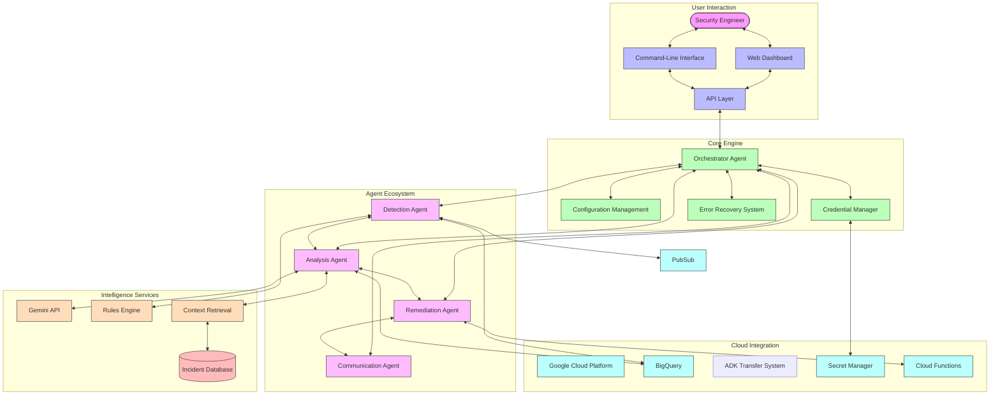
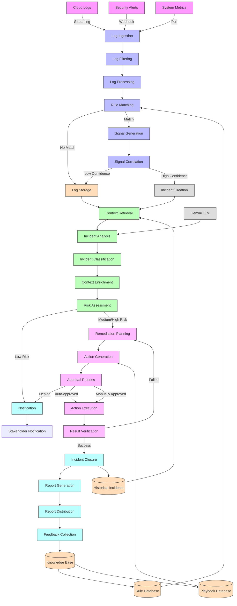
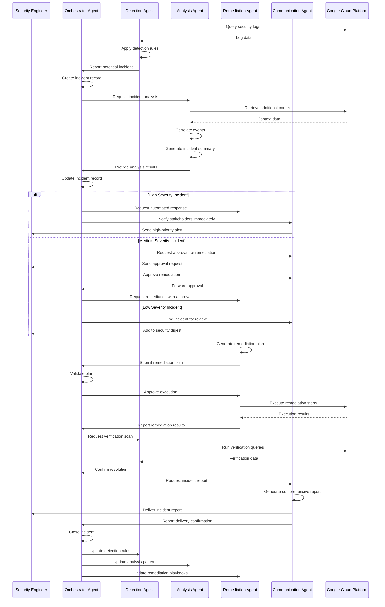
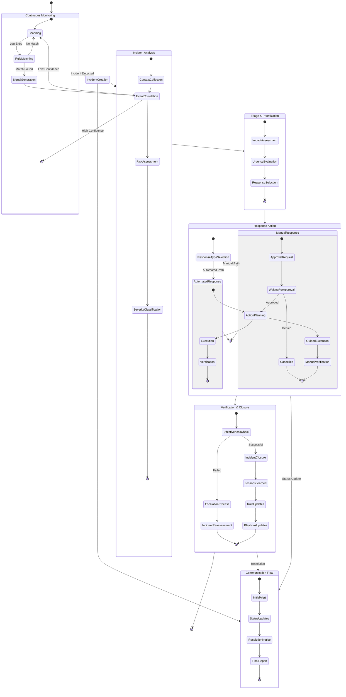

# SentinelOps Architecture Diagrams

This document provides a comprehensive overview of the SentinelOps architecture through a series of detailed diagrams. These diagrams illustrate the system's components, interactions, data flows, and integration points.

## Table of Contents

1. [High-Level Architecture](#high-level-architecture)
2. [Core Components](#core-components)
3. [Data Flow](#data-flow)
4. [Agent Interactions](#agent-interactions)
5. [GCP Integration](#gcp-integration)
6. [Incident Response Workflow](#incident-response-workflow)

## High-Level Architecture

This diagram illustrates the overall architecture of the SentinelOps system, showing the main components and their relationships.

## Core Components

This diagram details the internal components of each agent and the core services they depend on.

```mermaid
flowchart TB
    subgraph "Detection Agent"
        D_Agent[Agent Controller]
        D_Rules[Builtin Rules]
        D_QueryBuilder[Query Builder]
        D_QueryCache[Query Cache]
        D_Optimizer[Query Optimizer]
        D_EventCorrelator[Event Correlator]
        D_QuotaManager[Quota Manager]
        D_Pagination[Query Pagination]
        D_CatchupManager[Catchup Scan Manager]
        D_Monitoring[Performance Monitoring]
        
        D_Agent --> D_Rules
        D_Agent --> D_QueryBuilder
        D_QueryBuilder --> D_QueryCache
        D_QueryBuilder --> D_Optimizer
        D_Agent --> D_EventCorrelator
        D_Agent --> D_QuotaManager
        D_Agent --> D_Pagination
        D_Agent --> D_CatchupManager
        D_Agent --> D_Monitoring
    end
    
    subgraph "Analysis Agent"
        A_Agent[Agent Controller]
        A_EventExtraction[Event Extraction]
        A_EventCorrelation[Event Correlation]
        A_ContextRetrieval[Context Retrieval]
        A_IncidentRetrieval[Incident Retrieval]
        A_RecommendationEngine[Recommendation Engine]
        A_TokenOptimizer[Token Optimizer]
        A_Monitoring[Performance Monitoring]
        
        A_Agent --> A_EventExtraction
        A_Agent --> A_EventCorrelation
        A_Agent --> A_ContextRetrieval
        A_Agent --> A_IncidentRetrieval
        A_Agent --> A_RecommendationEngine
        A_Agent --> A_TokenOptimizer
        A_Agent --> A_Monitoring
    end
    
    subgraph "Remediation Agent"
        R_Agent[Agent Controller]
        R_ActionPlanner[Action Planner]
        R_RiskAssessor[Risk Assessor]
        R_ExecutionEngine[Execution Engine]
        R_VerificationSystem[Verification System]
        R_RollbackManager[Rollback Manager]
        
        R_Agent --> R_ActionPlanner
        R_Agent --> R_RiskAssessor
        R_Agent --> R_ExecutionEngine
        R_Agent --> R_VerificationSystem
        R_Agent --> R_RollbackManager
    end
    
    subgraph "Communication Agent"
        C_Agent[Agent Controller]
        C_NotificationSystem[Notification System]
        C_ReportGenerator[Report Generator]
        C_SeverityClassifier[Severity Classifier]
        C_StakeholderManager[Stakeholder Manager]
        
        C_Agent --> C_NotificationSystem
        C_Agent --> C_ReportGenerator
        C_Agent --> C_SeverityClassifier
        C_Agent --> C_StakeholderManager
    end
    
    subgraph "Orchestrator Agent"
        O_Agent[Agent Controller]
        O_WorkflowManager[Workflow Manager]
        O_StateManager[State Manager]
        O_ErrorHandler[Error Handler]
        O_AuditLogger[Audit Logger]
        O_CredentialManager[Credential Manager]
        
        O_Agent --> O_WorkflowManager
        O_Agent --> O_StateManager
        O_Agent --> O_ErrorHandler
        O_Agent --> O_AuditLogger
        O_Agent --> O_CredentialManager
    end
    
    subgraph "Core Services"
        Base[Base Agent Class]
        Exceptions[Exception Handling]
        Recovery[Recovery System]
        Secrets[Secrets Management]
    end
    
    %% Cross-Agent Interactions
    EventBus[Event Bus]
    
    D_Agent <--> EventBus
    A_Agent <--> EventBus
    R_Agent <--> EventBus
    C_Agent <--> EventBus
    O_Agent <--> EventBus
    
    %% Core Service Connections
    D_Agent --> Base
    A_Agent --> Base
    R_Agent --> Base
    C_Agent --> Base
    O_Agent --> Base
    
    O_ErrorHandler --> Exceptions
    O_ErrorHandler --> Recovery
    O_CredentialManager --> Secrets
    
    %% Agent Interactions
    D_EventCorrelator --> A_EventCorrelation
    A_RecommendationEngine --> R_ActionPlanner
    R_ExecutionEngine --> C_ReportGenerator
    O_WorkflowManager --> D_Agent
    O_WorkflowManager --> A_Agent
    O_WorkflowManager --> R_Agent
    O_WorkflowManager --> C_Agent
    
    %% Style definitions
    classDef detection fill:#f9d,stroke:#333,stroke-width:1px;
    classDef analysis fill:#bbf,stroke:#333,stroke-width:1px;
    classDef remediation fill:#bfb,stroke:#333,stroke-width:1px;
    classDef communication fill:#fdb,stroke:#333,stroke-width:1px;
    classDef orchestrator fill:#bff,stroke:#333,stroke-width:1px;
    classDef core fill:#ddd,stroke:#333,stroke-width:1px;
    classDef bus fill:#fbb,stroke:#333,stroke-width:1px;
    
    %% Apply styles
    class D_Agent,D_Rules,D_QueryBuilder,D_QueryCache,D_Optimizer,D_EventCorrelator,D_QuotaManager,D_Pagination,D_CatchupManager,D_Monitoring detection;
    class A_Agent,A_EventExtraction,A_EventCorrelation,A_ContextRetrieval,A_IncidentRetrieval,A_RecommendationEngine,A_TokenOptimizer,A_Monitoring analysis;
    class R_Agent,R_ActionPlanner,R_RiskAssessor,R_ExecutionEngine,R_VerificationSystem,R_RollbackManager remediation;
    class C_Agent,C_NotificationSystem,C_ReportGenerator,C_SeverityClassifier,C_StakeholderManager communication;
    class O_Agent,O_WorkflowManager,O_StateManager,O_ErrorHandler,O_AuditLogger,O_CredentialManager orchestrator;
    class Base,Exceptions,Recovery,Secrets core;
    class EventBus bus;
```

## Data Flow

This diagram shows how data flows through the SentinelOps system, from initial detection to incident resolution.

## Agent Interactions

This sequence diagram illustrates how the different agents interact during an incident response scenario.

## GCP Integration

This diagram shows how SentinelOps integrates with various Google Cloud Platform services.

```mermaid
graph TB
    subgraph "SentinelOps System"
        API[API Gateway]
        Core[Core Engine]
        Agents[Agent System]
        Storage[Local Storage]
    end
    
    subgraph "Google Cloud Platform"
        subgraph "Data Sources"
            CloudLogs[(Cloud Logging)]
            SecurityCmd[(Security Command Center)]
            AuditLogs[(Audit Logs)]
            VPCFlow[(VPC Flow Logs)]
            FirewallRules[(Firewall Rules)]
        end
        
        subgraph "Data Processing"
            BigQuery[(BigQuery)]
            Dataflow[Dataflow]
            ADKContext[ADK Context Management]
        end
        
        subgraph "Execution Environment"
            CloudRun[Cloud Run]
            CloudFunctions[Cloud Functions]
            GCE[Compute Engine]
        end
        
        subgraph "Security & Management"
            IAM[Identity & Access Management]
            SecretManager[Secret Manager]
            KMS[Key Management Service]
        end
        
        subgraph "AI & ML"
            Gemini[Gemini API]
            VertexAI[Vertex AI]
        end
    end
    
    %% Data Source Connections
    CloudLogs --> BigQuery
    SecurityCmd --> BigQuery
    AuditLogs --> BigQuery
    VPCFlow --> BigQuery
    FirewallRules --> BigQuery
    
    %% Data Processing Flow
    CloudLogs --> PubSub
    PubSub --> Dataflow
    Dataflow --> BigQuery
    
    %% SentinelOps to GCP Connections
    API --> IAM
    Core --> CloudRun
    Agents --> CloudFunctions
    Storage --> BigQuery
    
    %% Security Connections
    Core --> SecretManager
    Core --> KMS
    Agents --> SecretManager
    
    %% AI Connections
    Agents --> Gemini
    Agents --> VertexAI
    
    %% Execution Environment
    CloudRun --> IAM
    CloudFunctions --> IAM
    GCE --> IAM
    
    %% Style Classes
    classDef sentinelops fill:#f9f,stroke:#333,stroke-width:1px;
    classDef datasource fill:#bbf,stroke:#333,stroke-width:1px;
    classDef processing fill:#bfb,stroke:#333,stroke-width:1px;
    classDef execution fill:#fbf,stroke:#333,stroke-width:1px;
    classDef security fill:#fdb,stroke:#333,stroke-width:1px;
    classDef ai fill:#bff,stroke:#333,stroke-width:1px;
    
    %% Apply Styles
    class API,Core,Agents,Storage sentinelops;
    class CloudLogs,SecurityCmd,AuditLogs,VPCFlow,FirewallRules datasource;
    class BigQuery,Dataflow,PubSub processing;
    class CloudRun,CloudFunctions,GCE execution;
    class IAM,SecretManager,KMS security;
    class Gemini,VertexAI ai;
```

## Incident Response Workflow

This state diagram illustrates the complete incident response workflow, from detection to resolution.

