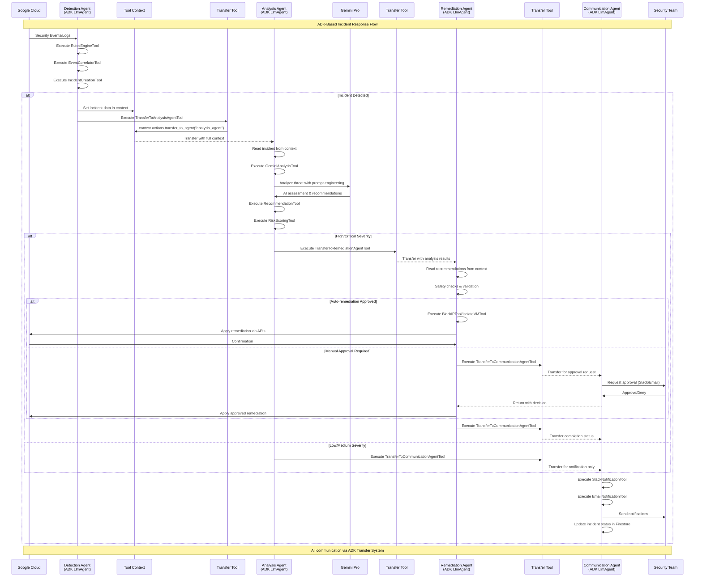

# SentinelOps Data Flow with ADK



## ADK Data Flow Components

### Tool Context Propagation
```mermaid
graph LR
    subgraph DetectionContext[Detection Context]
        DC[Tool Context<br/>- incident_id<br/>- events[]<br/>- severity<br/>- detection_time]
    end
    
    subgraph AnalysisContext[Analysis Context +]
        AC[Enriched Context<br/>+ analysis_result<br/>+ risk_score<br/>+ recommendations[]<br/>+ confidence]
    end
    
    subgraph RemediationContext[Remediation Context +]
        RC[Action Context<br/>+ actions_to_take[]<br/>+ dry_run_results<br/>+ approval_status<br/>+ rollback_plan]
    end
    
    subgraph CommunicationContext[Communication Context +]
        CC[Final Context<br/>+ remediation_results<br/>+ notification_channels[]<br/>+ escalation_needed<br/>+ incident_summary]
    end
    
    DC -->|Transfer| AC
    AC -->|Transfer| RC
    RC -->|Transfer| CC
    
    style DC fill:#fff3e0
    style AC fill:#ffe0b2
    style RC fill:#ffebee
    style CC fill:#e8f5e9
```

## Data Flow Description with ADK

### 1. Detection Phase (ADK Tools)
- **Input**: Raw security events from GCP services
- **Tools Executed**:
  - `LogMonitoringTool`: Queries BigQuery for security events
  - `RulesEngineTool`: Applies detection rules
  - `EventCorrelatorTool`: Groups related events
  - `IncidentCreationTool`: Creates deduplicated incidents
- **Output**: Incident object in tool context

### 2. Transfer to Analysis
- **Mechanism**: `TransferToAnalysisAgentTool`
- **Context Data**:
  ```python
  context.data = {
      "incident": incident_object,
      "priority": "high",
      "source": "real_time_detection",
      "correlation_id": "uuid",
      "event_count": 15
  }
  ```
- **Transfer**: `context.actions.transfer_to_agent("analysis_agent")`

### 3. Analysis Phase (Gemini Integration)
- **Input**: Incident from context
- **Tools Executed**:
  - `GeminiAnalysisTool`: Multi-shot prompting with Gemini Pro
  - `RecommendationTool`: Generate remediation actions
  - `RiskScoringTool`: Calculate risk metrics
  - `ContextRetrievalTool`: Enrich with historical data
- **Output**: Analysis results added to context

### 4. Conditional Routing
- **High/Critical**: Transfer to Remediation Agent
- **Medium/Low**: Transfer directly to Communication Agent
- **Decision Logic**: Built into Analysis Agent workflow

### 5. Remediation Phase (Production Controls)
- **Input**: Analysis results and recommendations
- **Tools Executed**:
  - `SafetyCheckTool`: Validate proposed actions
  - `BlockIPTool`: Create firewall rules (if needed)
  - `IsolateVMTool`: Isolate instances (if needed)
  - `RevokeCredentialsTool`: Revoke keys (if needed)
- **Controls**:
  - Dry-run mode for validation
  - Approval requirements for critical actions
  - Rollback plans generated

### 6. Communication Phase (Multi-Channel)
- **Input**: Complete incident context
- **Tools Executed**:
  - `SlackNotificationTool`: Send Slack alerts
  - `EmailNotificationTool`: Send email reports
  - `SMSNotificationTool`: Critical alerts via SMS
  - `WebhookTool`: Custom integrations
- **Outputs**:
  - Notifications sent to all channels
  - Incident status updated in Firestore
  - Audit trail maintained

## Key ADK Patterns in Data Flow

### 1. Context Enrichment Pattern
Each agent adds to the context without removing previous data:
```python
# In Analysis Agent
async def execute(self, context: ToolContext, **kwargs):
    # Read from context
    incident = context.data.get("incident")
    
    # Process
    analysis_result = await self.analyze(incident)
    
    # Add to context (don't overwrite)
    context.data["analysis_result"] = analysis_result
    context.data["analyzed_at"] = datetime.now()
    
    # Transfer with enriched context
    return await self.transfer_to_next_agent(context)
```

### 2. Error Handling in Transfers
```python
class TransferWithFallback:
    async def execute(self, context: ToolContext, **kwargs):
        primary_target = kwargs.get("target")
        fallback_target = kwargs.get("fallback", "orchestrator_agent")
        
        try:
            context.actions.transfer_to_agent(primary_target)
            return {"status": "success", "target": primary_target}
        except TransferException:
            # Fallback to orchestrator
            context.actions.transfer_to_agent(fallback_target)
            return {"status": "fallback", "target": fallback_target}
```

### 3. Audit Trail Pattern
Every transfer is logged for compliance:
```python
class AuditedTransferTool(BaseTool):
    async def execute(self, context: ToolContext, **kwargs):
        audit_entry = {
            "timestamp": datetime.now(),
            "source_agent": context.data.get("current_agent"),
            "target_agent": kwargs.get("target"),
            "incident_id": context.data.get("incident_id"),
            "context_size": len(str(context.data))
        }
        
        await self.audit_logger.log(audit_entry)
        context.actions.transfer_to_agent(kwargs.get("target"))
```

## Performance Optimizations

1. **Context Size Management**: Only essential data transferred
2. **Lazy Loading**: Large datasets referenced, not copied
3. **Caching**: Analysis results cached to avoid redundant Gemini calls
4. **Parallel Tools**: Where possible, tools execute concurrently
5. **Circuit Breakers**: Prevent cascade failures in transfers