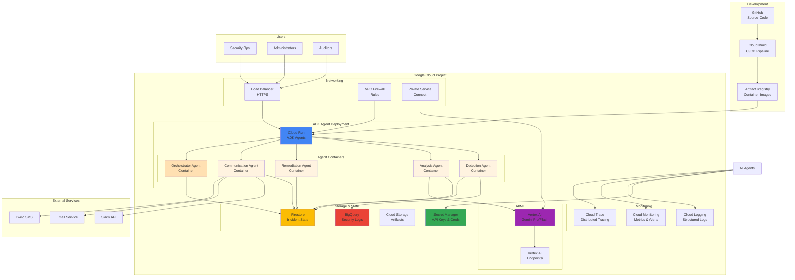
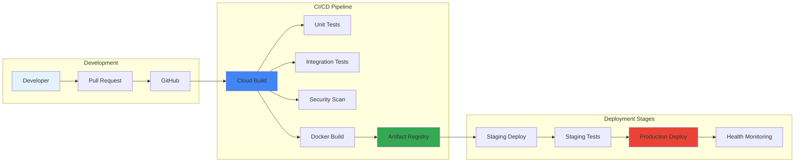

# Deployment Architecture with ADK



## ADK Deployment Components

### Cloud Run (ADK Agent Hosting)
- **Service**: Fully managed serverless platform
- **Agents**: Each ADK agent runs as a containerized service
- **Scaling**: Auto-scales based on load (0 to N instances)
- **Benefits**:
  - No infrastructure management
  - Pay-per-use pricing
  - Automatic HTTPS endpoints
  - Built-in load balancing

### Agent Containers
Each agent is packaged as a Docker container with:
```dockerfile
FROM python:3.11-slim

# Install ADK and dependencies
RUN pip install google-adk google-cloud-gemini

# Copy agent code and business logic
COPY src/detection_agent /app/detection_agent
COPY src/common /app/common
COPY src/tools /app/tools

# Set up ADK agent
ENV ADK_AGENT_NAME=detection_agent
ENV GOOGLE_CLOUD_PROJECT=sentinelops

CMD ["python", "-m", "detection_agent.main"]
```

### Storage Architecture
1. **BigQuery**: Raw security logs and analytics
   - Partitioned tables for efficient querying
   - Streaming inserts for real-time data
   - Cost-effective long-term storage

2. **Firestore**: Incident state and agent coordination
   - Real-time synchronization
   - Document-based storage for incidents
   - Offline support for resilience

3. **Secret Manager**: Secure credential storage
   - API keys for external services
   - Service account keys
   - Encryption keys

### Networking & Security
1. **VPC Configuration**:
   - Private IP addresses for internal communication
   - Firewall rules restricting access
   - Private Service Connect for Vertex AI

2. **Load Balancing**:
   - Global HTTPS load balancer
   - SSL/TLS termination
   - DDoS protection

3. **Identity & Access Management**:
   - Service accounts with least privilege
   - Workload Identity for Kubernetes
   - Binary Authorization for containers

### AI/ML Infrastructure
1. **Vertex AI Integration**:
   - Gemini Pro for analysis agent
   - Gemini Flash for detection agent
   - Private endpoints for security

2. **Model Configuration**:
   ```python
   # Production Gemini configuration
   analysis_model = GenerativeModel(
       "gemini-1.5-pro-001",
       generation_config={
           "temperature": 0.2,  # Lower for consistency
           "top_p": 0.8,
           "top_k": 40,
           "max_output_tokens": 2048,
       },
       safety_settings=production_safety_settings
   )
   ```

### Monitoring & Observability
1. **Cloud Logging**:
   - Structured JSON logs from all agents
   - Log-based metrics for alerting
   - Log sinks for long-term storage

2. **Cloud Monitoring**:
   - Custom metrics for agent performance
   - SLO monitoring (99.9% uptime)
   - Alert policies for incidents

3. **Cloud Trace**:
   - Distributed tracing across agents
   - ADK tool execution timing
   - Transfer latency tracking

## Deployment Pipeline



### Deployment Configuration
```yaml
# cloud-run-service.yaml
apiVersion: serving.knative.dev/v1
kind: Service
metadata:
  name: sentinelops-detection-agent
spec:
  template:
    metadata:
      annotations:
        run.googleapis.com/execution-environment: gen2
        run.googleapis.com/cpu-throttling: "false"
    spec:
      containers:
      - image: gcr.io/PROJECT_ID/detection-agent:latest
        resources:
          limits:
            cpu: "2"
            memory: "2Gi"
        env:
        - name: ADK_AGENT_NAME
          value: detection_agent
        - name: GEMINI_MODEL
          value: gemini-1.5-flash
        - name: LOG_LEVEL
          value: INFO
      serviceAccountName: detection-agent-sa
```

## Key Deployment Decisions

1. **No Cloud Functions**: All remediation logic runs within ADK agents
2. **Containerized Agents**: Each agent is independently deployable
3. **Managed Services**: Leverage GCP managed services for reduced ops
4. **Zero-Downtime Deployments**: Blue-green deployments via Cloud Run
5. **Cost Optimization**: Auto-scaling to zero for development environments

## Production Readiness Checklist

- [x] ADK agents containerized and tested
- [x] Firestore for state management (not Cloud Functions)
- [x] Secret Manager integration for credentials
- [x] VPC security controls implemented
- [x] Monitoring and alerting configured
- [x] CI/CD pipeline established
- [x] Disaster recovery plan documented
- [ ] Load testing completed
- [ ] Security audit passed
- [ ] Production deployment approved