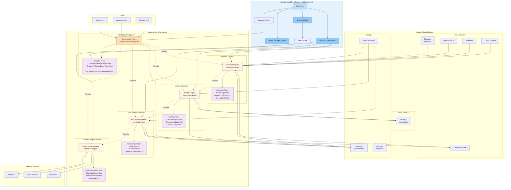

# SentinelOps System Architecture with ADK

## Architecture Components with ADK

### Google Agent Development Kit (ADK)
- **ADK Core**: Foundation framework providing agent orchestration
- **LlmAgent**: Base class for all intelligent agents with Gemini integration
- **SequentialAgent**: Used for orchestrator to coordinate workflows
- **BaseTool**: Base class for all domain-specific tools
- **Tool Context**: Mechanism for passing data between tools and agents
- **Transfer System**: ADK's native agent-to-agent communication

### ADK Agents (Production Implementation)
- **Detection Agent**: Extends LlmAgent, monitors cloud resources for security incidents
  - Leverages Gemini Flash for intelligent pattern recognition
  - Executes specialized detection tools
- **Analysis Agent**: Extends LlmAgent, uses Gemini Pro for threat analysis
  - Sophisticated prompt engineering for security analysis
  - Multi-shot prompting for comprehensive analysis
- **Remediation Agent**: Extends LlmAgent, executes automated response actions
  - Production-grade tools with safety mechanisms
  - Direct GCP API integration
- **Communication Agent**: Extends LlmAgent, manages notifications
  - Multi-channel notification support
  - Template-based messaging
- **Orchestrator Agent**: Extends SequentialAgent, coordinates workflows
  - Conditional routing based on incident severity
  - Manages complex incident response workflows

### ADK Tools (Domain Expertise)
Each agent has 5-10 specialized tools that extend BaseTool:
- **Detection Tools**: Security event analysis and correlation
- **Analysis Tools**: AI-powered threat assessment and recommendations
- **Remediation Tools**: Automated response actions with safety controls
- **Communication Tools**: Multi-channel notification delivery
- **Transfer Tools**: Enable agent-to-agent communication via ADK

### Key Architecture Features
1. **ADK Native Design**: Built from the ground up using ADK patterns
2. **Tool-First Approach**: All functionality exposed through ADK tools
3. **Transfer System**: ADK's native agent communication
4. **Direct API Integration**: Agents interact directly with GCP services
5. **Production Patterns**: Circuit breakers, caching, telemetry in every tool