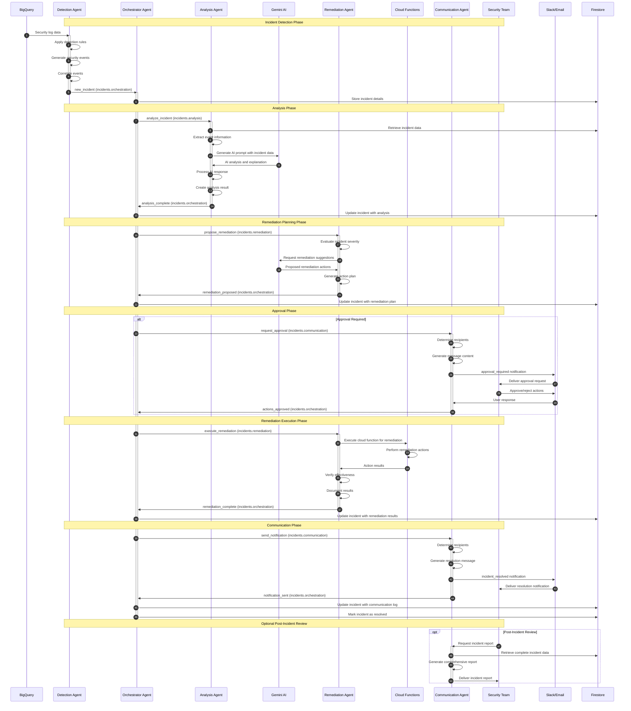

# SentinelOps Incident Response Workflow

The following sequence diagram illustrates the complete incident response workflow in the SentinelOps multi-agent architecture.

## Workflow Explanation

This diagram shows the complete incident response workflow in SentinelOps:

1. **Detection Phase**: The Detection Agent monitors BigQuery logs, applies detection rules, and creates incidents when suspicious activity is found.

2. **Analysis Phase**: The Orchestrator coordinates with the Analysis Agent, which uses Gemini AI to assess the incident's severity and impact.

3. **Remediation Planning**: The Remediation Agent works with Gemini AI to develop an action plan based on the incident analysis.

4. **Approval Workflow**: For incidents requiring human oversight, the Communication Agent manages the interaction with the Security Team via Slack or email.

5. **Remediation Execution**: Upon approval, remediation actions are executed through Cloud Functions to address the security issue.

6. **Resolution Communication**: The Communication Agent notifies all stakeholders of incident resolution and outcomes.

7. **Post-Incident Review**: An optional comprehensive incident report can be generated for review and future improvements.

All incident data is persisted in Firestore throughout the workflow, and the Gemini AI integration provides intelligent analysis and remediation planning.
