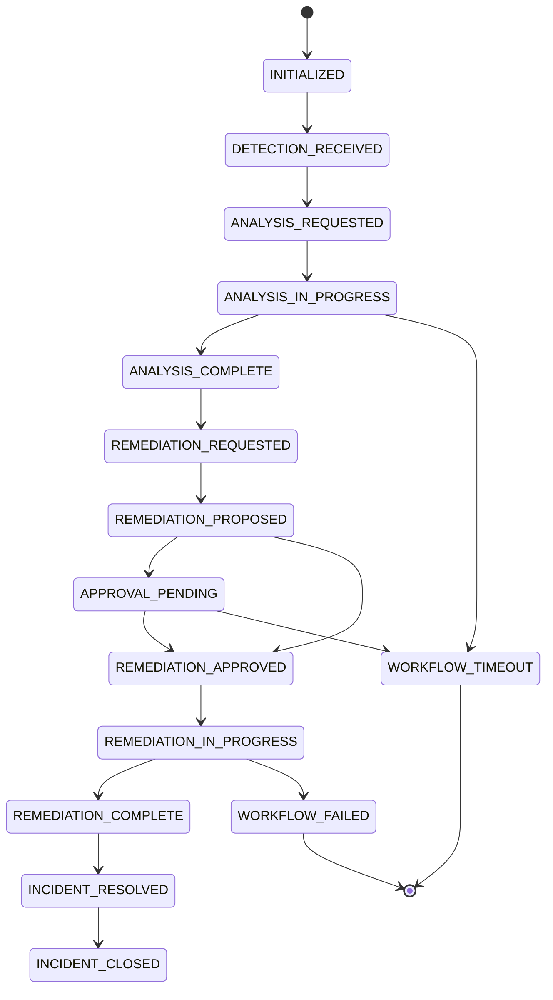

# Orchestration Agent Documentation

## Overview

The Orchestration Agent is the central coordinator of the SentinelOps security automation platform. It manages the entire incident response workflow, coordinating between Detection, Analysis, Remediation, and Communication agents to ensure efficient and reliable incident handling.

## Table of Contents

1. [Architecture](#architecture)
2. [Workflow Management](#workflow-management)
3. [Configuration](#configuration)
4. [Monitoring Guide](#monitoring-guide)
5. [API Reference](#api-reference)
6. [Troubleshooting](#troubleshooting)

## Architecture

### Core Components

```
┌─────────────────────────────────────────────────────────────┐
│                    Orchestration Agent                       │
├─────────────────────────────────────────────────────────────┤
│  ┌─────────────┐  ┌─────────────┐  ┌─────────────────────┐ │
│  │   Workflow   │  │   Message   │  │    Incident State   │ │
│  │   Engine     │  │   Router    │  │    Manager          │ │
│  └─────────────┘  └─────────────┘  └─────────────────────┘ │
│  ┌─────────────┐  ┌─────────────┐  ┌─────────────────────┐ │
│  │ Auto-Approval│  │    Audit    │  │     Metrics         │ │
│  │   Engine     │  │   Logger    │  │    Collector        │ │
│  └─────────────┘  └─────────────┘  └─────────────────────┘ │
│  ┌─────────────┐  ┌─────────────┐  ┌─────────────────────┐ │
│  │Error Recovery│  │ Performance │  │    Timeout          │ │
│  │   Manager    │  │  Optimizer  │  │    Manager          │ │
│  └─────────────┘  └─────────────┘  └─────────────────────┘ │
└─────────────────────────────────────────────────────────────┘
```

### Key Features

- **Workflow State Machine**: Manages incident lifecycle through defined states
- **Message Routing**: Handles inter-agent communication with retry logic
- **Auto-Approval Engine**: Risk-based automated approval for safe actions
- **Audit Trail**: Complete audit logging with integrity verification
- **Performance Optimization**: Caching, batching, and query optimization
- **Error Recovery**: Circuit breakers and multiple recovery strategies

## Workflow Management

### Incident Lifecycle States

The orchestrator manages incidents through the following states:



### State Transitions

| From State | To State | Condition | Description |
|------------|----------|-----------|-------------|
| INITIALIZED | DETECTION_RECEIVED | New incident | Incident detected by detection agent |
| DETECTION_RECEIVED | ANALYSIS_REQUESTED | Always | Request analysis from analysis agent |
| ANALYSIS_REQUESTED | ANALYSIS_IN_PROGRESS | Analysis started | Analysis agent acknowledged request |
| ANALYSIS_IN_PROGRESS | ANALYSIS_COMPLETE | Confidence > 0 | Analysis completed successfully |
| ANALYSIS_COMPLETE | REMEDIATION_REQUESTED | Confidence ≥ 0.7 | High confidence triggers remediation |
| REMEDIATION_PROPOSED | APPROVAL_PENDING | Approval required | Manual approval needed |
| REMEDIATION_PROPOSED | REMEDIATION_APPROVED | Auto-approved | Safe actions auto-approved |
| REMEDIATION_IN_PROGRESS | REMEDIATION_COMPLETE | All actions completed | All remediation actions successful |

### Parallel Workflow Support

The orchestrator supports parallel execution of workflow steps for efficiency:

```python
# Example: Parallel notification and remediation
await orchestrator._execute_parallel_steps(incident_id, [
    {"type": "notification", "notification_type": "status_update"},
    {"type": "remediation", "action": "isolate_instance"}
])
```

## Configuration

### Core Configuration Options

```yaml
orchestrator:
  # Maximum number of incidents to handle concurrently
  max_concurrent_incidents: 10

  # Global workflow timeout in seconds
  workflow_timeout: 1800

  # Auto-approval settings
  auto_remediation:
    enabled: true
    max_risk_score: 0.5

  # Timeout settings per workflow stage
  timeouts:
    analysis: 300         # 5 minutes
    remediation: 600      # 10 minutes
    approval: 1800        # 30 minutes

  # Performance settings
  performance:
    cache_ttl_minutes: 5
    batch_size: 50
    max_query_cache_size: 100
```

### Auto-Approval Rules Configuration

```yaml
approval_rules:
  - rule_id: "safe_readonly"
    name: "Safe Read-Only Actions"
    description: "Auto-approve read-only diagnostic actions"
    conditions:
      severity:
        operator: "in"
        value: ["low", "medium"]
      confidence_score:
        operator: "greater_than"
        value: 0.7
    action_patterns:
      - "get_.*"
      - "list_.*"
      - "describe_.*"
    max_risk_score: 0.2
    enabled: true
```

### Firestore Indexes Required

```yaml
indexes:
- collection: incidents
  fields:
  - field: status
    order: ASCENDING
  - field: created_at
    order: DESCENDING

- collection: incidents
  fields:
  - field: severity
    order: ASCENDING
  - field: updated_at
    order: DESCENDING
```

## Monitoring Guide

### Key Metrics to Monitor

1. **Incident Processing Metrics**
   - `incidents_processed`: Total incidents processed
   - `incidents_by_severity`: Breakdown by severity level
   - `incidents_by_status`: Current status distribution

2. **Performance Metrics**
   - `workflow_duration`: Time from detection to resolution
   - `state_transition_time`: Time spent in each state
   - `cache_hit_rate`: Performance optimization effectiveness

3. **Reliability Metrics**
   - `error_rate`: Errors per workflow stage
   - `timeout_rate`: Timeouts by stage
   - `circuit_breaker_trips`: System protection activations

### Health Checks

```python
# Check orchestrator health
health_status = await orchestrator.get_health_status()

# Expected response
{
    "status": "healthy",
    "active_incidents": 5,
    "error_rate": 0.02,
    "circuit_breakers": {
        "agent_communication": "closed",
        "firestore_error": "closed"
    },
    "performance": {
        "cache_hit_rate": 0.85,
        "avg_response_time_ms": 150
    }
}
```

### Alert Configuration

```yaml
alerts:
  - name: "High Error Rate"
    condition: "error_rate > 0.1"
    severity: "critical"

  - name: "Workflow Timeout"
    condition: "workflow_timeouts > 5 per hour"
    severity: "warning"

  - name: "Circuit Breaker Open"
    condition: "circuit_breaker_state == 'open'"
    severity: "critical"
```

## API Reference

### Message Types Handled

#### Inbound Messages

1. **new_incident**
   ```json
   {
     "message_type": "new_incident",
     "incident": {
       "incident_id": "INC-123",
       "title": "Security Alert",
       "severity": "high"
     }
   }
   ```

2. **analysis_complete**
   ```json
   {
     "message_type": "analysis_complete",
     "incident_id": "INC-123",
     "analysis": {
       "confidence_score": 0.85,
       "attack_type": "unauthorized_access"
     }
   }
   ```

3. **remediation_proposed**
   ```json
   {
     "message_type": "remediation_proposed",
     "incident_id": "INC-123",
     "actions": [
       {
         "action_type": "isolate_instance",
         "target_resource": "instance-123"
       }
     ]
   }
   ```

#### Outbound Messages

1. **analyze_incident**
   ```json
   {
     "message_type": "analyze_incident",
     "incident_id": "INC-123",
     "priority": "high"
   }
   ```

2. **execute_remediation**
   ```json
   {
     "message_type": "execute_remediation",
     "incident_id": "INC-123",
     "actions": [...],
     "execution_id": "exec-456"
   }
   ```

### Custom Handler Registration

```python
# Register a custom message handler
def custom_handler(message, sender_info):
    # Handle custom message type
    pass

orchestrator.register_message_handler("custom_type", custom_handler)
```

## Troubleshooting

### Common Issues and Solutions

#### 1. Stuck Incidents

**Symptoms**: Incidents remain in the same state for extended periods

**Solution**:
```python
# Check for stuck incidents
stuck_incidents = await orchestrator.get_stuck_incidents()

# Attempt repair
for incident_id in stuck_incidents:
    success = await orchestrator.error_recovery.repair_incident(incident_id)
```

#### 2. High Error Rate

**Symptoms**: Increased workflow failures

**Actions**:
1. Check circuit breaker status
2. Review error logs in audit trail
3. Verify agent connectivity
4. Check Firestore quotas

#### 3. Performance Degradation

**Symptoms**: Slow incident processing

**Actions**:
1. Monitor cache hit rates
2. Check batch queue sizes
3. Review concurrent operation limits
4. Analyze query performance

### Debug Mode

Enable debug logging for detailed troubleshooting:

```python
import logging
logging.getLogger('orchestrator').setLevel(logging.DEBUG)
```

### Recovery Procedures

#### Manual Workflow Restart

```python
# Restart a failed workflow
await orchestrator._restart_workflow(
    error=None,
    error_type=ErrorType.WORKFLOW_ERROR,
    incident_id="INC-123",
    context={}
)
```

#### Circuit Breaker Reset

```python
# Manually reset a tripped circuit breaker
orchestrator.error_recovery.circuit_breaker_state["agent_communication"] = {
    "state": "closed"
}
```

## Best Practices

1. **Incident Limits**: Keep max_concurrent_incidents reasonable (10-20)
2. **Timeout Configuration**: Set stage-specific timeouts based on expected durations
3. **Auto-Approval**: Start conservative with auto-approval rules
4. **Monitoring**: Set up alerts for all critical metrics
5. **Audit Retention**: Implement audit log retention policies
6. **Performance Tuning**: Monitor and adjust cache sizes and batch limits

## Appendix

### Error Recovery Strategies

| Error Type | Recovery Strategy | Description |
|------------|------------------|-------------|
| AGENT_COMMUNICATION | RETRY_WITH_BACKOFF | Exponential backoff retry |
| FIRESTORE_ERROR | RETRY_WITH_BACKOFF | Retry with jitter |
| WORKFLOW_ERROR | ESCALATE | Notify administrators |
| TIMEOUT_ERROR | ESCALATE | Human intervention required |
| VALIDATION_ERROR | SKIP | Log and continue |

### Performance Optimization Features

1. **Incident Caching**: 5-minute TTL with LRU eviction
2. **Batch Operations**: Groups up to 50 Firestore writes
3. **Query Optimization**: Indexes on frequently filtered fields
4. **Connection Pooling**: Thread pool for concurrent operations
5. **Rate Limiting**: Prevents resource exhaustion

For additional information, see the [SentinelOps Architecture Guide](../../architecture/README.md).
