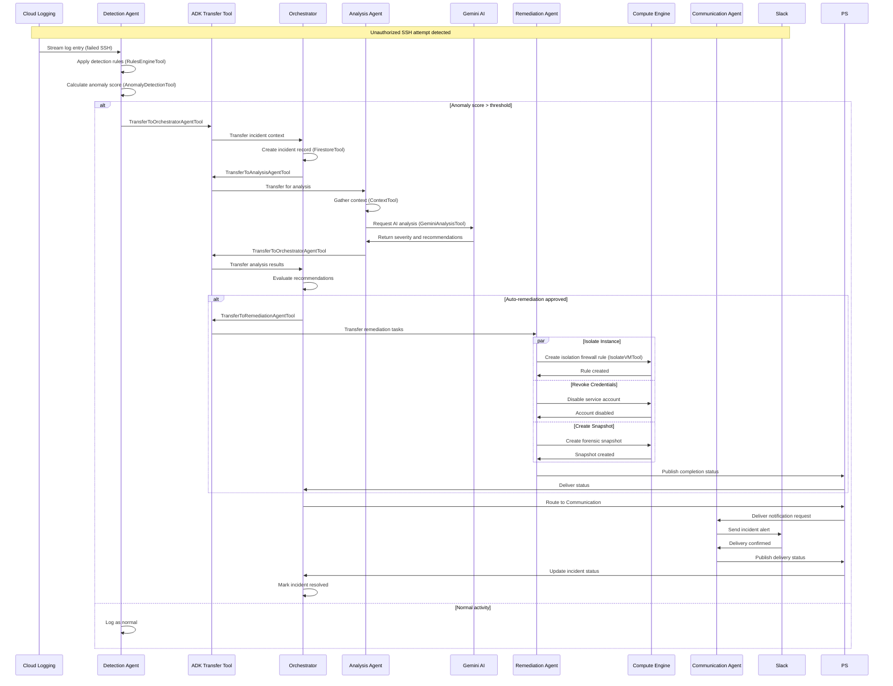
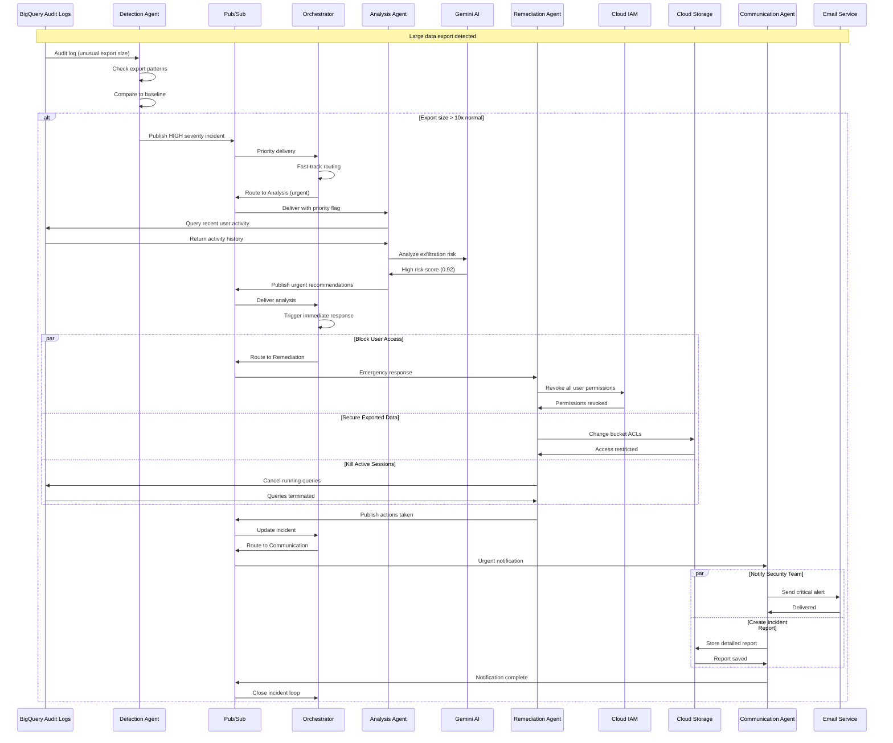
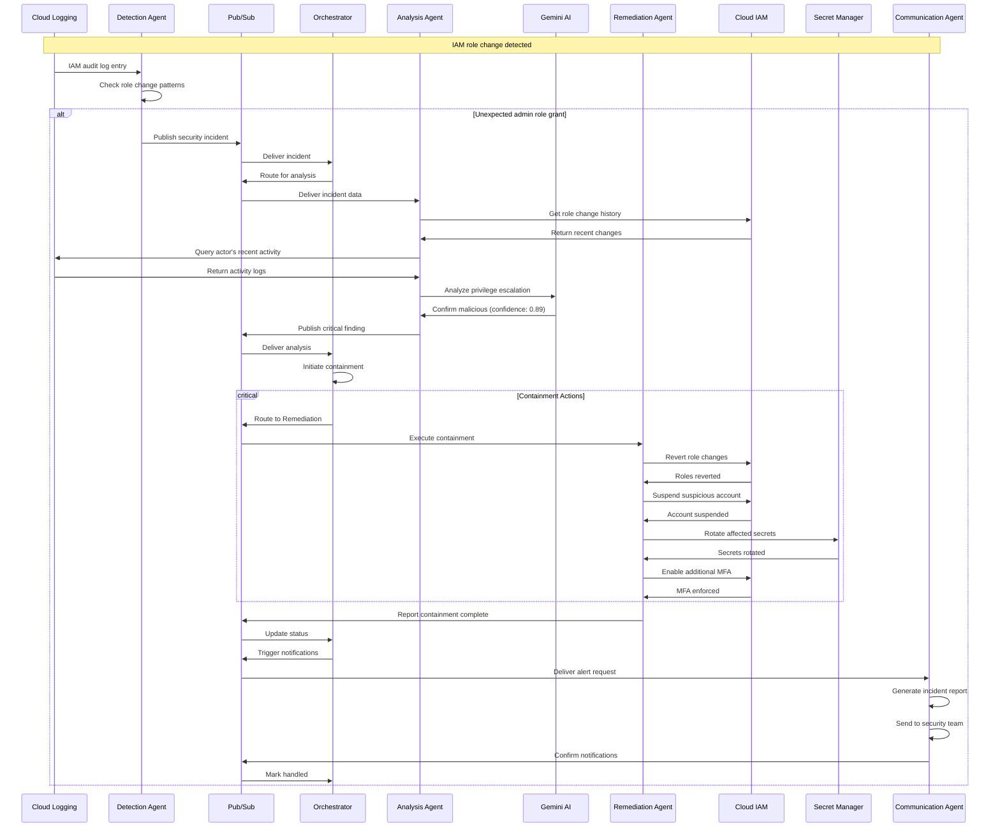
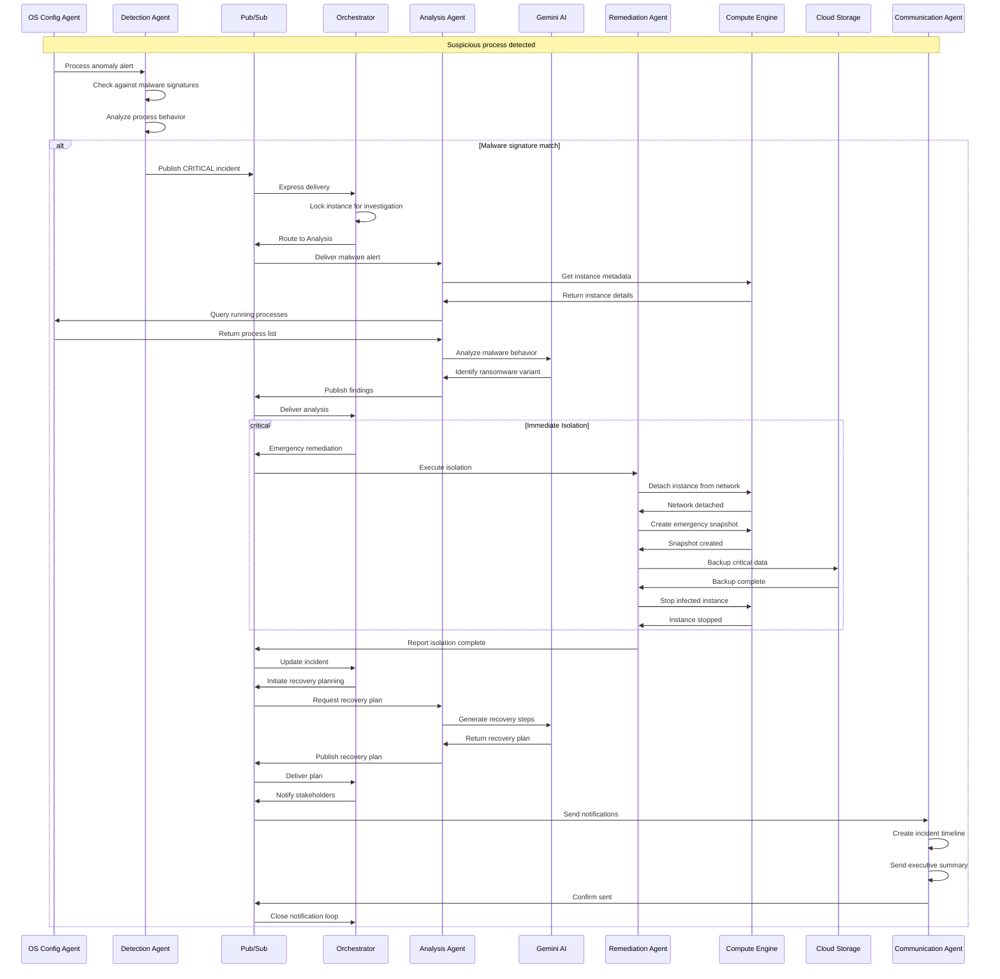
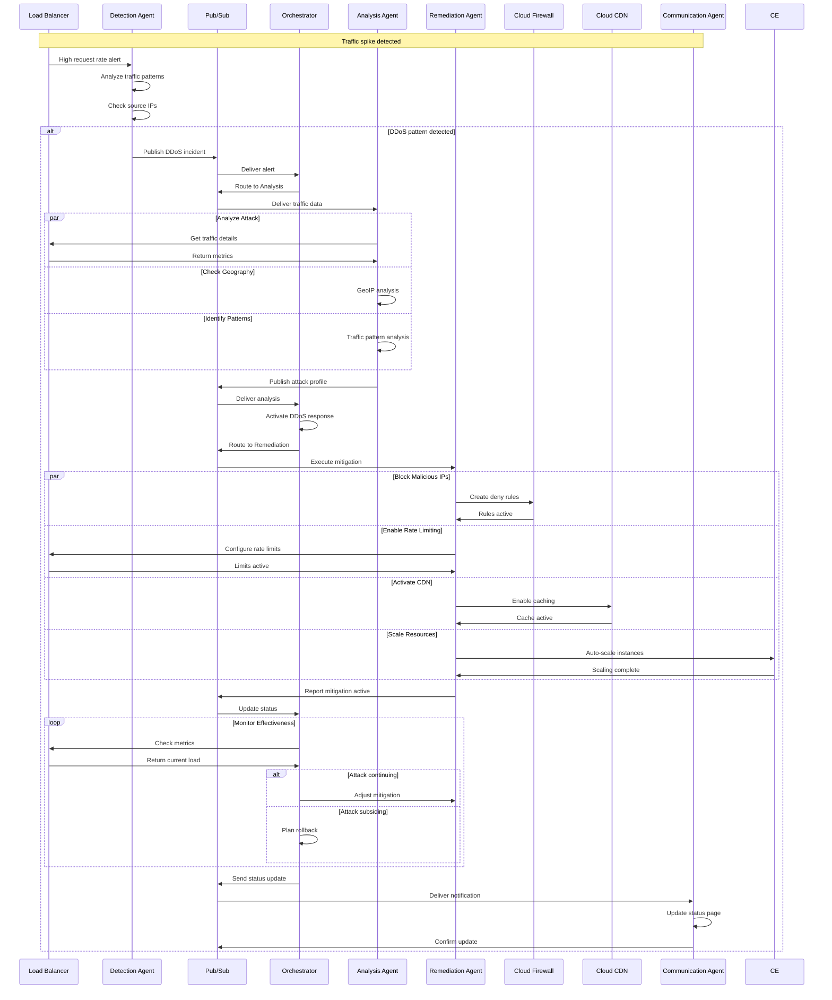
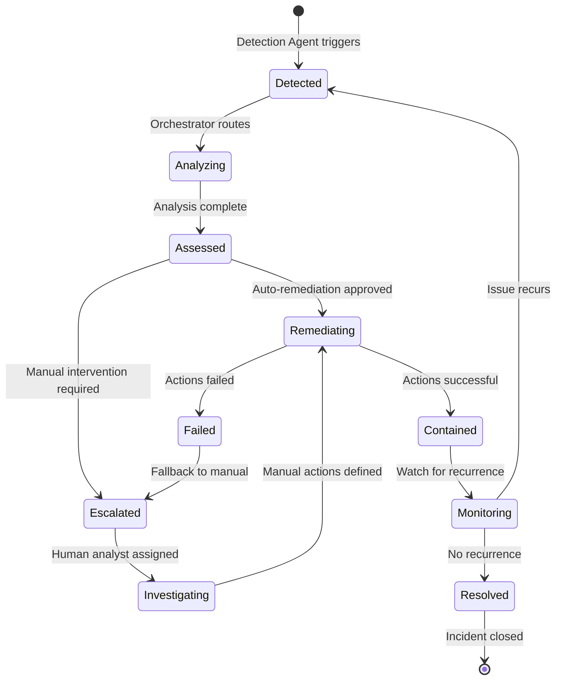
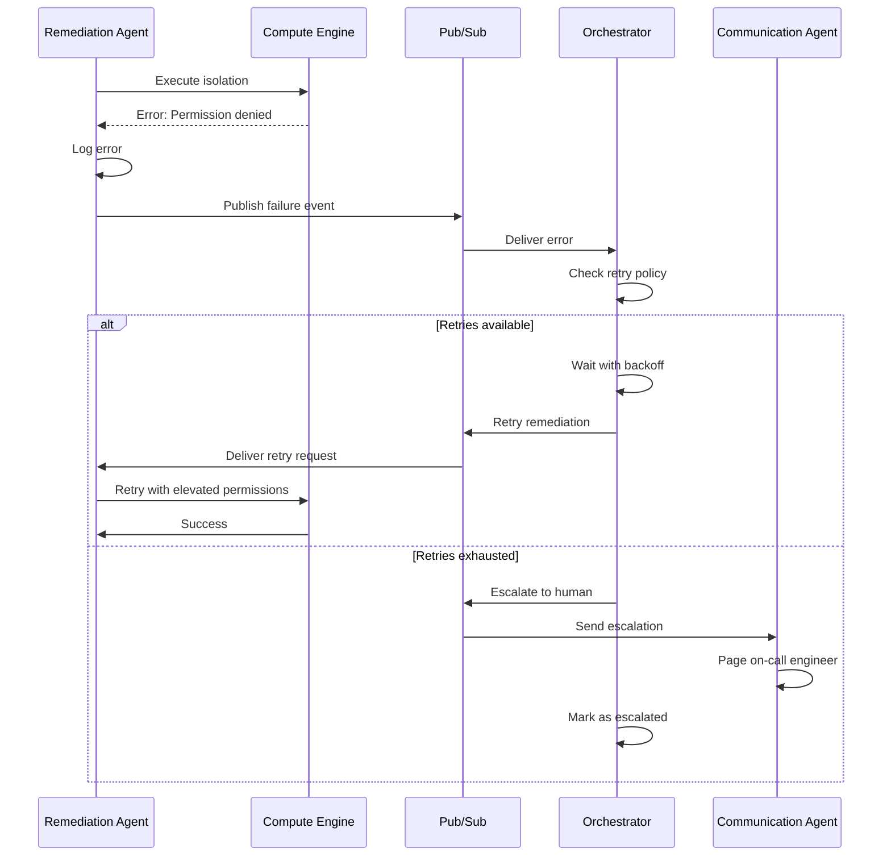

# Incident Response Sequence Diagrams

## Overview

This document provides detailed sequence diagrams showing how SentinelOps handles various types of security incidents from detection through resolution using the Google Agent Development Kit (ADK) framework.

## 1. Unauthorized Access Incident

This sequence shows the complete flow for detecting and responding to unauthorized access attempts using ADK's transfer system.

## 2. Data Exfiltration Attempt

This sequence shows detection and response to potential data exfiltration.

## 3. Privilege Escalation Detection

This sequence shows response to detected privilege escalation.

## 4. Malware Detection and Response

This sequence shows the response to detected malware on a compute instance.

## 5. DDoS Attack Mitigation

This sequence shows automated response to a detected DDoS attack.

## State Management

Each incident follows a defined state machine:

## Error Handling Sequences

### Failed Remediation Recovery

## Performance Considerations

### Parallel Processing
- Detection: Process multiple log streams concurrently
- Analysis: Batch related incidents for efficiency
- Remediation: Execute independent actions in parallel
- Communication: Batch notifications per channel

### Optimization Points
1. **Detection**: Use BigQuery materialized views for common queries
2. **Analysis**: Cache Gemini responses for similar incidents
3. **Remediation**: Pre-compute IAM policies for quick application
4. **Communication**: Use templates to reduce processing time

### SLA Targets
| Incident Type | Detection | Analysis | Remediation | Total |
|--------------|-----------|----------|-------------|--------|
| Critical | < 30s | < 60s | < 120s | < 4min |
| High | < 60s | < 120s | < 180s | < 6min |
| Medium | < 120s | < 180s | < 300s | < 10min |
| Low | < 300s | < 300s | < 600s | < 20min |
