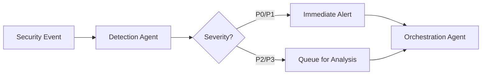

# Incident Response Procedures

This document outlines the procedures for responding to security incidents detected by SentinelOps.

## Table of Contents

1. [Incident Classification](#incident-classification)
2. [Response Team Structure](#response-team-structure)
3. [Incident Response Workflow](#incident-response-workflow)
4. [Automated Response Procedures](#automated-response-procedures)
5. [Manual Intervention Procedures](#manual-intervention-procedures)
6. [Communication Protocols](#communication-protocols)
7. [Post-Incident Procedures](#post-incident-procedures)

## Incident Classification

### Severity Levels

| Level | Name | Description | Response Time | Examples |
|-------|------|-------------|---------------|----------|
| P0 | Critical | Active attack or data breach | < 15 min | Active ransomware, data exfiltration |
| P1 | High | Imminent threat to production | < 30 min | Suspicious IAM changes, firewall breaches |
| P2 | Medium | Security risk requiring attention | < 2 hours | Unusual API activity, failed auth attempts |
| P3 | Low | Minor security concern | < 24 hours | Policy violations, best practice deviations |

### Incident Types

1. **Unauthorized Access**
   - Compromised credentials
   - Privilege escalation
   - Unauthorized API usage

2. **Data Security**
   - Data exfiltration attempts
   - Unauthorized data access
   - Encryption violations

3. **Network Security**
   - Firewall breaches
   - DDoS attacks
   - Suspicious network traffic

4. **Compliance Violations**
   - Policy breaches
   - Regulatory non-compliance
   - Audit failures

## Response Team Structure

### Primary Response Team

**Incident Commander**
- Overall incident coordination
- Decision authority for remediation
- External communication

**Security Analyst**
- Incident investigation
- Threat analysis
- Evidence collection

**Platform Engineer**
- System remediation
- Technical implementation
- Service restoration

**Communications Lead**
- Stakeholder updates
- Status page management
- Customer notifications

### Escalation Chain

```
P3 Low → Security Analyst → Team Lead
P2 Medium → Security Analyst → Incident Commander
P1 High → Incident Commander → VP Engineering
P0 Critical → Incident Commander → CTO/CISO → CEO
```

## Incident Response Workflow

### 1. Detection Phase



**Actions:**
- Event detected by monitoring systems
- Initial classification by Detection Agent
- Alert routing based on severity

### 2. Analysis Phase

**P0/P1 Response (< 5 minutes):**
```bash
# 1. Acknowledge incident
gcloud firestore documents update incidents/${INCIDENT_ID} \
  --data='{"status":"acknowledged","acknowledged_by":"analyst@company.com","acknowledged_at":"'$(date -u +%Y-%m-%dT%H:%M:%SZ)'"}'

# 2. Begin investigation
python scripts/analyze_incident.py --incident-id ${INCIDENT_ID} --priority urgent

# 3. Notify incident commander
gcloud pubsub topics publish communication-topic \
  --message='{"type":"page","recipient":"incident-commander","incident_id":"'${INCIDENT_ID}'"}'
```

**P2/P3 Response:**
- Review in next analysis cycle
- Correlate with other events
- Determine if escalation needed

### 3. Containment Phase

**Automated Containment Actions:**

| Threat Type | Automatic Action | Manual Override |
|-------------|------------------|-----------------|
| Compromised Credentials | Revoke access tokens | Restore specific tokens |
| Malicious IP | Block at firewall | Whitelist IP |
| Compromised VM | Isolate instance | Reconnect to network |
| Data Exfiltration | Suspend egress rules | Enable specific transfers |

**Manual Containment Procedures:**

1. **Isolate Affected Resources**
   ```bash
   # Isolate compute instance
   gcloud compute instances set-machine-type ${INSTANCE_NAME} \
     --zone=${ZONE} \
     --custom-network-interface=[]

   # Disable service account
   gcloud iam service-accounts disable ${SERVICE_ACCOUNT_EMAIL}
   ```

2. **Preserve Evidence**
   ```bash
   # Create disk snapshot
   gcloud compute disks snapshot ${DISK_NAME} \
     --zone=${ZONE} \
     --snapshot-names=incident-${INCIDENT_ID}-snapshot

   # Export logs
   gcloud logging read "timestamp>=\"${START_TIME}\" AND timestamp<=\"${END_TIME}\"" \
     --format=json > incident-${INCIDENT_ID}-logs.json
   ```

### 4. Eradication Phase

**Remove Threat Vectors:**

1. **Clean Compromised Systems**
   ```bash
   # Remove malicious files
   gcloud compute ssh ${INSTANCE_NAME} --zone=${ZONE} \
     --command="sudo find / -name '${MALICIOUS_PATTERN}' -delete"

   # Reset configurations
   gcloud compute instances reset ${INSTANCE_NAME} --zone=${ZONE}
   ```

2. **Patch Vulnerabilities**
   ```bash
   # Update system packages
   gcloud compute ssh ${INSTANCE_NAME} --zone=${ZONE} \
     --command="sudo apt-get update && sudo apt-get upgrade -y"

   # Apply security patches
   gcloud compute instances update ${INSTANCE_NAME} \
     --zone=${ZONE} \
     --metadata=startup-script-url=gs://sentinelops-scripts/security-patch.sh
   ```

### 5. Recovery Phase

**Service Restoration:**

1. **Verify System Integrity**
   ```bash
   # Run integrity checks
   python scripts/verify_system_integrity.py --instance ${INSTANCE_NAME}

   # Scan for remaining threats
   gcloud alpha web-security-scanner scans start \
     gs://sentinelops-configs/security-scan.yaml
   ```

2. **Restore Services**
   ```bash
   # Re-enable service accounts
   gcloud iam service-accounts enable ${SERVICE_ACCOUNT_EMAIL}

   # Restore network connectivity
   gcloud compute instances add-network-interface ${INSTANCE_NAME} \
     --zone=${ZONE} \
     --network=sentinelops-vpc \
     --subnet=sentinelops-subnet
   ```

3. **Monitor Recovery**
   ```bash
   # Set up enhanced monitoring
   gcloud monitoring policies create \
     --notification-channels=${CHANNEL_ID} \
     --display-name="Post-Incident Monitoring ${INCIDENT_ID}" \
     --policy-from-file=monitoring/post-incident-policy.yaml
   ```

## Automated Response Procedures

### Credential Compromise Response

```yaml
trigger: suspicious_login_pattern
conditions:
  - failed_attempts > 5
  - geographic_anomaly: true
  - time_anomaly: true
actions:
  - revoke_all_sessions
  - force_password_reset
  - enable_mfa_requirement
  - notify_user
  - log_incident
```

### Network Attack Response

```yaml
trigger: ddos_detected
conditions:
  - requests_per_second > 10000
  - unique_ips > 1000
  - pattern_match: "attack_signature"
actions:
  - enable_cloud_armor
  - rate_limit_enforcement
  - geographic_blocking
  - scale_up_instances
  - notify_ops_team
```

### Data Exfiltration Response

```yaml
trigger: unusual_data_transfer
conditions:
  - egress_bytes > 1GB
  - destination: external
  - time: outside_business_hours
actions:
  - block_egress_traffic
  - snapshot_instance
  - isolate_workload
  - forensic_capture
  - executive_notification
```

## Manual Intervention Procedures

### When Manual Intervention is Required

1. **Critical Business Services Affected**
   - Customer-facing application down
   - Payment processing impacted
   - Data integrity concerns

2. **Automated Response Failed**
   - Script execution errors
   - Insufficient permissions
   - Unexpected system state

3. **Complex Attack Patterns**
   - Advanced persistent threats
   - Zero-day exploits
   - Insider threats

### Manual Response Checklist

- [ ] Establish incident command
- [ ] Open bridge line/war room
- [ ] Document all actions taken
- [ ] Coordinate with legal team (if needed)
- [ ] Prepare executive briefing
- [ ] Engage external security firm (if needed)
- [ ] Update status page
- [ ] Notify affected customers

## Communication Protocols

### Internal Communications

**Slack Channels:**
- `#incident-response` - Primary coordination
- `#security-alerts` - Automated alerts
- `#incident-${ID}` - Dedicated incident channel

**Email Lists:**
- `security-team@company.com` - All security incidents
- `incident-p0@company.com` - Critical incidents only
- `executives@company.com` - P0 incidents

### External Communications

**Customer Notification Timeline:**
- P0: Within 1 hour of confirmation
- P1: Within 4 hours
- P2: Within 24 hours
- P3: Monthly security bulletin

**Communication Templates:**

### Customer Notification Template (Example)

```markdown
Subject: [Security Notice] ${INCIDENT_TYPE} - ${SEVERITY}

Dear Customer,

[Organization name] is writing to inform you of a security incident that ${IMPACT_DESCRIPTION}.

**What Happened:**
${INCIDENT_DESCRIPTION}

**When:**
- Detected: ${DETECTION_TIME}
- Contained: ${CONTAINMENT_TIME}
- Resolved: ${RESOLUTION_TIME}

**Impact:**
${IMPACT_DETAILS}

**Actions Taken:**
${REMEDIATION_ACTIONS}

**What You Should Do:**
${CUSTOMER_ACTIONS}

[Organization name] takes security seriously and apologizes for any inconvenience.

Questions? Contact security@company.com
```

## Post-Incident Procedures

### 1. Incident Documentation

Create post-incident report including:
- Timeline of events
- Root cause analysis
- Impact assessment
- Remediation actions
- Lessons learned

### 2. Security Improvements

```bash
# Update security policies
gcloud compute security-policies rules create ${RULE_ID} \
  --security-policy=${POLICY} \
  --expression="${NEW_RULE_EXPRESSION}" \
  --action=deny-403

# Enhance monitoring
gcloud monitoring policies create \
  --notification-channels=${CHANNEL_ID} \
  --display-name="Enhanced Detection - ${THREAT_TYPE}" \
  --policy-from-file=monitoring/enhanced-policy.yaml
```

### 3. Process Updates

- Review and update runbooks
- Enhance automation scripts
- Update training materials
- Schedule tabletop exercise

### 4. Compliance Reporting

**Required Reports:**
- Regulatory notifications (if applicable)
- Cyber insurance claims
- Board/executive briefing
- Customer transparency report

### 5. Metrics and KPIs

Track and report:
- Mean Time to Detect (MTTD)
- Mean Time to Respond (MTTR)
- Mean Time to Contain (MTTC)
- Mean Time to Recover (MTTR)
- False positive rate
- Automation success rate

## Appendices

### A. Contact Information

| Role | Name | Email | Phone | Escalation |
|------|------|-------|-------|------------|
| Security Lead | John Doe | john@company.com | +1-555-0001 | Primary |
| Incident Commander | Jane Smith | jane@company.com | +1-555-0002 | Primary |
| Platform Lead | Bob Johnson | bob@company.com | +1-555-0003 | Secondary |
| VP Engineering | Alice Brown | alice@company.com | +1-555-0004 | Executive |
| CTO | Charlie Wilson | charlie@company.com | +1-555-0005 | Executive |

### B. External Resources

- Google Cloud Support: 1-877-355-5787
- FBI Cyber Division: 1-855-TELL-FBI
- Mandiant IR: 1-866-627-6341
- CrowdStrike IR: 1-888-512-8906

### C. Useful Commands

```bash
# Check system status
gcloud compute instances list --filter="status:RUNNING"
gcloud run services list
gcloud functions list

# View recent security events
gcloud logging read "protoPayload.methodName=\"google.iam.admin.v1.CreateServiceAccountKey\"" --limit=10
gcloud logging read "resource.type=\"gce_firewall_rule\" AND protoPayload.methodName=\"v1.compute.firewalls.insert\"" --limit=10

# Emergency shutdown
gcloud compute instances stop $(gcloud compute instances list --format="value(name)")
gcloud run services update-traffic --to-percent=0 --region=${REGION} ${SERVICE}
```
