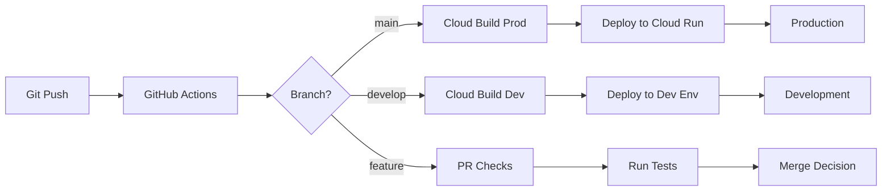

# CI/CD Pipeline Updates Guide

This comprehensive guide covers updating and maintaining the CI/CD pipeline for SentinelOps agents built with Google's Agent Development Kit (ADK), including adding new agents, updating test suites, and customizing deployment workflows.

## Table of Contents
1. [Pipeline Overview](#pipeline-overview)
2. [Adding New Agents](#adding-new-agents)
3. [Updating Test Suites](#updating-test-suites)
4. [Modifying Deployment Configurations](#modifying-deployment-configurations)
5. [Working with Cloud Build](#working-with-cloud-build)
6. [GitHub Actions Customization](#github-actions-customization)
7. [Pipeline Best Practices](#pipeline-best-practices)
8. [Troubleshooting](#troubleshooting)

## Pipeline Overview

### Current CI/CD Architecture


### Pipeline Components
- **GitHub Actions**: PR validation, testing, code quality
- **Cloud Build**: Container building and deployment
- **Cloud Run**: Agent hosting and auto-scaling
- **Artifact Registry**: Container image storage
- **Secret Manager**: Secure credential management

## Adding New Agents

### 1. Update CI/CD Configuration Files

#### Add to cloudbuild.yaml
```yaml
# cloudbuild.yaml
steps:
  # ... existing steps ...

  # Build new agent container
  - name: 'gcr.io/cloud-builders/docker'
    id: 'build-new-agent'
    args:
      - 'build'
      - '-t'
      - '${_REGION}-docker.pkg.dev/${PROJECT_ID}/sentinelops/new-agent:${SHORT_SHA}'
      - '-t'
      - '${_REGION}-docker.pkg.dev/${PROJECT_ID}/sentinelops/new-agent:latest'
      - '-f'
      - 'src/new_agent/Dockerfile'
      - '.'
    waitFor: ['build-adk']

  # Push new agent image
  - name: 'gcr.io/cloud-builders/docker'
    id: 'push-new-agent'
    args:
      - 'push'
      - '--all-tags'
      - '${_REGION}-docker.pkg.dev/${PROJECT_ID}/sentinelops/new-agent'
    waitFor: ['build-new-agent']

  # Deploy new agent to Cloud Run
  - name: 'gcr.io/google.com/cloudsdktool/cloud-sdk'
    id: 'deploy-new-agent'
    entrypoint: 'gcloud'
    args:
      - 'run'
      - 'deploy'
      - 'new-agent'
      - '--image=${_REGION}-docker.pkg.dev/${PROJECT_ID}/sentinelops/new-agent:${SHORT_SHA}'
      - '--region=${_REGION}'
      - '--platform=managed'
      - '--service-account=new-agent@${PROJECT_ID}.iam.gserviceaccount.com'
      - '--set-env-vars=ENVIRONMENT=production,ADK_LOG_LEVEL=INFO'
      - '--memory=2Gi'
      - '--cpu=1'
      - '--min-instances=1'
      - '--max-instances=10'
      - '--timeout=300'
    waitFor: ['push-new-agent']

# Update images list
images:
  - '${_REGION}-docker.pkg.dev/${PROJECT_ID}/sentinelops/new-agent:${SHORT_SHA}'
  - '${_REGION}-docker.pkg.dev/${PROJECT_ID}/sentinelops/new-agent:latest'
```

#### Add Dockerfile for New Agent
```dockerfile
# src/new_agent/Dockerfile
FROM python:3.11-slim

# Install system dependencies
RUN apt-get update && apt-get install -y \
    gcc \
    g++ \
    && rm -rf /var/lib/apt/lists/*

# Set working directory
WORKDIR /app

# Copy ADK first (for better caching)
COPY adk/ ./adk/
RUN pip install -e ./adk

# Copy requirements
COPY requirements.txt .
RUN pip install --no-cache-dir -r requirements.txt

# Copy agent code
COPY src/new_agent/ ./src/new_agent/
COPY src/common/ ./src/common/
COPY src/tools/ ./src/tools/

# Set environment variables
ENV PYTHONPATH=/app
ENV PORT=8080

# Health check
HEALTHCHECK --interval=30s --timeout=10s --start-period=40s --retries=3 \
  CMD python -c "import requests; requests.get('http://localhost:8080/health').raise_for_status()"

# Run the agent
CMD ["python", "src/new_agent/main.py"]
```

### 2. Update GitHub Actions Workflow

#### Modify .github/workflows/ci.yml
```yaml
# .github/workflows/ci.yml
name: CI Pipeline

on:
  push:
    branches: [main, develop]
  pull_request:
    branches: [main]

jobs:
  test:
    runs-on: ubuntu-latest
    strategy:
      matrix:
        agent: [detection, analysis, remediation, communication, orchestrator, new_agent]

    steps:
      - uses: actions/checkout@v3

      - name: Set up Python
        uses: actions/setup-python@v4
        with:
          python-version: '3.11'

      - name: Install dependencies
        run: |
          pip install -e ./adk
          pip install -r requirements.txt
          pip install -r requirements-test.txt

      - name: Run tests for ${{ matrix.agent }}
        run: |
          pytest tests/${{ matrix.agent }}/ -v --cov=src/${{ matrix.agent }} --cov-report=xml

      - name: Upload coverage
        uses: codecov/codecov-action@v3
        with:
          file: ./coverage.xml
          flags: ${{ matrix.agent }}

  # Add new agent to build matrix
  build:
    needs: test
    runs-on: ubuntu-latest
    strategy:
      matrix:
        agent: [detection, analysis, remediation, communication, orchestrator, new_agent]

    steps:
      - uses: actions/checkout@v3

      - name: Build ${{ matrix.agent }} container
        run: |
          docker build -f src/${{ matrix.agent }}/Dockerfile -t ${{ matrix.agent }}:test .

      - name: Test container startup
        run: |
          docker run -d --name test-${{ matrix.agent }} \
            -e GOOGLE_CLOUD_PROJECT=test-project \
            -e DRY_RUN_DEFAULT=true \
            ${{ matrix.agent }}:test

          sleep 10
          docker logs test-${{ matrix.agent }}
          docker exec test-${{ matrix.agent }} curl -f http://localhost:8080/health
```

### 3. Create Deployment Script for New Agent

```python
# scripts/deployment/add_new_agent.py
import subprocess
import yaml
import json
from pathlib import Path

class NewAgentDeployer:
    """Helper to add new agent to CI/CD pipeline."""

    def __init__(self, agent_name: str):
        self.agent_name = agent_name
        self.agent_dir = f"src/{agent_name}_agent"

    def create_agent_structure(self):
        """Create directory structure for new agent."""
        directories = [
            self.agent_dir,
            f"{self.agent_dir}/tools",
            f"tests/{self.agent_name}_agent",
            f"config/{self.agent_name}_agent"
        ]

        for directory in directories:
            Path(directory).mkdir(parents=True, exist_ok=True)

        # Create __init__.py files
        for directory in directories:
            (Path(directory) / "__init__.py").touch()

    def create_dockerfile(self):
        """Create Dockerfile for new agent."""
        dockerfile_template = '''FROM python:3.11-slim

# Install system dependencies
RUN apt-get update && apt-get install -y gcc g++ && rm -rf /var/lib/apt/lists/*

WORKDIR /app

# Copy and install ADK
COPY adk/ ./adk/
RUN pip install -e ./adk

# Install requirements
COPY requirements.txt .
RUN pip install --no-cache-dir -r requirements.txt

# Copy agent code
COPY src/{agent_name}_agent/ ./src/{agent_name}_agent/
COPY src/common/ ./src/common/
COPY src/tools/ ./src/tools/

ENV PYTHONPATH=/app
ENV PORT=8080

HEALTHCHECK --interval=30s --timeout=10s --start-period=40s --retries=3 \\
  CMD python -c "import requests; requests.get('http://localhost:8080/health').raise_for_status()"

CMD ["python", "src/{agent_name}_agent/main.py"]
'''

        dockerfile_path = Path(self.agent_dir) / "Dockerfile"
        dockerfile_path.write_text(
            dockerfile_template.format(agent_name=self.agent_name)
        )

    def update_cloudbuild(self):
        """Add agent to Cloud Build configuration."""
        cloudbuild_path = Path("cloudbuild.yaml")

        with open(cloudbuild_path) as f:
            config = yaml.safe_load(f)

        # Add build step
        build_step = {
            'name': 'gcr.io/cloud-builders/docker',
            'id': f'build-{self.agent_name}-agent',
            'args': [
                'build',
                '-t', f'${{_REGION}}-docker.pkg.dev/${{PROJECT_ID}}/sentinelops/{self.agent_name}-agent:${{SHORT_SHA}}',
                '-t', f'${{_REGION}}-docker.pkg.dev/${{PROJECT_ID}}/sentinelops/{self.agent_name}-agent:latest',
                '-f', f'src/{self.agent_name}_agent/Dockerfile',
                '.'
            ],
            'waitFor': ['build-adk']
        }

        # Add push step
        push_step = {
            'name': 'gcr.io/cloud-builders/docker',
            'id': f'push-{self.agent_name}-agent',
            'args': [
                'push',
                '--all-tags',
                f'${{_REGION}}-docker.pkg.dev/${{PROJECT_ID}}/sentinelops/{self.agent_name}-agent'
            ],
            'waitFor': [f'build-{self.agent_name}-agent']
        }

        # Add deploy step
        deploy_step = {
            'name': 'gcr.io/google.com/cloudsdktool/cloud-sdk',
            'id': f'deploy-{self.agent_name}-agent',
            'entrypoint': 'gcloud',
            'args': [
                'run', 'deploy', f'{self.agent_name}-agent',
                f'--image=${{_REGION}}-docker.pkg.dev/${{PROJECT_ID}}/sentinelops/{self.agent_name}-agent:${{SHORT_SHA}}',
                '--region=${_REGION}',
                '--platform=managed',
                f'--service-account={self.agent_name}-agent@${{PROJECT_ID}}.iam.gserviceaccount.com',
                '--set-env-vars=ENVIRONMENT=production,ADK_LOG_LEVEL=INFO',
                '--memory=2Gi',
                '--cpu=1'
            ],
            'waitFor': [f'push-{self.agent_name}-agent']
        }

        # Insert steps
        config['steps'].extend([build_step, push_step, deploy_step])

        # Add images
        config['images'].extend([
            f'${{_REGION}}-docker.pkg.dev/${{PROJECT_ID}}/sentinelops/{self.agent_name}-agent:${{SHORT_SHA}}',
            f'${{_REGION}}-docker.pkg.dev/${{PROJECT_ID}}/sentinelops/{self.agent_name}-agent:latest'
        ])

        # Save updated config
        with open(cloudbuild_path, 'w') as f:
            yaml.dump(config, f, default_flow_style=False, sort_keys=False)

    def create_service_account(self, project_id: str):
        """Create service account for new agent."""
        commands = [
            # Create service account
            [
                "gcloud", "iam", "service-accounts", "create",
                f"{self.agent_name}-agent",
                f"--display-name={self.agent_name.title()} Agent",
                f"--project={project_id}"
            ],
            # Grant necessary roles
            [
                "gcloud", "projects", "add-iam-policy-binding",
                project_id,
                f"--member=serviceAccount:{self.agent_name}-agent@{project_id}.iam.gserviceaccount.com",
                "--role=roles/firestore.dataEditor"
            ],
            [
                "gcloud", "projects", "add-iam-policy-binding",
                project_id,
                f"--member=serviceAccount:{self.agent_name}-agent@{project_id}.iam.gserviceaccount.com",
                "--role=roles/logging.logWriter"
            ]
        ]

        for cmd in commands:
            print(f"Running: {' '.join(cmd)}")
            subprocess.run(cmd, check=True)

    def deploy(self, project_id: str):
        """Complete deployment process for new agent."""
        print(f"Adding {self.agent_name} agent to CI/CD pipeline...")

        # Create structure
        self.create_agent_structure()
        print("✓ Created agent directory structure")

        # Create Dockerfile
        self.create_dockerfile()
        print("✓ Created Dockerfile")

        # Update Cloud Build
        self.update_cloudbuild()
        print("✓ Updated cloudbuild.yaml")

        # Create service account
        self.create_service_account(project_id)
        print("✓ Created service account")

        print(f"\n✅ {self.agent_name} agent added successfully!")
        print("\nNext steps:")
        print(f"1. Implement agent logic in {self.agent_dir}/")
        print(f"2. Add tests in tests/{self.agent_name}_agent/")
        print("3. Update GitHub Actions workflow")
        print("4. Commit and push changes")

if __name__ == "__main__":
    import argparse

    parser = argparse.ArgumentParser(description="Add new agent to CI/CD pipeline")
    parser.add_argument("agent_name", help="Name of the new agent")
    parser.add_argument("--project-id", required=True, help="GCP Project ID")

    args = parser.parse_args()

    deployer = NewAgentDeployer(args.agent_name)
    deployer.deploy(args.project_id)
```

## Updating Test Suites

### 1. Add Tests for New Agent

```python
# tests/new_agent/test_new_agent.py
import pytest
from unittest.mock import Mock, patch, AsyncMock
from src.new_agent.adk_agent import NewAgent

class TestNewAgent:
    @pytest.fixture
    def agent(self):
        """Create test agent instance."""
        with patch('google.adk.llm.GeminiClient'):
            return NewAgent()

    async def test_agent_initialization(self, agent):
        """Test agent initializes correctly."""
        assert agent.name == "new_agent"
        assert len(agent.tools) > 0

    async def test_agent_workflow(self, agent):
        """Test agent workflow execution."""
        test_context = {"test": True}
        result = await agent.run(test_context)
        assert result["success"] is True

# tests/new_agent/test_tools.py
import pytest
from src.new_agent.tools import NewAgentTool

class TestNewAgentTools:
    @pytest.fixture
    def tool(self):
        return NewAgentTool()

    async def test_tool_execution(self, tool):
        """Test tool executes correctly."""
        result = await tool.execute(param="test")
        assert result["success"] is True
```

### 2. Update Test Configuration

```yaml
# pytest.ini
[pytest]
testpaths = tests
python_files = test_*.py
python_classes = Test*
python_functions = test_*
addopts =
    -v
    --strict-markers
    --tb=short
    --cov-config=.coveragerc
markers =
    unit: Unit tests
    integration: Integration tests
    e2e: End-to-end tests
    new_agent: Tests for new agent
```

### 3. Add Integration Tests

```python
# tests/integration/test_new_agent_integration.py
import pytest
import asyncio
from src.orchestrator_agent.adk_agent import OrchestratorAgent
from src.new_agent.adk_agent import NewAgent

class TestNewAgentIntegration:
    @pytest.mark.integration
    async def test_orchestrator_to_new_agent(self):
        """Test orchestrator can communicate with new agent."""
        orchestrator = OrchestratorAgent()
        new_agent = NewAgent()

        # Register new agent
        orchestrator.register_agent("new_agent", new_agent)

        # Test transfer
        result = await orchestrator.transfer_to_agent(
            "new_agent",
            {"test": "data"}
        )

        assert result["success"] is True
```

## Modifying Deployment Configurations

### 1. Update Terraform Configuration

```hcl
# terraform/agents/new_agent.tf
resource "google_cloud_run_service" "new_agent" {
  name     = "new-agent"
  location = var.region

  template {
    spec {
      service_account_name = google_service_account.new_agent.email

      containers {
        image = "${var.region}-docker.pkg.dev/${var.project_id}/sentinelops/new-agent:latest"

        env {
          name  = "GOOGLE_CLOUD_PROJECT"
          value = var.project_id
        }

        env {
          name  = "ENVIRONMENT"
          value = var.environment
        }

        env {
          name  = "ADK_LOG_LEVEL"
          value = "INFO"
        }

        resources {
          limits = {
            cpu    = "1"
            memory = "2Gi"
          }
        }
      }
    }

    metadata {
      annotations = {
        "autoscaling.knative.dev/minScale" = "1"
        "autoscaling.knative.dev/maxScale" = "10"
      }
    }
  }

  traffic {
    percent         = 100
    latest_revision = true
  }
}

resource "google_service_account" "new_agent" {
  account_id   = "new-agent"
  display_name = "New Agent Service Account"
}

resource "google_project_iam_member" "new_agent_firestore" {
  project = var.project_id
  role    = "roles/datastore.user"
  member  = "serviceAccount:${google_service_account.new_agent.email}"
}
```

### 2. Update Deployment Scripts

```bash
#!/bin/bash
# scripts/deploy_new_agent.sh

set -e

AGENT_NAME="new_agent"
PROJECT_ID=${GOOGLE_CLOUD_PROJECT}
REGION=${REGION:-us-central1}

echo "Deploying ${AGENT_NAME} to Cloud Run..."

# Build and push image
gcloud builds submit \
  --config=cloudbuild.yaml \
  --substitutions=_AGENT=${AGENT_NAME},_REGION=${REGION} \
  --project=${PROJECT_ID}

# Deploy to Cloud Run
gcloud run deploy ${AGENT_NAME} \
  --image=${REGION}-docker.pkg.dev/${PROJECT_ID}/sentinelops/${AGENT_NAME}:latest \
  --platform=managed \
  --region=${REGION} \
  --service-account=${AGENT_NAME}@${PROJECT_ID}.iam.gserviceaccount.com \
  --set-env-vars="ENVIRONMENT=production" \
  --min-instances=1 \
  --max-instances=10 \
  --memory=2Gi \
  --cpu=1 \
  --project=${PROJECT_ID}

echo "✅ ${AGENT_NAME} deployed successfully!"
```

### 3. Environment-Specific Configurations

```yaml
# config/environments/production.yaml
agents:
  new_agent:
    min_instances: 2
    max_instances: 20
    memory: 4Gi
    cpu: 2
    environment_vars:
      LOG_LEVEL: INFO
      ENABLE_PROFILING: true
      METRICS_ENABLED: true

# config/environments/development.yaml
agents:
  new_agent:
    min_instances: 0
    max_instances: 2
    memory: 1Gi
    cpu: 0.5
    environment_vars:
      LOG_LEVEL: DEBUG
      ENABLE_PROFILING: false
      DRY_RUN_DEFAULT: true
```

## Working with Cloud Build

### 1. Cloud Build Triggers

```yaml
# cloudbuild-triggers/new-agent-trigger.yaml
name: new-agent-deploy
description: Deploy New Agent on push to main
github:
  owner: cdgtlmda
  name: SentinelOps
  push:
    branch: ^main$
includedFiles:
  - src/new_agent/**
  - requirements.txt
  - adk/**
build:
  config: cloudbuild.yaml
  substitutions:
    _DEPLOY_AGENT: new_agent
    _REGION: us-central1
```

### 2. Multi-Stage Build Pipeline

```yaml
# cloudbuild-multistage.yaml
steps:
  # Stage 1: Run tests
  - name: 'python:3.11'
    id: 'test'
    entrypoint: 'bash'
    args:
      - '-c'
      - |
        pip install -e ./adk
        pip install -r requirements.txt
        pip install -r requirements-test.txt
        pytest tests/${_AGENT}/ -v --junit-xml=test-results.xml

  # Stage 2: Build only if tests pass
  - name: 'gcr.io/cloud-builders/docker'
    id: 'build'
    args:
      - 'build'
      - '--build-arg=BUILD_ID=${BUILD_ID}'
      - '--build-arg=COMMIT_SHA=${SHORT_SHA}'
      - '-t'
      - '${_IMAGE_URL}:${SHORT_SHA}'
      - '-f'
      - 'src/${_AGENT}/Dockerfile'
      - '.'
    waitFor: ['test']

  # Stage 3: Security scan
  - name: 'gcr.io/cloud-builders/gcloud'
    id: 'scan'
    args:
      - 'beta'
      - 'container'
      - 'images'
      - 'scan'
      - '${_IMAGE_URL}:${SHORT_SHA}'
    waitFor: ['build']

  # Stage 4: Deploy if scan passes
  - name: 'gcr.io/google.com/cloudsdktool/cloud-sdk'
    id: 'deploy'
    entrypoint: 'bash'
    args:
      - '-c'
      - |
        # Check scan results
        SCAN_RESULTS=$(gcloud beta container images describe ${_IMAGE_URL}:${SHORT_SHA} \
          --format="value(image_summary.vulnerability_counts)")

        if [[ "$SCAN_RESULTS" == *"CRITICAL"* ]]; then
          echo "Critical vulnerabilities found. Deployment blocked."
          exit 1
        fi

        # Deploy
        gcloud run deploy ${_AGENT} \
          --image=${_IMAGE_URL}:${SHORT_SHA} \
          --region=${_REGION} \
          --platform=managed
    waitFor: ['scan']
```

### 3. Build Optimization

```yaml
# .gcloudignore
# Exclude unnecessary files from build context
.git
.github/
docs/
tests/
scripts/
*.md
.env*
__pycache__/
*.pyc
.pytest_cache/
.coverage*
htmlcov/
```

## GitHub Actions Customization

### 1. Matrix Testing Strategy

```yaml
# .github/workflows/test-matrix.yml
name: Test Matrix

on:
  pull_request:
    paths:
      - 'src/**'
      - 'tests/**'
      - 'requirements*.txt'

jobs:
  test:
    runs-on: ubuntu-latest
    strategy:
      fail-fast: false
      matrix:
        python-version: ['3.9', '3.10', '3.11']
        agent: [detection, analysis, remediation, communication, orchestrator, new_agent]
        test-type: [unit, integration]
        exclude:
          # Skip integration tests for some combinations
          - python-version: '3.9'
            test-type: integration
          - python-version: '3.10'
            test-type: integration

    steps:
      - uses: actions/checkout@v3

      - name: Set up Python ${{ matrix.python-version }}
        uses: actions/setup-python@v4
        with:
          python-version: ${{ matrix.python-version }}

      - name: Cache dependencies
        uses: actions/cache@v3
        with:
          path: ~/.cache/pip
          key: ${{ runner.os }}-pip-${{ hashFiles('**/requirements*.txt') }}

      - name: Install dependencies
        run: |
          pip install -e ./adk
          pip install -r requirements.txt
          pip install -r requirements-test.txt

      - name: Run ${{ matrix.test-type }} tests for ${{ matrix.agent }}
        run: |
          if [ "${{ matrix.test-type }}" == "unit" ]; then
            pytest tests/${{ matrix.agent }}/ -m unit -v
          else
            pytest tests/${{ matrix.agent }}/ -m integration -v
          fi
```

### 2. Deployment Workflow

```yaml
# .github/workflows/deploy.yml
name: Deploy to Production

on:
  push:
    branches: [main]
  workflow_dispatch:
    inputs:
      agents:
        description: 'Agents to deploy (comma-separated)'
        required: false
        default: 'all'

jobs:
  deploy:
    runs-on: ubuntu-latest
    permissions:
      contents: read
      id-token: write

    steps:
      - uses: actions/checkout@v3

      - name: Authenticate to Google Cloud
        uses: google-github-actions/auth@v1
        with:
          workload_identity_provider: ${{ secrets.WIF_PROVIDER }}
          service_account: ${{ secrets.WIF_SERVICE_ACCOUNT }}

      - name: Set up Cloud SDK
        uses: google-github-actions/setup-gcloud@v1

      - name: Determine agents to deploy
        id: agents
        run: |
          if [ "${{ github.event.inputs.agents }}" == "all" ] || [ -z "${{ github.event.inputs.agents }}" ]; then
            echo "agents=detection,analysis,remediation,communication,orchestrator,new_agent" >> $GITHUB_OUTPUT
          else
            echo "agents=${{ github.event.inputs.agents }}" >> $GITHUB_OUTPUT
          fi

      - name: Deploy agents
        run: |
          IFS=',' read -ra AGENTS <<< "${{ steps.agents.outputs.agents }}"
          for agent in "${AGENTS[@]}"; do
            echo "Deploying $agent..."
            gcloud builds submit \
              --config=cloudbuild.yaml \
              --substitutions=_AGENT=$agent,_REGION=${{ vars.REGION }} \
              --project=${{ vars.PROJECT_ID }}
          done

      - name: Verify deployments
        run: |
          IFS=',' read -ra AGENTS <<< "${{ steps.agents.outputs.agents }}"
          for agent in "${AGENTS[@]}"; do
            echo "Verifying $agent..."
            URL=$(gcloud run services describe $agent \
              --region=${{ vars.REGION }} \
              --format="value(status.url)")

            curl -f "$URL/health" || exit 1
          done
```

### 3. Custom Actions

```yaml
# .github/actions/adk-test/action.yml
name: 'ADK Agent Test'
description: 'Test ADK agent with validation'
inputs:
  agent:
    description: 'Agent to test'
    required: true
  test-type:
    description: 'Type of test (unit/integration/e2e)'
    default: 'unit'

runs:
  using: 'composite'
  steps:
    - name: Validate ADK structure
      shell: bash
      run: |
        # Check agent follows ADK patterns
        python scripts/validate_adk_agent.py ${{ inputs.agent }}

    - name: Run ADK-specific tests
      shell: bash
      run: |
        pytest tests/${{ inputs.agent }}/test_adk_*.py -v

    - name: Test tool validation
      shell: bash
      run: |
        python -m google.adk.tools.validator src/${{ inputs.agent }}_agent/tools/
```

## Pipeline Best Practices

### 1. Version Management

```python
# scripts/version_manager.py
import json
import subprocess
from datetime import datetime

class VersionManager:
    """Manage agent versions across pipeline."""

    def __init__(self):
        self.version_file = "versions.json"
        self.versions = self.load_versions()

    def load_versions(self):
        """Load current versions."""
        try:
            with open(self.version_file) as f:
                return json.load(f)
        except FileNotFoundError:
            return {}

    def bump_version(self, agent: str, bump_type: str = "patch"):
        """Bump agent version."""
        current = self.versions.get(agent, "0.0.0")
        major, minor, patch = map(int, current.split("."))

        if bump_type == "major":
            major += 1
            minor = 0
            patch = 0
        elif bump_type == "minor":
            minor += 1
            patch = 0
        else:  # patch
            patch += 1

        new_version = f"{major}.{minor}.{patch}"
        self.versions[agent] = new_version

        # Save versions
        with open(self.version_file, "w") as f:
            json.dump(self.versions, f, indent=2)

        # Git tag
        tag = f"{agent}-v{new_version}"
        subprocess.run(["git", "tag", tag])

        return new_version

    def get_changelog(self, agent: str, since_version: str = None):
        """Get changelog for agent."""
        if since_version:
            tag_range = f"{agent}-v{since_version}..HEAD"
        else:
            tag_range = "HEAD"

        result = subprocess.run(
            ["git", "log", "--oneline", tag_range, "--", f"src/{agent}_agent/"],
            capture_output=True,
            text=True
        )

        return result.stdout
```

### 2. Pipeline Monitoring

```python
# scripts/pipeline_monitor.py
import requests
from datetime import datetime, timedelta

class PipelineMonitor:
    """Monitor CI/CD pipeline health."""

    def __init__(self, project_id: str):
        self.project_id = project_id
        self.cloud_build_api = "https://cloudbuild.googleapis.com/v1"

    def get_recent_builds(self, hours: int = 24):
        """Get recent build status."""
        cutoff = datetime.utcnow() - timedelta(hours=hours)

        response = requests.get(
            f"{self.cloud_build_api}/projects/{self.project_id}/builds",
            params={
                "filter": f'create_time>"{cutoff.isoformat()}Z"'
            }
        )

        builds = response.json().get("builds", [])

        # Analyze results
        stats = {
            "total": len(builds),
            "successful": sum(1 for b in builds if b["status"] == "SUCCESS"),
            "failed": sum(1 for b in builds if b["status"] == "FAILURE"),
            "in_progress": sum(1 for b in builds if b["status"] == "WORKING"),
            "average_duration": self._calculate_avg_duration(builds)
        }

        return stats

    def _calculate_avg_duration(self, builds):
        """Calculate average build duration."""
        durations = []
        for build in builds:
            if "startTime" in build and "finishTime" in build:
                start = datetime.fromisoformat(build["startTime"].replace("Z", ""))
                finish = datetime.fromisoformat(build["finishTime"].replace("Z", ""))
                duration = (finish - start).total_seconds()
                durations.append(duration)

        return sum(durations) / len(durations) if durations else 0

    def check_pipeline_health(self):
        """Check overall pipeline health."""
        stats = self.get_recent_builds()

        health_score = 100
        issues = []

        # Check success rate
        if stats["total"] > 0:
            success_rate = stats["successful"] / stats["total"]
            if success_rate < 0.95:
                health_score -= 20
                issues.append(f"Low success rate: {success_rate:.1%}")

        # Check build duration
        if stats["average_duration"] > 600:  # 10 minutes
            health_score -= 10
            issues.append(f"Slow builds: {stats['average_duration']:.1f}s average")

        return {
            "score": health_score,
            "status": "healthy" if health_score >= 80 else "unhealthy",
            "issues": issues,
            "stats": stats
        }
```

### 3. Rollback Strategy

```bash
#!/bin/bash
# scripts/rollback_agent.sh

set -e

AGENT=$1
REGION=${REGION:-us-central1}
PROJECT_ID=${GOOGLE_CLOUD_PROJECT}

if [ -z "$AGENT" ]; then
    echo "Usage: $0 <agent-name>"
    exit 1
fi

echo "Rolling back ${AGENT}..."

# Get current revision
CURRENT_REVISION=$(gcloud run services describe ${AGENT} \
    --region=${REGION} \
    --format="value(spec.template.metadata.name)")

# Get previous revision
PREVIOUS_REVISION=$(gcloud run revisions list \
    --service=${AGENT} \
    --region=${REGION} \
    --format="value(metadata.name)" \
    --limit=2 | tail -n 1)

if [ -z "$PREVIOUS_REVISION" ]; then
    echo "No previous revision found"
    exit 1
fi

echo "Current revision: ${CURRENT_REVISION}"
echo "Rolling back to: ${PREVIOUS_REVISION}"

# Update traffic to previous revision
gcloud run services update-traffic ${AGENT} \
    --region=${REGION} \
    --to-revisions=${PREVIOUS_REVISION}=100

echo "✅ Rollback complete"

# Verify health
sleep 10
URL=$(gcloud run services describe ${AGENT} \
    --region=${REGION} \
    --format="value(status.url)")

if curl -f "${URL}/health"; then
    echo "✅ Health check passed"
else
    echo "❌ Health check failed"
    exit 1
fi
```

## Troubleshooting

### Common Pipeline Issues

#### Build Failures
```bash
# Debug Cloud Build locally
cloud-build-local \
  --config=cloudbuild.yaml \
  --substitutions=_AGENT=detection,_REGION=us-central1 \
  --dryrun=false

# Check build logs
gcloud builds log <BUILD_ID>

# Stream logs
gcloud builds log <BUILD_ID> --stream
```

#### Test Failures
```bash
# Run tests locally with same configuration
docker run --rm \
  -v $(pwd):/workspace \
  -w /workspace \
  python:3.11 \
  bash -c "pip install -e ./adk && pip install -r requirements.txt && pytest tests/"

# Debug specific test
pytest tests/new_agent/test_adk_agent.py::TestNewAgent::test_agent_initialization -vvs
```

#### Deployment Issues
```bash
# Check service logs
gcloud run services logs read new-agent \
  --region=us-central1 \
  --limit=100

# Check service status
gcloud run services describe new-agent \
  --region=us-central1 \
  --format=json | jq '.status'

# Test service connectivity
curl -H "Authorization: Bearer $(gcloud auth print-identity-token)" \
  https://new-agent-<hash>-uc.a.run.app/health
```

### Performance Optimization

```yaml
# Cache Docker layers
- name: 'gcr.io/cloud-builders/docker'
  args:
    - 'build'
    - '--cache-from'
    - '${_IMAGE_URL}:latest'
    - '-t'
    - '${_IMAGE_URL}:${SHORT_SHA}'
    - '.'

# Parallel builds
options:
  machineType: 'E2_HIGHCPU_8'
  logging: CLOUD_LOGGING_ONLY

# Kaniko for faster builds
- name: 'gcr.io/kaniko-project/executor:latest'
  args:
    - '--dockerfile=src/${_AGENT}/Dockerfile'
    - '--destination=${_IMAGE_URL}:${SHORT_SHA}'
    - '--cache=true'
    - '--cache-ttl=24h'
```

---

*This comprehensive guide ensures smooth CI/CD pipeline updates and maintenance for your growing SentinelOps agent ecosystem.*
