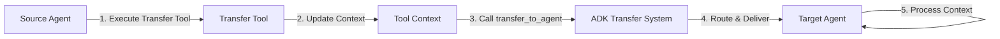

# Debugging ADK Transfers Guide

This guide provides comprehensive techniques for debugging agent-to-agent transfers in SentinelOps using Google's Agent Development Kit (ADK), including tracing, monitoring, and troubleshooting common issues.

## Table of Contents
1. [Understanding ADK Transfers](#understanding-adk-transfers)
2. [Transfer Debugging Tools](#transfer-debugging-tools)
3. [Tracing Transfer Flows](#tracing-transfer-flows)
4. [Common Transfer Issues](#common-transfer-issues)
5. [Advanced Debugging Techniques](#advanced-debugging-techniques)
6. [Transfer Monitoring](#transfer-monitoring)
7. [Debugging Scripts and Utilities](#debugging-scripts-and-utilities)

## Understanding ADK Transfers

### Transfer Architecture



### Transfer Components

1. **Transfer Tools**: Extend `BaseTool` to initiate transfers
2. **Tool Context**: Carries data between agents
3. **ADK Router**: Manages agent discovery and routing
4. **Transfer Metadata**: Tracking and debugging information

### Transfer Flow Example

```python
# How transfers work internally
class TransferToAnalysisAgentTool(BaseTool):
    def execute(self, context: ToolContext, incident: dict):
        # 1. Add data to context
        context.data["incident"] = incident
        context.data["transfer_initiated_at"] = datetime.utcnow()

        # 2. Add metadata for debugging
        context.metadata["source_agent"] = "detection_agent"
        context.metadata["transfer_id"] = str(uuid.uuid4())

        # 3. Initiate transfer
        context.actions.transfer_to_agent("analysis_agent")

        # 4. Return tracking info
        return {
            "success": True,
            "transfer_id": context.metadata["transfer_id"],
            "target": "analysis_agent"
        }
```

## Transfer Debugging Tools

### 1. ADK Transfer Inspector

```python
# scripts/debug/transfer_inspector.py
import json
from datetime import datetime
from google.adk.debug import TransferInspector

class SentinelOpsTransferInspector:
    def __init__(self):
        self.inspector = TransferInspector()
        self.transfers = {}

    def start_monitoring(self, agent_names: list):
        """Start monitoring transfers for specified agents."""
        for agent in agent_names:
            self.inspector.attach_to_agent(agent)

        # Set up transfer interceptor
        self.inspector.on_transfer = self._log_transfer

        print(f"Monitoring transfers for: {', '.join(agent_names)}")

    def _log_transfer(self, transfer_event):
        """Log transfer details for debugging."""
        transfer_id = transfer_event.metadata.get("transfer_id", "unknown")

        self.transfers[transfer_id] = {
            "timestamp": datetime.utcnow().isoformat(),
            "source": transfer_event.source_agent,
            "target": transfer_event.target_agent,
            "context_size": len(json.dumps(transfer_event.context.data)),
            "metadata": transfer_event.metadata,
            "status": "initiated"
        }

        self._print_transfer_info(transfer_id)

    def _print_transfer_info(self, transfer_id):
        """Pretty print transfer information."""
        transfer = self.transfers[transfer_id]
        print(f"\n{'='*60}")
        print(f"Transfer ID: {transfer_id}")
        print(f"Time: {transfer['timestamp']}")
        print(f"Route: {transfer['source']} → {transfer['target']}")
        print(f"Context Size: {transfer['context_size']} bytes")
        print(f"Metadata: {json.dumps(transfer['metadata'], indent=2)}")
        print(f"{'='*60}\n")

# Usage
if __name__ == "__main__":
    inspector = SentinelOpsTransferInspector()
    inspector.start_monitoring([
        "detection_agent",
        "analysis_agent",
        "orchestrator_agent"
    ])
```

### 2. Context Debugger

```python
# src/debug/context_debugger.py
class ContextDebugger:
    """Debug tool for inspecting ADK context during transfers."""

    def __init__(self, enable_logging=True):
        self.enable_logging = enable_logging
        self.context_history = []

    def wrap_tool(self, tool: BaseTool) -> BaseTool:
        """Wrap a tool to add context debugging."""
        original_execute = tool.execute

        async def debug_execute(context: ToolContext, **kwargs):
            # Capture context before execution
            pre_context = self._capture_context(context, "pre")

            # Execute original tool
            result = await original_execute(context, **kwargs)

            # Capture context after execution
            post_context = self._capture_context(context, "post")

            # Log changes
            if self.enable_logging:
                self._log_context_changes(pre_context, post_context)

            return result

        tool.execute = debug_execute
        return tool

    def _capture_context(self, context: ToolContext, phase: str):
        """Capture context state."""
        return {
            "phase": phase,
            "timestamp": datetime.utcnow().isoformat(),
            "data": dict(context.data),
            "metadata": dict(context.metadata),
            "data_keys": list(context.data.keys()),
            "size": len(json.dumps(context.data))
        }

    def _log_context_changes(self, pre, post):
        """Log what changed in the context."""
        print(f"\n[Context Changes in {pre['timestamp']}]")

        # Check for new keys
        new_keys = set(post['data_keys']) - set(pre['data_keys'])
        if new_keys:
            print(f"  New keys added: {new_keys}")

        # Check for removed keys
        removed_keys = set(pre['data_keys']) - set(post['data_keys'])
        if removed_keys:
            print(f"  Keys removed: {removed_keys}")

        # Check size change
        size_change = post['size'] - pre['size']
        if size_change != 0:
            print(f"  Context size change: {size_change:+d} bytes")

        # Store in history
        self.context_history.append({
            "pre": pre,
            "post": post,
            "changes": {
                "new_keys": list(new_keys),
                "removed_keys": list(removed_keys),
                "size_change": size_change
            }
        })
```

### 3. Transfer Flow Visualizer

```python
# scripts/debug/transfer_visualizer.py
import networkx as nx
import matplotlib.pyplot as plt
from collections import defaultdict

class TransferFlowVisualizer:
    """Visualize transfer flows between agents."""

    def __init__(self):
        self.graph = nx.DiGraph()
        self.transfer_counts = defaultdict(int)
        self.transfer_times = defaultdict(list)

    def add_transfer(self, source: str, target: str, duration_ms: float):
        """Add a transfer to the visualization."""
        # Add nodes if not present
        if source not in self.graph:
            self.graph.add_node(source)
        if target not in self.graph:
            self.graph.add_node(target)

        # Add edge
        edge_key = (source, target)
        self.transfer_counts[edge_key] += 1
        self.transfer_times[edge_key].append(duration_ms)

        # Update graph
        avg_time = sum(self.transfer_times[edge_key]) / len(self.transfer_times[edge_key])
        self.graph.add_edge(
            source, target,
            weight=self.transfer_counts[edge_key],
            avg_time=avg_time
        )

    def visualize(self, output_file="transfer_flow.png"):
        """Generate visualization of transfer flows."""
        plt.figure(figsize=(12, 8))

        # Layout
        pos = nx.spring_layout(self.graph, k=2, iterations=50)

        # Draw nodes
        nx.draw_networkx_nodes(
            self.graph, pos,
            node_color='lightblue',
            node_size=3000,
            alpha=0.8
        )

        # Draw edges with width based on transfer count
        edge_widths = [self.graph[u][v]['weight'] for u, v in self.graph.edges()]
        nx.draw_networkx_edges(
            self.graph, pos,
            width=edge_widths,
            alpha=0.6,
            edge_color='gray',
            arrows=True,
            arrowsize=20
        )

        # Draw labels
        nx.draw_networkx_labels(self.graph, pos, font_size=10)

        # Add edge labels with transfer counts and avg time
        edge_labels = {}
        for (u, v), data in self.graph.edges(items=True):
            count = data['weight']
            avg_time = data['avg_time']
            edge_labels[(u, v)] = f"{count} transfers\n{avg_time:.1f}ms avg"

        nx.draw_networkx_edge_labels(
            self.graph, pos, edge_labels,
            font_size=8
        )

        plt.title("Agent Transfer Flow Visualization")
        plt.axis('off')
        plt.tight_layout()
        plt.savefig(output_file, dpi=300, bbox_inches='tight')
        plt.close()

        print(f"Transfer flow visualization saved to {output_file}")
```

## Tracing Transfer Flows

### 1. Enable Transfer Tracing

```python
# src/common/transfer_tracing.py
import opentelemetry
from opentelemetry import trace
from opentelemetry.exporter.cloud_trace import CloudTraceSpanExporter
from opentelemetry.sdk.trace import TracerProvider
from opentelemetry.sdk.trace.export import BatchSpanProcessor

class TransferTracer:
    """Distributed tracing for ADK transfers."""

    def __init__(self, project_id: str):
        # Set up Cloud Trace
        trace.set_tracer_provider(TracerProvider())
        tracer_provider = trace.get_tracer_provider()

        # Add Cloud Trace exporter
        cloud_trace_exporter = CloudTraceSpanExporter(
            project_id=project_id
        )
        tracer_provider.add_span_processor(
            BatchSpanProcessor(cloud_trace_exporter)
        )

        self.tracer = trace.get_tracer(__name__)

    def trace_transfer(self, transfer_id: str, source: str, target: str):
        """Create trace span for transfer."""
        with self.tracer.start_as_current_span(
            f"transfer_{source}_to_{target}",
            attributes={
                "transfer.id": transfer_id,
                "transfer.source": source,
                "transfer.target": target,
                "transfer.timestamp": datetime.utcnow().isoformat()
            }
        ) as span:
            return span

    def add_transfer_metadata(self, span, metadata: dict):
        """Add metadata to transfer span."""
        for key, value in metadata.items():
            span.set_attribute(f"transfer.{key}", str(value))
```

### 2. Transfer Timeline Analysis

```python
# scripts/debug/transfer_timeline.py
import pandas as pd
import plotly.graph_objects as go
from datetime import datetime

class TransferTimeline:
    """Analyze and visualize transfer timelines."""

    def __init__(self):
        self.transfers = []

    def add_transfer_event(self, transfer_id: str, agent: str,
                          event_type: str, timestamp: datetime):
        """Add transfer event to timeline."""
        self.transfers.append({
            "transfer_id": transfer_id,
            "agent": agent,
            "event_type": event_type,
            "timestamp": timestamp
        })

    def analyze_transfer(self, transfer_id: str):
        """Analyze specific transfer timeline."""
        events = [t for t in self.transfers if t["transfer_id"] == transfer_id]
        events.sort(key=lambda x: x["timestamp"])

        if not events:
            print(f"No events found for transfer {transfer_id}")
            return

        print(f"\nTransfer Timeline: {transfer_id}")
        print("="*60)

        start_time = events[0]["timestamp"]

        for event in events:
            elapsed = (event["timestamp"] - start_time).total_seconds() * 1000
            print(f"{elapsed:>8.1f}ms | {event['agent']:>20} | {event['event_type']}")

        total_time = (events[-1]["timestamp"] - start_time).total_seconds() * 1000
        print(f"\nTotal transfer time: {total_time:.1f}ms")

    def visualize_timeline(self, output_file="transfer_timeline.html"):
        """Create interactive timeline visualization."""
        df = pd.DataFrame(self.transfers)

        fig = go.Figure()

        # Group by transfer_id
        for transfer_id in df['transfer_id'].unique():
            transfer_events = df[df['transfer_id'] == transfer_id]

            fig.add_trace(go.Scatter(
                x=transfer_events['timestamp'],
                y=transfer_events['agent'],
                mode='markers+lines',
                name=transfer_id,
                text=transfer_events['event_type'],
                hovertemplate='%{text}<br>%{x}<br>%{y}'
            ))

        fig.update_layout(
            title="Transfer Timeline Visualization",
            xaxis_title="Time",
            yaxis_title="Agent",
            height=600
        )

        fig.write_html(output_file)
        print(f"Timeline visualization saved to {output_file}")
```

### 3. Context Flow Tracking

```python
# src/debug/context_flow_tracker.py
class ContextFlowTracker:
    """Track how context flows through agents."""

    def __init__(self):
        self.context_snapshots = {}
        self.flow_graph = nx.DiGraph()

    def snapshot_context(self, agent_name: str, transfer_id: str,
                        context: ToolContext, phase: str):
        """Take snapshot of context at specific point."""
        key = f"{agent_name}_{transfer_id}_{phase}"

        self.context_snapshots[key] = {
            "agent": agent_name,
            "transfer_id": transfer_id,
            "phase": phase,
            "timestamp": datetime.utcnow(),
            "data": self._serialize_context(context),
            "data_hash": self._hash_context(context)
        }

        # Add to flow graph
        if phase == "received":
            # Find source of this transfer
            source = self._find_transfer_source(transfer_id)
            if source:
                self.flow_graph.add_edge(source, agent_name, transfer_id=transfer_id)

    def analyze_context_flow(self, transfer_id: str):
        """Analyze how context changed through transfer."""
        snapshots = [
            s for s in self.context_snapshots.values()
            if s["transfer_id"] == transfer_id
        ]

        snapshots.sort(key=lambda x: x["timestamp"])

        print(f"\nContext Flow Analysis: {transfer_id}")
        print("="*60)

        for i, snapshot in enumerate(snapshots):
            print(f"\n[{i+1}] {snapshot['agent']} - {snapshot['phase']}")
            print(f"    Time: {snapshot['timestamp']}")
            print(f"    Hash: {snapshot['data_hash'][:16]}...")

            if i > 0:
                # Compare with previous snapshot
                prev_hash = snapshots[i-1]["data_hash"]
                if prev_hash != snapshot["data_hash"]:
                    print("    ⚠️  Context modified!")
                    self._show_context_diff(snapshots[i-1], snapshot)

    def _show_context_diff(self, before, after):
        """Show differences between context snapshots."""
        before_data = json.loads(before["data"])
        after_data = json.loads(after["data"])

        # Find differences
        added_keys = set(after_data.keys()) - set(before_data.keys())
        removed_keys = set(before_data.keys()) - set(after_data.keys())

        if added_keys:
            print(f"    Added: {added_keys}")
        if removed_keys:
            print(f"    Removed: {removed_keys}")
```

## Common Transfer Issues

### 1. Transfer Timeout Issues

```python
# src/debug/transfer_timeout_analyzer.py
class TransferTimeoutAnalyzer:
    """Analyze and debug transfer timeout issues."""

    def __init__(self, timeout_threshold_ms=5000):
        self.timeout_threshold = timeout_threshold_ms
        self.transfer_durations = {}

    def analyze_timeouts(self, log_file: str):
        """Analyze transfer logs for timeout patterns."""
        timeouts = []

        with open(log_file, 'r') as f:
            for line in f:
                if "transfer_timeout" in line:
                    timeout_info = self._parse_timeout_log(line)
                    timeouts.append(timeout_info)

        if not timeouts:
            print("No timeout issues found")
            return

        # Analyze patterns
        print(f"\nTransfer Timeout Analysis")
        print(f"Found {len(timeouts)} timeout issues")
        print("="*60)

        # Group by route
        routes = {}
        for timeout in timeouts:
            route = f"{timeout['source']} → {timeout['target']}"
            routes[route] = routes.get(route, 0) + 1

        print("\nTimeouts by Route:")
        for route, count in sorted(routes.items(), key=lambda x: x[1], reverse=True):
            print(f"  {route}: {count} timeouts")

        # Timing analysis
        durations = [t['duration_ms'] for t in timeouts if 'duration_ms' in t]
        if durations:
            print(f"\nTiming Statistics:")
            print(f"  Average duration: {sum(durations)/len(durations):.1f}ms")
            print(f"  Max duration: {max(durations):.1f}ms")
            print(f"  Min duration: {min(durations):.1f}ms")
```

### 2. Context Size Issues

```python
# src/debug/context_size_analyzer.py
class ContextSizeAnalyzer:
    """Debug context size issues in transfers."""

    MAX_CONTEXT_SIZE = 10 * 1024 * 1024  # 10MB

    def analyze_context_size(self, context: ToolContext):
        """Analyze context size and identify large data."""
        total_size = 0
        size_breakdown = {}

        for key, value in context.data.items():
            serialized = json.dumps(value, default=str)
            size = len(serialized.encode('utf-8'))
            total_size += size
            size_breakdown[key] = size

        # Sort by size
        sorted_items = sorted(
            size_breakdown.items(),
            key=lambda x: x[1],
            reverse=True
        )

        print(f"\nContext Size Analysis")
        print(f"Total size: {total_size:,} bytes ({total_size/1024/1024:.2f} MB)")
        print("="*60)

        print("\nTop 10 largest items:")
        for key, size in sorted_items[:10]:
            percentage = (size / total_size) * 100
            print(f"  {key}: {size:,} bytes ({percentage:.1f}%)")

        # Warnings
        if total_size > self.MAX_CONTEXT_SIZE:
            print(f"\n⚠️  WARNING: Context exceeds maximum size!")
            print(f"   Maximum: {self.MAX_CONTEXT_SIZE:,} bytes")
            print(f"   Current: {total_size:,} bytes")

            # Suggest optimizations
            print("\nSuggested optimizations:")
            for key, size in sorted_items[:3]:
                if size > 1024 * 1024:  # > 1MB
                    print(f"  - Consider compressing '{key}'")
                    print(f"  - Consider storing '{key}' externally")
```

### 3. Transfer Loop Detection

```python
# src/debug/transfer_loop_detector.py
class TransferLoopDetector:
    """Detect and debug transfer loops between agents."""

    def __init__(self, max_depth=10):
        self.max_depth = max_depth
        self.transfer_chains = defaultdict(list)

    def track_transfer(self, transfer_id: str, source: str, target: str):
        """Track transfer in chain."""
        chain = self.transfer_chains[transfer_id]
        chain.append((source, target, datetime.utcnow()))

        # Check for loops
        if self._detect_loop(chain):
            self._handle_loop_detection(transfer_id, chain)

    def _detect_loop(self, chain):
        """Detect if there's a loop in transfer chain."""
        if len(chain) < 2:
            return False

        # Build path
        path = [chain[0][0]]  # Start with first source
        for _, target, _ in chain:
            path.append(target)

        # Check for cycles
        visited = set()
        for agent in path:
            if agent in visited:
                return True
            visited.add(agent)

        # Check depth
        return len(chain) > self.max_depth

    def _handle_loop_detection(self, transfer_id: str, chain):
        """Handle detected transfer loop."""
        print(f"\n🔴 TRANSFER LOOP DETECTED!")
        print(f"Transfer ID: {transfer_id}")
        print("="*60)

        print("\nTransfer Chain:")
        for i, (source, target, timestamp) in enumerate(chain):
            print(f"{i+1}. {source} → {target} at {timestamp}")

        # Find the loop
        agents = [chain[0][0]]
        for _, target, _ in chain:
            if target in agents:
                loop_start = agents.index(target)
                print(f"\nLoop detected: {' → '.join(agents[loop_start:])} → {target}")
                break
            agents.append(target)

        # Suggest fixes
        print("\nSuggested fixes:")
        print("1. Add loop detection in transfer tools")
        print("2. Implement maximum transfer depth")
        print("3. Add transfer history to context")
```

## Advanced Debugging Techniques

### 1. Transfer Replay System

```python
# src/debug/transfer_replay.py
class TransferReplaySystem:
    """Replay transfers for debugging."""

    def __init__(self):
        self.recorded_transfers = []
        self.replay_mode = False

    def record_transfer(self, transfer_data: dict):
        """Record transfer for later replay."""
        self.recorded_transfers.append({
            "timestamp": datetime.utcnow(),
            "data": transfer_data,
            "context_snapshot": self._snapshot_context(transfer_data.get("context"))
        })

    async def replay_transfer(self, transfer_index: int, target_agent):
        """Replay specific transfer for debugging."""
        if transfer_index >= len(self.recorded_transfers):
            print(f"Invalid transfer index: {transfer_index}")
            return

        transfer = self.recorded_transfers[transfer_index]
        print(f"\nReplaying transfer {transfer_index}")
        print(f"Original timestamp: {transfer['timestamp']}")

        # Restore context
        context = self._restore_context(transfer['context_snapshot'])

        # Mark as replay
        context.metadata["is_replay"] = True
        context.metadata["original_timestamp"] = transfer['timestamp']

        # Execute transfer
        self.replay_mode = True
        result = await target_agent.process_transfer(context)
        self.replay_mode = False

        print(f"Replay complete. Result: {result}")
        return result
```

### 2. Transfer Mutation Testing

```python
# src/debug/transfer_mutation_testing.py
class TransferMutationTester:
    """Test transfer robustness with mutations."""

    def __init__(self):
        self.mutations = [
            self._mutate_missing_field,
            self._mutate_wrong_type,
            self._mutate_large_data,
            self._mutate_circular_reference
        ]

    async def test_transfer_robustness(self, transfer_tool, base_context):
        """Test how transfer handles various mutations."""
        results = []

        for mutation in self.mutations:
            mutated_context = mutation(base_context.copy())

            try:
                result = await transfer_tool.execute(mutated_context)
                results.append({
                    "mutation": mutation.__name__,
                    "success": True,
                    "result": result
                })
            except Exception as e:
                results.append({
                    "mutation": mutation.__name__,
                    "success": False,
                    "error": str(e)
                })

        # Generate report
        self._generate_robustness_report(results)

    def _mutate_missing_field(self, context):
        """Remove required field."""
        if "incident_id" in context.data:
            del context.data["incident_id"]
        return context

    def _mutate_wrong_type(self, context):
        """Change field to wrong type."""
        if "severity" in context.data:
            context.data["severity"] = 123  # Should be string
        return context
```

## Transfer Monitoring

### 1. Real-time Transfer Dashboard

```python
# src/monitoring/transfer_dashboard.py
from flask import Flask, render_template, jsonify
import threading
import queue

class TransferDashboard:
    """Real-time dashboard for monitoring transfers."""

    def __init__(self, port=5000):
        self.app = Flask(__name__)
        self.port = port
        self.transfer_queue = queue.Queue()
        self.transfer_stats = {
            "total": 0,
            "successful": 0,
            "failed": 0,
            "in_progress": 0,
            "by_route": defaultdict(int),
            "avg_duration": {}
        }

        self._setup_routes()

    def _setup_routes(self):
        @self.app.route('/')
        def index():
            return render_template('transfer_dashboard.html')

        @self.app.route('/api/stats')
        def get_stats():
            return jsonify(self.transfer_stats)

        @self.app.route('/api/transfers/recent')
        def get_recent_transfers():
            recent = []
            while not self.transfer_queue.empty() and len(recent) < 50:
                recent.append(self.transfer_queue.get())
            return jsonify(recent)

    def update_transfer(self, transfer_event):
        """Update dashboard with new transfer event."""
        self.transfer_queue.put(transfer_event)

        # Update statistics
        if transfer_event["status"] == "completed":
            self.transfer_stats["successful"] += 1
            route = f"{transfer_event['source']}→{transfer_event['target']}"
            self.transfer_stats["by_route"][route] += 1
        elif transfer_event["status"] == "failed":
            self.transfer_stats["failed"] += 1

        self.transfer_stats["total"] += 1

    def run(self):
        """Start dashboard server."""
        thread = threading.Thread(
            target=self.app.run,
            kwargs={"port": self.port, "debug": False}
        )
        thread.daemon = True
        thread.start()
        print(f"Transfer dashboard running at http://localhost:{self.port}")
```

### 2. Transfer Metrics Collection

```python
# src/monitoring/transfer_metrics.py
from prometheus_client import Counter, Histogram, Gauge

# Define metrics
transfer_total = Counter(
    'sentinelops_transfers_total',
    'Total number of transfers',
    ['source', 'target', 'status']
)

transfer_duration = Histogram(
    'sentinelops_transfer_duration_seconds',
    'Transfer duration in seconds',
    ['source', 'target']
)

transfers_in_progress = Gauge(
    'sentinelops_transfers_in_progress',
    'Number of transfers currently in progress'
)

transfer_context_size = Histogram(
    'sentinelops_transfer_context_size_bytes',
    'Size of transfer context in bytes',
    ['source', 'target'],
    buckets=[1024, 10240, 102400, 1048576, 10485760]  # 1KB to 10MB
)

class TransferMetricsCollector:
    """Collect metrics for transfer monitoring."""

    def record_transfer_start(self, source: str, target: str):
        """Record transfer start."""
        transfers_in_progress.inc()
        return time.time()

    def record_transfer_complete(self, source: str, target: str,
                               start_time: float, success: bool,
                               context_size: int):
        """Record transfer completion."""
        duration = time.time() - start_time
        status = "success" if success else "failure"

        transfer_total.labels(source=source, target=target, status=status).inc()
        transfer_duration.labels(source=source, target=target).observe(duration)
        transfer_context_size.labels(source=source, target=target).observe(context_size)
        transfers_in_progress.dec()
```

## Debugging Scripts and Utilities

### 1. Transfer Debug CLI

```python
#!/usr/bin/env python
# scripts/debug/transfer_debug_cli.py
import click
import asyncio
from src.debug.transfer_inspector import SentinelOpsTransferInspector
from src.debug.transfer_timeline import TransferTimeline

@click.group()
def cli():
    """SentinelOps Transfer Debugging CLI"""
    pass

@cli.command()
@click.option('--agents', '-a', multiple=True, required=True)
@click.option('--duration', '-d', default=60, help='Duration in seconds')
def monitor(agents, duration):
    """Monitor transfers between agents."""
    inspector = SentinelOpsTransferInspector()
    inspector.start_monitoring(list(agents))

    click.echo(f"Monitoring for {duration} seconds...")
    time.sleep(duration)

    # Show summary
    click.echo("\nTransfer Summary:")
    for tid, transfer in inspector.transfers.items():
        click.echo(f"  {tid}: {transfer['source']} → {transfer['target']}")

@cli.command()
@click.argument('transfer_id')
def trace(transfer_id):
    """Trace specific transfer through system."""
    timeline = TransferTimeline()
    timeline.analyze_transfer(transfer_id)

@cli.command()
@click.argument('log_file')
def analyze_timeouts(log_file):
    """Analyze transfer timeout issues."""
    analyzer = TransferTimeoutAnalyzer()
    analyzer.analyze_timeouts(log_file)

if __name__ == '__main__':
    cli()
```

### 2. Transfer Test Generator

```python
# scripts/debug/generate_transfer_tests.py
class TransferTestGenerator:
    """Generate test cases for transfer debugging."""

    def generate_test_suite(self, output_dir: str):
        """Generate comprehensive transfer test suite."""
        test_cases = [
            self._generate_basic_transfer_test(),
            self._generate_large_context_test(),
            self._generate_timeout_test(),
            self._generate_error_handling_test(),
            self._generate_concurrent_transfer_test()
        ]

        for test_case in test_cases:
            filename = f"{output_dir}/test_{test_case['name']}.py"
            with open(filename, 'w') as f:
                f.write(test_case['code'])

            print(f"Generated: {filename}")

    def _generate_basic_transfer_test(self):
        return {
            "name": "basic_transfer",
            "code": '''
import pytest
from src.tools.transfer_tools import TransferToAnalysisAgentTool

async def test_basic_transfer():
    """Test basic transfer functionality."""
    tool = TransferToAnalysisAgentTool()
    context = create_test_context()

    result = await tool.execute(
        context=context,
        incident={"id": "TEST-001", "severity": "HIGH"}
    )

    assert result["success"] is True
    assert result["target"] == "analysis_agent"
'''
        }
```

### 3. Transfer Health Check Script

```bash
#!/bin/bash
# scripts/debug/check_transfer_health.sh

echo "SentinelOps Transfer Health Check"
echo "================================"

# Check agent connectivity
echo -n "Checking agent connectivity... "
for agent in detection analysis remediation communication orchestrator; do
    if curl -s http://localhost:800${i}/health > /dev/null; then
        echo -n "✓"
    else
        echo -n "✗"
    fi
done
echo ""

# Check transfer routes
echo -n "Checking transfer routes... "
python -c "
from src.common.agent_discovery import AgentDiscovery
discovery = AgentDiscovery()
routes = discovery.get_available_routes()
print(f'Found {len(routes)} routes')
for route in routes:
    print(f'  {route}')
"

# Check recent transfer success rate
echo "Recent transfer statistics:"
python -c "
from src.monitoring.transfer_metrics import get_transfer_stats
stats = get_transfer_stats(minutes=60)
print(f'  Success rate: {stats['success_rate']:.1%}')
print(f'  Avg duration: {stats['avg_duration']:.1f}ms')
print(f'  Total transfers: {stats['total']}')
"
```

---

*This comprehensive debugging guide provides the tools and techniques needed to effectively troubleshoot and optimize ADK transfers in the SentinelOps system.*
