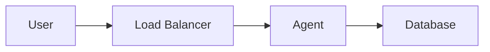

# Documentation Style Guide

## Overview

This guide establishes standards for creating and maintaining SentinelOps documentation. Following these guidelines ensures consistency, clarity, and professionalism across all documentation.

## General Principles

1. **Clarity First**: Write for developers who are new to SentinelOps
2. **Be Concise**: Avoid unnecessary words while maintaining completeness
3. **Use Examples**: Show, don't just tell
4. **Stay Current**: Update documentation when code changes
5. **Test Everything**: Verify all code examples work

## Document Structure

### File Organization

```
docs/
├── 01-getting-started/     # New user guides
├── 02-architecture/        # System design docs
├── 03-deployment/          # Installation guides
├── 04-operations/          # Running in production
├── 05-development/         # Contributing guides
└── 06-reference/           # API and config refs
```

### Document Template

```markdown
# Document Title

**Last Updated**: [Date]

## Overview
Brief description of what this document covers and who should read it.

## Prerequisites (if applicable)
- Required knowledge
- Required tools
- Required access

## Main Content
Organized with clear headings and subheadings.

## Examples
Practical, working examples.

## Troubleshooting (if applicable)
Common issues and solutions.

## Next Steps
Where to go from here.

## Related Documentation
Links to relevant docs.
```

## Markdown Standards

### Headings

- Use ATX-style headings (`#` not underlines)
- Only one H1 (`#`) per document
- Use sentence case for headings
- Leave blank lines before and after headings

```markdown
# Main Title

## Section Heading

### Subsection Heading
```

### Code Blocks

Always specify the language:

````markdown
```python
def example():
    return "Hello, SentinelOps!"
```

```bash
gcloud auth login
```

```yaml
config:
  key: value
```
````

### Lists

Use consistent markers:
- Dashes (`-`) for unordered lists
- Numbers (`1.`) for ordered lists
- Indent with 2 spaces for nested items

```markdown
- First item
  - Nested item
  - Another nested item
- Second item

1. First step
2. Second step
   - Sub-step A
   - Sub-step B
3. Third step
```

### Links

- Use descriptive link text
- Use relative paths for internal docs
- Use full URLs for external resources

```markdown
See the [Architecture Overview](../02-architecture/architecture.md) for details.
Visit [Google Cloud Console](https://console.cloud.google.com).
```

### Tables

Use pipes and alignment:

```markdown
| Column 1 | Column 2 | Column 3 |
|----------|:--------:|---------:|
| Left     | Center   | Right    |
| aligned  | aligned  | aligned  |
```

## Writing Style

### Voice and Tone

- **Active Voice**: "The agent processes requests" not "Requests are processed by the agent"
- **Present Tense**: "The system sends" not "The system will send"
- **Direct**: "You must" not "It is required that you"
- **Professional**: Avoid slang, jokes, or overly casual language

### Technical Writing

1. **Define Acronyms**: First use should include the full term
   - "Agent Development Kit (ADK)"

2. **Be Specific**: Avoid vague terms
   - ❌ "The system might take a while"
   - ✅ "Processing typically takes 2-5 seconds"

3. **Use Consistent Terminology**:
   - "agent" not "Agent" (unless starting a sentence)
   - "Firestore" not "Cloud Firestore"
   - "GCP" not "Google Cloud" (after first mention)

### Code Examples

1. **Complete and Runnable**: Examples should work when copied
2. **Include Imports**: Show all necessary imports
3. **Add Comments**: Explain non-obvious code
4. **Handle Errors**: Show proper error handling

```python
# Good example
from google.cloud import firestore
from typing import Dict, Any

def get_incident(incident_id: str) -> Dict[str, Any]:
    """Retrieve an incident from Firestore.

    Args:
        incident_id: The unique incident identifier

    Returns:
        Dictionary containing incident data

    Raises:
        ValueError: If incident_id is invalid
        RuntimeError: If Firestore is unavailable
    """
    if not incident_id:
        raise ValueError("incident_id is required")

    try:
        db = firestore.Client()
        doc = db.collection('incidents').document(incident_id).get()
        if not doc.exists:
            return {}
        return doc.to_dict()
    except Exception as e:
        raise RuntimeError(f"Failed to retrieve incident: {e}")
```

## Specific Guidelines

### API Documentation

- Document all parameters with types
- Include example requests and responses
- Note any rate limits or quotas
- Specify error codes and meanings

### Configuration Documentation

- Show complete examples
- Document all options with defaults
- Group related settings
- Include validation rules

### Troubleshooting Sections

Structure problems consistently:

```markdown
### Problem: [Clear problem description]

**Symptoms**:
- Symptom 1
- Symptom 2

**Cause**: Brief explanation

**Solution**:
1. Step-by-step fix
2. With specific commands

**Prevention**: How to avoid this issue
```

### Command Line Examples

- Show the full command
- Include expected output
- Use `$` for shell prompts
- Escape special characters

```bash
$ gcloud config set project my-project
Updated property [core/project].

$ export GOOGLE_CLOUD_PROJECT="my-project"
```

## File Naming

- Use kebab-case: `quick-start.md`
- Be descriptive: `adk-troubleshooting.md` not `trouble.md`
- No spaces or special characters
- Use `.md` extension for Markdown

## Diagrams

When using Mermaid diagrams:



- Keep diagrams simple and focused
- Use consistent styling
- Include text descriptions for accessibility

## Review Checklist

Before submitting documentation:

- [ ] Spell check completed
- [ ] Links verified (internal and external)
- [ ] Code examples tested
- [ ] Formatting consistent
- [ ] "Last Updated" date added/updated
- [ ] Related docs linked
- [ ] No sensitive information exposed
- [ ] Screenshots up-to-date (if used)

## Common Mistakes to Avoid

1. **Assuming Knowledge**: Don't assume readers know GCP or ADK
2. **Outdated Information**: Remove or update old content
3. **Broken Links**: Test all links regularly
4. **Inconsistent Formatting**: Follow the style guide
5. **Missing Context**: Explain why, not just how
6. **Security Issues**: Never include real credentials or keys

## Tools and Resources

### Recommended Tools

- **Markdown Linter**: markdownlint
- **Spell Checker**: cspell or aspell
- **Link Checker**: markdown-link-check
- **Preview**: VS Code with Markdown Preview

### Useful Commands

```bash
# Check for broken links
find docs -name "*.md" -exec markdown-link-check {} \;

# Spell check
cspell "docs/**/*.md"

# Format check
markdownlint docs/
```

## Contributing

When contributing documentation:

1. Read existing docs to understand the style
2. Follow this guide strictly
3. Ask for clarification if needed
4. Request review from maintainers
5. Update the "Last Updated" date

## Examples of Good Documentation

### Good: Clear and Actionable

```markdown
## Configure Firestore Indexes

Before deploying, create the required indexes:

1. Navigate to the [Firestore Console](https://console.cloud.google.com/firestore)
2. Click "Indexes" in the left menu
3. Click "Create Index"
4. Add these composite indexes:
   - Collection: `incidents`
   - Fields: `severity` (Ascending), `created_at` (Descending)
```

### Bad: Vague and Incomplete

```markdown
## Setup Database

Configure the database with the necessary indexes for performance.
```

## Maintenance

This style guide should be:
- Reviewed quarterly
- Updated when new patterns emerge
- Enforced in pull request reviews
- Used as training material for new contributors

## Related Documentation

- [Contributing Guide](../CONTRIBUTING.md)
- [README Template](../README.md)
- [Architecture Documentation](./02-architecture/architecture.md)
